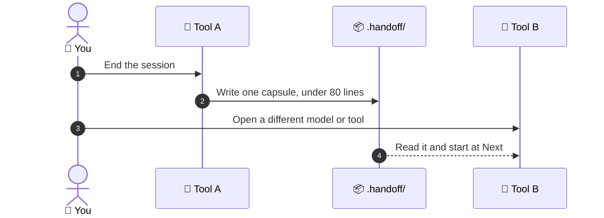

# 🔁 superforge-handoff

[](https://opensource.org/licenses/MIT)
[](https://claude.com/claude-code)
[](https://github.com/takaoumehara/superforge-skill)

**English** · [日本語](README.ja.md) · [简体中文](README.zh-CN.md) · [Español](README.es.md) · [한국어](README.ko.md)

> **Clear the thread, switch the model, change the tool — and keep the work.**

---

## 🔰 What is this?

When a hospital shift changes, the outgoing nurse does not narrate the entire day. They hand over a short structured note: who is here, what has been done, what happens next, what to watch. It is short precisely because the charts already exist.

This skill writes that note for a work session. A capsule under 80 lines lands in `.handoff/`, pointing at the files that hold the detail rather than restating them, and any model or tool can pick the work up from it.

---

## 📐 Architecture



The capsule points at `docs/`; it does not duplicate it. That is what keeps it short enough to actually be read.

---

## ✨ Features

### 📦 Short because it points, not repeats
The capsule holds the objective, the verified state, running processes and ports, the immediate next steps, and which files to read first. Everything else stays in the `docs/` artifacts the other skills already wrote.

### 🔁 Plain Markdown any tool can read
Claude Code, Codex, Gemini CLI, Antigravity, Cursor — the capsule is a file in your repository, not a vendor feature. It travels with the code through git, and nothing is uploaded anywhere.

### 📋 A resume prompt you paste and go
Along with the capsule you get a copy-paste-ready chat prompt naming the project, the file, the goal, the verified state, and the next step. Restarting is one paste, not a reconstruction from memory.

---

## 🔄 Before / After

| | Before | After |
|---|---|---|
| Switching tools | Re-explain the whole project | Read one capsule |
| Before `/clear` | Keep a bloated thread alive | Clear it safely |
| Where context lives | In a chat log you will lose | In your repository, under git |
| Restarting tomorrow | Reconstruct from memory | Paste the resume prompt |

---

## 🚀 Install & Usage

You need `git` and an AI tool that loads skills from a directory.

### 🖥️ Claude Code (CLI)

Clone the suite anywhere, then link this one skill:

```bash
git clone https://github.com/takaoumehara/superforge-skill ~/src/superforge-skill
ln -s ~/src/superforge-skill/skills/superforge-handoff ~/.claude/skills/superforge-handoff
```

Restart Claude Code, then invoke it:

```
/superforge-handoff
```

A dated file appears in `.handoff/`, followed by the resume prompt in the reply. Nothing else in the project is required.

### 🔗 Codex CLI / Gemini CLI / Antigravity

The same link, a different directory. Or let the installer find every skills directory on this machine and link all eleven skills at once:

```bash
cd ~/src/superforge-skill
./install.sh
```

It is idempotent, touches only its own symlinks, and accepts `--dry-run` and `--uninstall`.

### 🌐 claude.ai (browser)

Zip this skill's folder and upload it in your account's skill settings:

```bash
cd ~/src/superforge-skill/skills/superforge-handoff
zip -r superforge-handoff.zip .
```

The browser UI takes one skill at a time, so repeat it for each skill you want.

---

## 📄 License

MIT — see [LICENSE](../../LICENSE). The capsule format and the resume prompt template are in [SKILL.md](SKILL.md). Suite overview: [superforge-skill](../../README.md).
