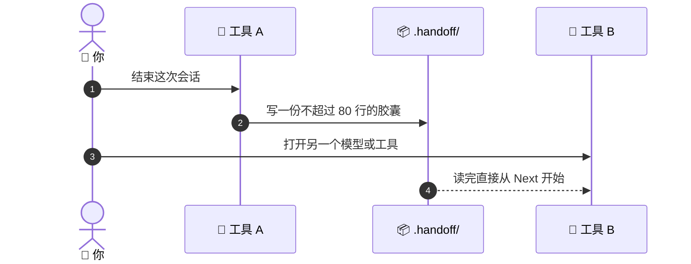

# 🔁 superforge-handoff

[](https://opensource.org/licenses/MIT)
[](https://claude.com/claude-code)
[](https://github.com/takaoumehara/superforge-skill)

[English](README.md) · [日本語](README.ja.md) · **简体中文** · [Español](README.es.md) · [한국어](README.ko.md)

> **清掉会话、换掉模型、换掉工具——活儿照样接着干。**

---

## 🔰 这是什么？

医院交接班时，下班的护士不会把一整天重讲一遍，而是递上一张简短的结构化交班条：现在有谁、已经做了什么、接下来要做什么、要盯着什么。它之所以能这么短，正是因为病历本来就在。

这个技能就是给一次工作会话写那张交班条。一份不超过 80 行的胶囊落在 `.handoff/` 里，它不复述细节，而是指向存放细节的文件，任何模型、任何工具都能据此接手。

---

## 📐 系统架构



胶囊只指向 `docs/`，不复制它。正因如此，它短到真的会有人读完。

---

## ✨ 三大亮点

### 📦 靠指路而不靠复述，所以短
胶囊里装的是：目标、已验证的状态、正在跑的进程和端口、立刻要做的下一步、以及先读哪几个文件。其余内容留在别的技能早就写好的 `docs/` 产物里。

### 🔁 任何工具都能读的纯 Markdown
Claude Code、Codex、Gemini CLI、Antigravity、Cursor 都行。胶囊是你仓库里的一个文件，不是某家厂商的功能；它跟着代码一起走 git，也不会上传到任何地方。

### 📋 一贴就能续上的重启提示词
除了胶囊，还会给你一段可直接粘贴的对话提示词，里面写着项目、文件、目标、已验证状态和下一步。重启是粘贴一次，而不是靠记忆重新拼出来。

---

## 🔄 使用前 / 使用后

| | 使用前 | 使用后 |
|---|---|---|
| 换工具 | 把项目从头讲一遍 | 读一份胶囊 |
| `/clear` 之前 | 硬撑着一个臃肿的会话 | 放心清掉 |
| 上下文放在哪 | 迟早会丢的聊天记录 | 纳入 git 的仓库里 |
| 第二天接着干 | 凭记忆重新拼装 | 粘贴重启提示词 |

---

## 🚀 安装与使用

### 🖥️ 一次装好全部 12 个技能（只需一次）

克隆仓库并运行安装脚本。它会找出本机所有技能目录，把 12 个技能一次性链接进去（Claude Code / Codex CLI / Gemini CLI / Antigravity）。

```bash
git clone https://github.com/takaoumehara/superforge-skill
cd superforge-skill
./install.sh
```

完整选项、只装单个技能的方法，以及 claude.ai 的上传步骤，都在[整套 README](../../README.zh-CN.md)。

### ⌨️ 调用它

```
/superforge-handoff
```

`.handoff/` 里会出现一个带日期的文件，回复中紧跟着重启提示词。项目这边不需要任何额外准备。

---

## 📄 许可证

MIT — 见 [LICENSE](../../LICENSE)。胶囊格式和重启提示词模板都在 [SKILL.md](SKILL.md)。整套说明见 [superforge-skill](../../README.zh-CN.md)。
