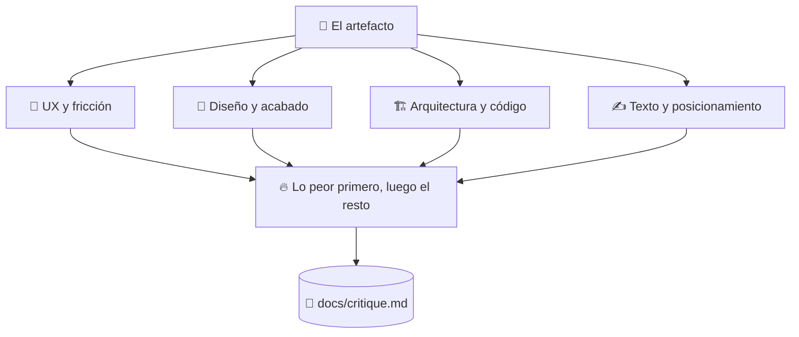

# 🔥 superforge-roast

[](https://opensource.org/licenses/MIT)
[](https://claude.com/claude-code)
[](https://github.com/takaoumehara/superforge-skill)

[English](README.md) · [日本語](README.ja.md) · [简体中文](README.zh-CN.md) · **Español** · [한국어](README.ko.md)

> **Escucha lo peor de tu trabajo de labios de algo que no tiene ningún motivo para ser amable.**

---

## 🔰 ¿Qué es esto?

La amistad que vale la pena es la que te avisa de que llevas espinacas entre los dientes antes de la reunión, no la que te dice que estás estupendo y te ve entrar.

Esta skill es esa amistad para un diseño, un PRD, una arquitectura o un texto. Abre con lo peor de todo en una sola frase, recorre cuatro lentes distintas y acompaña cada reproche con un arreglo concreto. Sin «buen comienzo», sin colchón, sin darte la razón por quedar bien.

---

## 📐 Arquitectura



Los hallazgos se agrupan por causa y no por pantalla, porque cinco síntomas de un mismo error son un trabajo, no cinco.

---

## ✨ Puntos clave

### 🚫 El cumplido está prohibido, no solo desaconsejado
Ni elogio de apertura, ni cláusula que suavice, ni conformidad cortés con una decisión que no aguanta un examen. La amabilidad que un modelo trae de fábrica es justo lo que vuelve inútil su opinión antes de un lanzamiento.

### 🔬 Cuatro lentes, aplicadas a propósito
UX y fricción: ¿dónde se pierde alguien o se marcha? Diseño y acabado: ¿esto parece salido de una plantilla genérica? Arquitectura: ¿por dónde se rompe cuando crecen los datos o cae la red? Texto: ¿es sermoneador, vago o relleno corporativo?

### 🔨 Cada defecto llega con su arreglo
La salida son dos bloques: **THE ROAST** nombra lo que está flojo y **THE FORGE** indica el cambio concreto que hay que hacer. Una crítica sobre la que no puedes actuar es solo alguien de mal humor con puntualidad.

---

## 🔄 Antes / Después

| | Antes | Después |
|---|---|---|
| Cómo empieza el feedback | «¡Buen comienzo! Solo un par de notas…» | Lo peor de todo, en una frase |
| Cobertura | Lo que casualmente saltó a la vista | Cuatro lentes, aplicadas a propósito |
| Agrupación de hallazgos | Pantalla por pantalla | Por causa: un arreglo cierra varios |
| Lo que te llevas | Una lista de quejas | Una lista de cambios que hacer |

---

## 🚀 Instalación y uso

### 🖥️ Instala las trece skills (una sola vez)

Clona el repositorio y ejecuta el instalador. Enlaza las trece skills en todos los directorios de skills de tu máquina (Claude Code, Codex CLI, Gemini CLI, Antigravity).

```bash
git clone https://github.com/takaoumehara/superforge-skill
cd superforge-skill
./install.sh
```

Todas las opciones, la instalación de una sola skill y la ruta de subida a claude.ai están en el [README de la suite](../../README.es.md).

### ⌨️ Invócala

```
/superforge-roast
```

Apúntala a cualquier artefacto de `docs/`, a un archivo, a una pantalla o a un texto pegado. El veredicto queda en `docs/critique.md`.

---

## 📄 Licencia

MIT — consulta [LICENSE](../../LICENSE). El cuerpo de la skill está en [SKILL.md](SKILL.md); la evaluación heurística, la auditoría de accesibilidad, el análisis de carga cognitiva y las pruebas con personas simuladas están en [references/evaluation-methods.md](references/evaluation-methods.md). Visión general de la suite: [superforge-skill](../../README.es.md).
