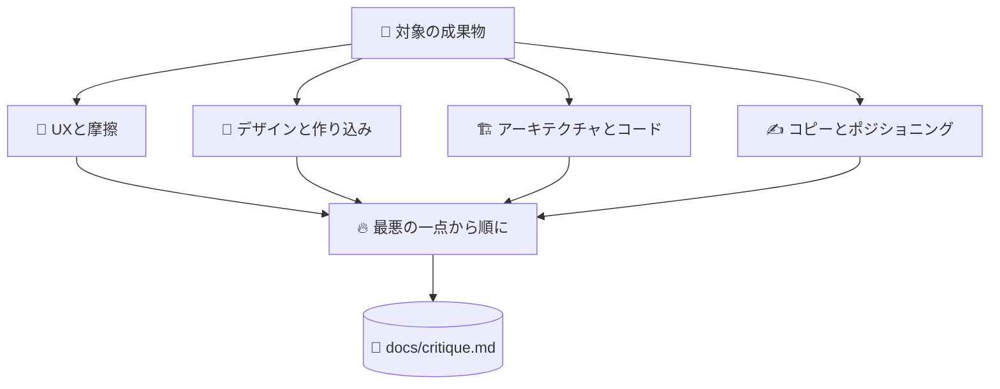

# 🔥 superforge-roast

[](https://opensource.org/licenses/MIT)
[](https://claude.com/claude-code)
[](https://github.com/takaoumehara/superforge-skill)

[English](README.md) · **日本語** · [简体中文](README.zh-CN.md) · [Español](README.es.md) · [한국어](README.ko.md)

> **忖度する理由を持たない相手から、自分の仕事のいちばん悪いところを聞く。**

---

## 🔰 これは何？

付き合う価値のある友人は、会議の前に「歯に青のりが付いてる」と言ってくれる人であって、「いい感じだよ」と言って送り出す人ではありません。

このスキルは、デザイン・PRD・アーキテクチャ・コピーに対するその友人です。いちばん悪い点を一文で言い切ってから始め、4つのレンズで通しで見て、指摘のひとつひとつに具体的な直し方を付けます。「いい出だしですね」も、和らげる前置きも、場を保つための同意もありません。

---

## 📐 システム概念図



指摘は画面別ではなく原因別にまとめます。1つのミスが生む5つの症状は、5件ではなく1件の作業だからです。

---

## ✨ 3つの強み

### 🚫 褒め言葉は「控えめに」ではなく禁止
冒頭の賞賛も、和らげる一句も、精査に耐えない判断への社交的な同意もありません。AI が既定で身につけている丁寧さこそが、リリース前のフィードバックを無価値にしています。

### 🔬 4つのレンズを意識的に当てる
UXと摩擦——どこで迷い、どこで離脱するか。デザインと作り込み——ありがちなテンプレート出力に見えないか。アーキテクチャ——データが増えたとき、通信が切れたときにどこが壊れるか。コピー——説教くさくないか、曖昧でないか、企業の埋め草になっていないか。

### 🔨 欠点には必ず直し方が付く
出力は2ブロックです。**THE ROAST** が弱い点を名指しし、**THE FORGE** が具体的に何をどう変えるかを示します。行動に移せない批評は、ただ予定どおり不機嫌なだけです。

---

## 🔄 導入前 / 導入後

| | 導入前 | 導入後 |
|---|---|---|
| フィードバックの入り | 「いい出だしですね。少しだけ…」 | いちばん悪い一点を一文で |
| 見る範囲 | 目に留まったところ | 4つのレンズを意識的に |
| 指摘のまとめ方 | 画面ごと | 原因ごと。1つ直せば複数消える |
| 手元に残るもの | 不満のリスト | 変更のリスト |

---

## 🚀 インストールと使い方

### 🖥️ 12個まとめて入れる（最初の1回だけ）

クローンしてインストーラを走らせるだけです。マシンの中にあるスキル用フォルダを全部探して、12個をまとめてリンクします（Claude Code / Codex CLI / Gemini CLI / Antigravity）。

```bash
git clone https://github.com/takaoumehara/superforge-skill
cd superforge-skill
./install.sh
```

オプション、1個だけ入れる方法、claude.ai へのアップロード手順は [スイート全体の README](../../README.ja.md) にあります。

### ⌨️ 呼び出す

```
/superforge-roast
```

`docs/` の成果物でも、ファイルでも、画面でも、貼り付けたコピーでも対象にできます。結論は `docs/critique.md` に残ります。

---

## 📄 ライセンス

MIT — [LICENSE](../../LICENSE) を参照してください。スキル本体は [SKILL.md](SKILL.md)、ヒューリスティック評価・アクセシビリティ監査・認知負荷分析・ペルソナ模擬テストは [references/evaluation-methods.md](references/evaluation-methods.md) にあります。スイート全体の説明は [superforge-skill](../../README.ja.md) へ。
