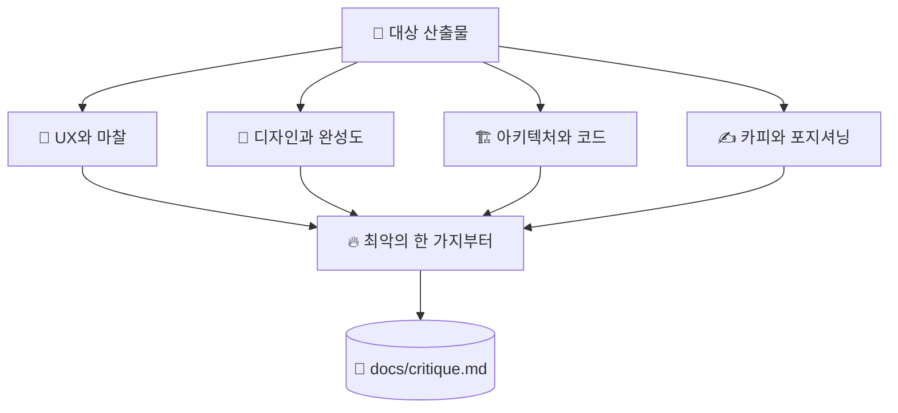

# 🔥 superforge-roast

[](https://opensource.org/licenses/MIT)
[](https://claude.com/claude-code)
[](https://github.com/takaoumehara/superforge-skill)

[English](README.md) · [日本語](README.ja.md) · [简体中文](README.zh-CN.md) · [Español](README.es.md) · **한국어**

> **눈치를 볼 이유가 전혀 없는 상대에게서, 내 작업의 가장 나쁜 점을 먼저 듣습니다.**

---

## 🔰 이게 뭔가요?

곁에 둘 만한 친구는 회의 전에 "이에 뭐 꼈어"라고 말해 주는 쪽이지, "괜찮아 보여"라고 하고 들여보내는 쪽이 아닙니다.

이 스킬은 디자인, PRD, 아키텍처, 카피에 대한 그런 친구입니다. 가장 나쁜 점을 한 문장으로 못 박고 시작해, 네 가지 렌즈로 훑고, 지적마다 구체적인 수정안을 붙입니다. "출발이 좋네요"도, 완충용 서두도, 분위기를 위한 동의도 없습니다.

---

## 📐 시스템 구조



발견은 화면별이 아니라 원인별로 묶습니다. 하나의 실수가 낳은 다섯 개의 증상은 다섯 건이 아니라 한 건의 작업이기 때문입니다.

---

## ✨ 3가지 강점

### 🚫 칭찬은 자제가 아니라 금지입니다
서두의 찬사도, 누그러뜨리는 절도, 따져 보면 버티지 못하는 결정에 대한 사교적 동의도 없습니다. 모델이 기본으로 갖춘 그 공손함이야말로 출시 전 피드백을 쓸모없게 만드는 원인입니다.

### 🔬 네 가지 렌즈를 의식적으로 들이댑니다
UX와 마찰 — 어디에서 헤매고 어디에서 떠나는가. 디자인과 완성도 — 흔한 템플릿 결과물처럼 보이지 않는가. 아키텍처 — 데이터가 불어나거나 네트워크가 끊길 때 어디가 무너지는가. 카피 — 설교조이거나 모호하거나 기업용 빈말은 아닌가.

### 🔨 모든 결함에 수정안이 따라붙습니다
출력은 두 덩어리입니다. **THE ROAST**가 약한 지점을 지목하고, **THE FORGE**가 무엇을 어떻게 바꿀지 제시합니다. 실행할 수 없는 비평은 정해진 시각에 기분이 나빴던 것에 지나지 않습니다.

---

## 🔄 도입 전 / 도입 후

| | 도입 전 | 도입 후 |
|---|---|---|
| 피드백의 첫 문장 | "시작이 좋네요. 몇 가지만…" | 가장 나쁜 한 가지를 한 문장으로 |
| 살펴보는 범위 | 눈에 띈 곳 위주 | 네 가지 렌즈를 의도적으로 |
| 발견 정리 방식 | 화면 단위로 나열 | 원인 단위로, 하나 고치면 여럿 해결 |
| 손에 남는 것 | 불만 목록 | 고쳐야 할 변경 목록 |

---

## 🚀 설치 및 사용법

`git`과 디렉터리에서 스킬을 불러오는 AI 도구만 있으면 됩니다.

### 🖥️ Claude Code (CLI)

원하는 위치에 전체 스위트를 클론한 뒤, 이 스킬 하나만 링크합니다.

```bash
git clone https://github.com/takaoumehara/superforge-skill ~/src/superforge-skill
ln -s ~/src/superforge-skill/skills/superforge-roast ~/.claude/skills/superforge-roast
```

Claude Code를 다시 시작하고 호출합니다.

```
/superforge-roast
```

`docs/`의 산출물, 파일 하나, 화면 하나, 붙여 넣은 카피 무엇이든 대상으로 삼을 수 있습니다. 결론은 `docs/critique.md`에 남습니다.

### 🔗 Codex CLI / Gemini CLI / Antigravity

링크할 디렉터리만 다릅니다. 설치 스크립트에 맡기면 이 머신의 모든 스킬 디렉터리를 찾아 열한 개를 한 번에 링크합니다.

```bash
cd ~/src/superforge-skill
./install.sh
```

여러 번 실행해도 결과가 같고, 자기가 만든 심볼릭 링크만 건드리며, `--dry-run`과 `--uninstall`을 지원합니다.

### 🌐 claude.ai (브라우저)

이 스킬 폴더를 zip으로 묶어 계정의 스킬 설정에서 업로드합니다.

```bash
cd ~/src/superforge-skill/skills/superforge-roast
zip -r superforge-roast.zip .
```

브라우저에서는 한 번에 하나씩만 올릴 수 있으므로 필요한 스킬 수만큼 반복합니다.

---

## 📄 라이선스

MIT — [LICENSE](../../LICENSE)를 참고하세요. 스킬 본문은 [SKILL.md](SKILL.md)에 있고, 휴리스틱 평가·접근성 감사·인지 부하 분석·가상 페르소나 테스트는 [references/evaluation-methods.md](references/evaluation-methods.md)에 있습니다. 스위트 전체 소개는 [superforge-skill](../../README.ko.md)을 보세요.
