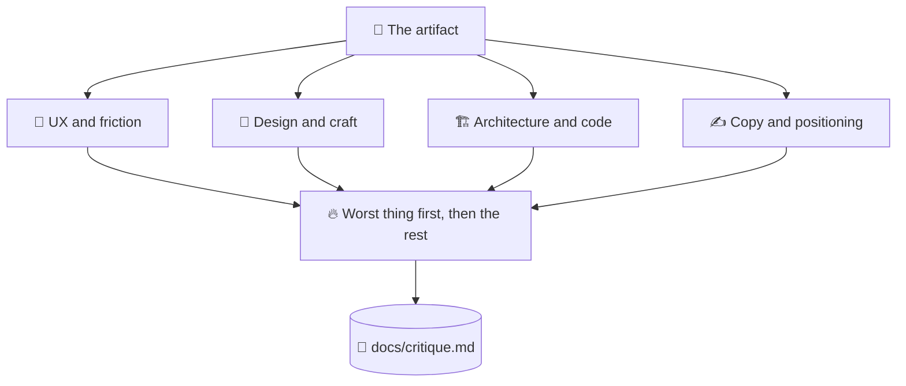

# 🔥 superforge-roast

[](https://opensource.org/licenses/MIT)
[](https://claude.com/claude-code)
[](https://github.com/takaoumehara/superforge-skill)

**English** · [日本語](README.ja.md) · [简体中文](README.zh-CN.md) · [Español](README.es.md) · [한국어](README.ko.md)

> **Hear the worst thing about your work from something that has no reason to be polite.**

---

## 🔰 What is this?

The friend worth having is the one who tells you there is spinach in your teeth before the meeting, not the one who says you look great and then watches you walk in.

This skill is that friend for a design, a PRD, an architecture, or a piece of copy. It opens with the single worst thing in one sentence, works through four separate lenses, and attaches a specific fix to every complaint. No "great start", no cushioning, no agreeing with you to be pleasant.

---

## 📐 Architecture



Findings are grouped by cause rather than by screen, because five symptoms of one mistake are one item of work, not five.

---

## ✨ Features

### 🚫 The compliment is banned, not just discouraged
No opening praise, no softening clause, no polite agreement with a decision that does not survive scrutiny. The politeness an AI defaults to is exactly what makes its feedback useless before a launch.

### 🔬 Four lenses, applied deliberately
UX and friction — where does someone get confused or leave? Design and craft — does this look like generic template output? Architecture — where does it break when data scales or the network drops? Copy — is this preachy, vague, or corporate filler?

### 🔨 Every flaw arrives with its fix
The output is two blocks: **THE ROAST** naming what is weak, and **THE FORGE** giving the specific change to make. A critique you cannot act on is just someone being unpleasant on a schedule.

---

## 🔄 Before / After

| | Before | After |
|---|---|---|
| How feedback opens | "Great start! A few small notes…" | The single worst thing, in one sentence |
| Coverage | Whatever happened to catch the eye | Four lenses, applied on purpose |
| How findings are grouped | Screen by screen | By cause, so one fix closes many |
| What you get | A list of complaints | A list of changes to make |

---

## 🚀 Install & Usage

You need `git` and an AI tool that loads skills from a directory.

### 🖥️ Claude Code (CLI)

Clone the suite anywhere, then link this one skill:

```bash
git clone https://github.com/takaoumehara/superforge-skill ~/src/superforge-skill
ln -s ~/src/superforge-skill/skills/superforge-roast ~/.claude/skills/superforge-roast
```

Restart Claude Code, then invoke it:

```
/superforge-roast
```

Point it at any artifact in `docs/`, a file, a screen, or pasted copy. The verdict lands in `docs/critique.md`.

### 🔗 Codex CLI / Gemini CLI / Antigravity

The same link, a different directory. Or let the installer find every skills directory on this machine and link all eleven skills at once:

```bash
cd ~/src/superforge-skill
./install.sh
```

It is idempotent, touches only its own symlinks, and accepts `--dry-run` and `--uninstall`.

### 🌐 claude.ai (browser)

Zip this skill's folder and upload it in your account's skill settings:

```bash
cd ~/src/superforge-skill/skills/superforge-roast
zip -r superforge-roast.zip .
```

The browser UI takes one skill at a time, so repeat it for each skill you want.

---

## 📄 License

MIT — see [LICENSE](../../LICENSE). The full skill body is in [SKILL.md](SKILL.md); heuristic evaluation, the accessibility audit, cognitive load analysis, and simulated persona testing are in [references/evaluation-methods.md](references/evaluation-methods.md). Suite overview: [superforge-skill](../../README.md).
