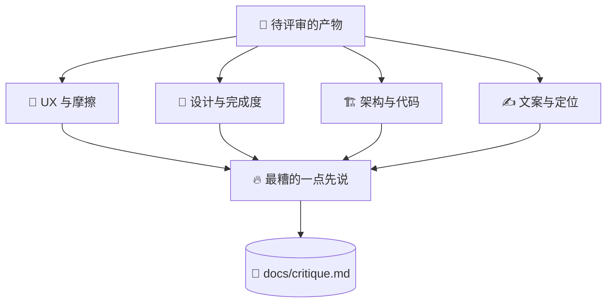

# 🔥 superforge-roast

[](https://opensource.org/licenses/MIT)
[](https://claude.com/claude-code)
[](https://github.com/takaoumehara/superforge-skill)

[English](README.md) · [日本語](README.ja.md) · **简体中文** · [Español](README.es.md) · [한국어](README.ko.md)

> **让一个没有理由跟你客气的对象，先把你作品里最糟的地方说出来。**

---

## 🔰 这是什么？

值得交的朋友，是开会前告诉你牙缝里有菜叶的那个，而不是说"你看着挺好"然后目送你进去的那个。

这个技能就是设计稿、PRD、架构方案或文案的那位朋友。它先用一句话点出最糟的一处，再用四个独立视角通读一遍，并给每一条指摘配上具体改法。没有"开头不错"，没有缓冲铺垫，也没有为了气氛而附和。

---

## 📐 系统架构



问题按成因归类，而不是按页面归类：同一个失误产生的五个症状是一件事，不是五件。

---

## ✨ 三大亮点

### 🚫 夸奖不是"少说"，是禁止
没有开场赞美，没有缓和用的从句，也没有对经不起推敲的决定客气地点头。AI 默认的那份礼貌，恰恰是让上线前的反馈变得毫无用处的原因。

### 🔬 四个视角，刻意逐一使用
UX 与摩擦——用户会在哪里困惑、在哪里放弃？设计与完成度——看起来是不是通用模板的产物？架构——数据涨上来、网络断掉时哪里会崩？文案——是不是说教、含糊，或者一堆企业套话？

### 🔨 每个毛病都配一条改法
输出分两块：**THE ROAST** 点名哪里弱，**THE FORGE** 给出具体要改成什么。不能落地的批评，只是按时到岗的一次不高兴。

---

## 🔄 使用前 / 使用后

| | 使用前 | 使用后 |
|---|---|---|
| 反馈怎么开头 | "开头不错，就是有几个小建议……" | 一句话说出最糟的一点 |
| 覆盖范围 | 哪儿扎眼看哪儿 | 四个视角，刻意逐一走完 |
| 问题怎么归类 | 一个页面一个页面地列 | 按成因归类，改一处消掉一片 |
| 最后拿到什么 | 一串抱怨 | 一串要动手改的事 |

---

## 🚀 安装与使用

只需要 `git`，以及一个从目录加载技能的 AI 工具。

### 🖥️ Claude Code（CLI）

把整套克隆到任意位置，然后只链接这一个技能：

```bash
git clone https://github.com/takaoumehara/superforge-skill ~/src/superforge-skill
ln -s ~/src/superforge-skill/skills/superforge-roast ~/.claude/skills/superforge-roast
```

重启 Claude Code，然后调用：

```
/superforge-roast
```

`docs/` 里的产物、某个文件、某个页面，或者直接粘贴的文案，都可以作为评审对象。结论会落在 `docs/critique.md`。

### 🔗 Codex CLI / Gemini CLI / Antigravity

链接方式相同，只是目录不同。也可以交给安装脚本，它会找出本机所有技能目录，一次性链接全部 11 个技能：

```bash
cd ~/src/superforge-skill
./install.sh
```

脚本可重复执行，只处理自己创建的符号链接，并支持 `--dry-run` 预览和 `--uninstall` 卸载。

### 🌐 claude.ai（浏览器）

把这个技能的文件夹打包成 zip，在账号的技能设置里上传：

```bash
cd ~/src/superforge-skill/skills/superforge-roast
zip -r superforge-roast.zip .
```

浏览器端一次只能传一个技能，需要几个就重复几次。

---

## 📄 许可证

MIT — 见 [LICENSE](../../LICENSE)。技能正文在 [SKILL.md](SKILL.md)；启发式评估、无障碍审计、认知负荷分析和模拟人物测试都在 [references/evaluation-methods.md](references/evaluation-methods.md)。整套说明见 [superforge-skill](../../README.md)。
