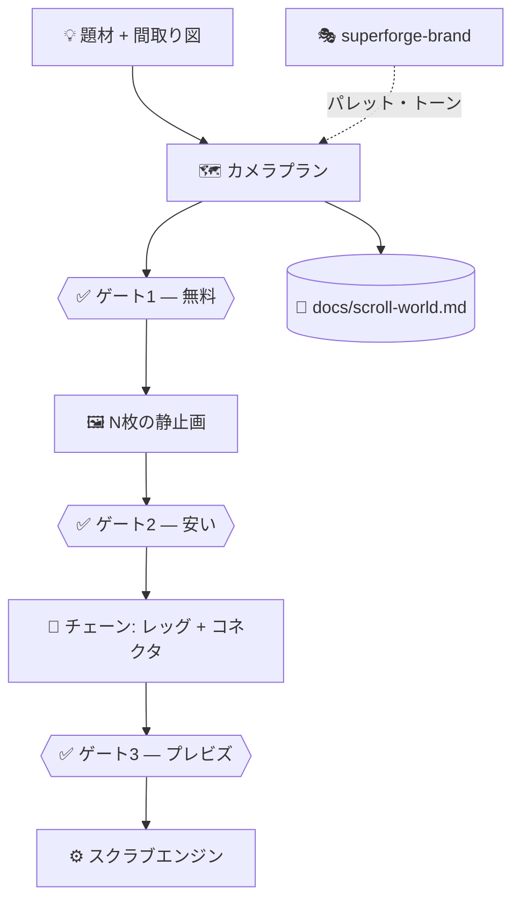

# 🎬 superforge-scroll

[](https://opensource.org/licenses/MIT)
[](https://claude.com/claude-code)
[](https://github.com/takaoumehara/superforge-skill)

[English](README.md) · **日本語**

> **スクロールがカメラを動かし、カットなしで世界を飛び抜ける。そのカメラを、1ピクセルも生成する前に設計する。**

---

## 🔰 これは何か

スクロールすると、カメラが建物の外から内部へ、そして次の空間へと途切れなく飛んでいくページ。Apple の製品ページや Emons のサイトがやっているあれです。仕掛けは WebGL ではありません。カメラは事前レンダリングされた動画のなかで本当に動いていて、スクロールは時間を送っているだけです。

難所はスクロールエンジンではありません。動画生成モデルは、**どう考えても同じ建物ではありえない美しいクリップを6本、平然と返してくる**ということです。

---

## 📐 全体像



---

## ✨ 特徴

### 🗺️ 生成の前に、カメラを設計する
静止画は「シーンの絵」ではなく、**カメラのフレーム0**です。だから先に空間を描きます。部屋と開口部を持つ間取り図、ルートマップ、あるいはアイランドレイアウト。そこから各レッグの位置・向き・レンズ・視点高さを持つショットリストと、すべての繋ぎ目で両側に何が写っていなければならないかを定めたシーム契約をつくります。ストーリー順序を隣接グラフの上で実際に歩かせ、幾何学的に到達できない部屋をストーリーが要求したときは——並べ替える、廊下を挟む、部屋を2レッグに割る、例外シームとして device を明示する——**レンダリング後ではなく紙の上で**解決します。

### ☀️ 太陽は動かない
光の向きはシーンごとに選ぶものではなく、固定した太陽方位角からカメラの向きを引いて**導出する**ものです。まっすぐ進んでいるのに逆光が逆光のまま、という映像を目は理由を言えないまま拒絶します。

### 🔌 実際に契約しているサービスで動く
Kie.ai、Higgsfield、Monid、fal、Replicate、ベンダー直 API、接続済みの MCP ツール——すべて 5 行の能力契約と 2 つのシェル関数の背後に置かれています。特定ベンダーのハードコードはなく、あなたのお金を使う前に勝手にバックエンドが選ばれることもありません。

### 🔍 「成功に見える失敗」を捕まえるプローブ
動画 API は、先頭フレームを受け取り、プロンプトを無視し、課金し、技術的にはフレームロックされた**逆方向に飛ぶクリップ**を返すことがあります。ログはすべて成功と言います。最低解像度の安いプローブ3本がこれを捕まえます——誰も走らせないやつを含めて。同じ画像に正反対のプロンプトを2本投げ、出力が実際に分岐することを確認します。

### 🧵 フレーム一致のシーム
連結されるクリップは必ず前のクリップの**実際にレンダリングされた最終フレーム**から始まります。同じ被写体を生成し直したものではありません。これと短いクロスフェードが、「ひと続きの飛行」と「6本のクリップの並び」を分けます。

### 📱 モバイルはクロップではなく、2本目のチェーン
必ず確認し、黙って両方つくることはせず、コストを数字で伝えます。スマホ向けに構図された 9:16 のネイティブレンダリング——16:9 をポートレートに切ると、真ん中の 26% しか映らないからです。エンジン側のスマホ対策（シーク合流、iOS プライミング、セーフエリア）は選択に関係なく常時オンです。

---

## 🔄 Before / After

| | Before | After |
|---|---|---|
| 作業順序 | シーンを生成してから経路を探す | 経路を設計してからサンプリングする |
| カメラ指示 | 「かっこよく飛んで」 | レッグごとの位置・向き・レンズ・視点高さ |
| ライティング | シーンごとに選ぶ | 固定太陽方位角から導出 |
| 繋ぎ目 | 祈り、次にクロスフェードを伸ばす | 2つのアンカーを名指しした契約 |
| 動画バックエンド | スキルが書かれた時点のもの | プローブを通ったサービスすべて |
| 最初の出費 | チェーン全体 | 無料のプラン → 安い静止画 → プレビズ |

---

## 🚀 導入と使い方

### 🖥️ 15スキルをまとめて導入（一度だけ）

```bash
git clone https://github.com/takaoumehara/superforge-skill
cd superforge-skill
./install.sh
```

オプション、個別導入、claude.ai へのアップロードは[スイート README](../../README.ja.md) を参照。

### ⌨️ 呼び出す

```
/superforge-scroll
```

間取り図があれば持ってきてください。建築・インテリア案件では、渡せるもののなかで最も価値の高い入力です。動画バックエンドが未設定でも、プラン・ショットリスト・プロンプトまでは出ます。

---

## 📄 ライセンスと出典

MIT — [LICENSE](../../LICENSE) を参照。

**[scroll-world](https://github.com/oso95/scroll-world)**（作者 cyw、MIT）から派生。スクラブエンジン（`references/scrub-engine.js`）、背景ノックアウトスクリプト、ページテンプレート、フレーム受け渡しによるシーム手法は同プロジェクトの成果物で、記載のあるものは無変更で引き継いでいます。

本版で追加したもの：事前設計レイヤー、ハードコードされたベンダーを置き換えるバックエンド抽象化と資格プローブ、カメラ姿勢駆動の静止画プロンプト、スイートへの統合。

スキル本文：[SKILL.md](SKILL.md)。スイート全体：[superforge-skill](../../README.ja.md)。
