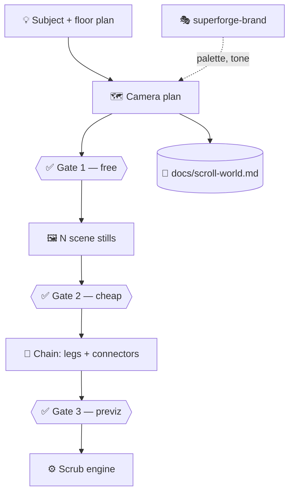

# 🎬 superforge-scroll

[](https://opensource.org/licenses/MIT)
[](https://claude.com/claude-code)
[](https://github.com/takaoumehara/superforge-skill)

**English** · [日本語](README.ja.md)

> **Scroll drives a camera through a world, with no cuts — and the camera is planned before a single pixel is generated.**

---

## 🔰 What is this?

The page where you scroll and a camera flies from outside a building into its interior, then on to the next space, continuously. Apple's product pages do it; so does the Emons logistics site. The trick is not WebGL — the camera genuinely moved, in pre-rendered video, and scroll only drives time.

The hard part is not the scroll engine. It is that a generative video model will happily produce six beautiful clips that cannot possibly be the same building.

---

## 📐 Architecture



---

## ✨ Features

### 🗺️ The camera is planned before anything is generated
The still is not a picture of the scene — it is the camera's frame 0. So the skill draws the space first: a floor plan with rooms and apertures, a route map, or an island layout, then a shot list carrying position, heading, lens and eye height per leg, and a seam contract naming what must be visible on both sides of every handoff. Story order is walked against the adjacency graph, and when the story wants a room the geometry can't reach, that conflict is resolved on paper — reorder, insert a corridor, split a room, or declare an exception seam — instead of discovered after the render.

### ☀️ The sun does not move
Light direction is derived from one fixed azimuth minus the current camera heading, per leg, rather than picked per scene. A build where you walk straight ahead and the backlight stays behind you is the thing the eye rejects without being able to say why.

### 🔌 Whichever video service you actually have
Kie.ai, Higgsfield, Monid, fal, Replicate, a direct vendor API, or a connected MCP tool — all behind one five-line capability contract and two shell functions. No vendor is hardcoded, and none is silently chosen for you before it spends your money.

### 🔍 The probe that catches the failure which looks like success
A video API can accept your first frame, ignore your prompt, bill you, and return a technically frame-locked clip flying the wrong direction. Every log says success. Three cheap probes at the lowest resolution catch it — including the one nobody runs: same image, two opposite prompts, confirm the outputs actually diverge.

### 🧵 Frame-identical seams
Every chained clip starts from the previous clip's *actual rendered last frame*, never from a fresh render of the same subject. That plus a short crossfade is the difference between one continuous flight and six clips in a row.

### 📱 Mobile is a second chain, not a crop
Always asked, never silently generated, cost stated. A native 9:16 render composed for phones — because cropping a 16:9 film to portrait shows the middle 26% of it. The engine's phone hardening (seek coalescing, iOS priming, safe-area) is always on regardless.

---

## 🔄 Before / After

| | Before | After |
|---|---|---|
| Order of work | Generate scenes, then find a route between them | Design the route, then sample it |
| Camera direction | "fly through it, make it cinematic" | Position, heading, lens, eye height, per leg |
| Lighting | Chosen per scene | Derived from a fixed sun azimuth |
| Seams | Hope, then a longer crossfade | A contract with two named anchors |
| Video backend | Whatever the skill was written against | Any service that passes the probe |
| First spend | The full chain | A free plan, then cheap stills, then previz |

---

## 🚀 Install & Usage

### 🖥️ Install all fifteen skills (once)

```bash
git clone https://github.com/takaoumehara/superforge-skill
cd superforge-skill
./install.sh
```

Full options, single-skill installs, and the claude.ai upload route are in the [suite README](../../README.md).

### ⌨️ Call it

```
/superforge-scroll
```

Bring a floor plan if you have one — on architecture and interior work it is the highest-value thing you can hand over. Without any video backend configured, the skill still produces the plan, the shot list, and the prompts.

---

## 📄 License & Attribution

MIT — see [LICENSE](../../LICENSE).

Derived from **[scroll-world](https://github.com/oso95/scroll-world)** by cyw, MIT licensed. The scrub engine (`references/scrub-engine.js`), the background knockout script, the page template, and the frame-handoff seam method are that project's work, carried over unmodified where noted.

This version adds the pre-production planning layer, the backend abstraction and qualification probe that replace the hardcoded vendor, camera-pose-driven still prompts, and suite integration.

Full skill body: [SKILL.md](SKILL.md). Suite overview: [superforge-skill](../../README.md).
