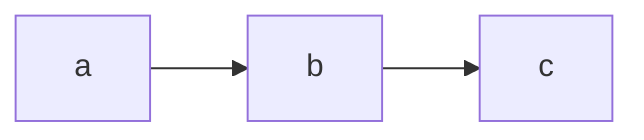

# Scroll World Plan — [PROJECT]

> Copy to `docs/scroll-world.md` and fill. **Nothing is generated until §8 passes.**
> Method: `superforge-scroll/references/planning.md`.

- **Subject:** [business + one-line pitch]
- **Brand:** [name] · palette from `docs/brand.md` if it exists, otherwise listed in §0
- **Scenes (N):** [5–7]
- **Mobile:** [not asked | desktop only | desktop + native 9:16 | landscape crop, user approved YYYY-MM-DD]
  — §10 fails the build while this still reads `not asked`.
- **Plan approved by user:** [date] · **Storyboard approved:** [date] · **Previz approved:** [date]

---

## 0. Direction

| | |
|---|---|
| Art direction | [clay diorama / papercraft / glossy toy / claymation / neon night / photoreal architectural] |
| Style preamble | see `docs/scroll-world.style.txt` — byte-identical in every prompt |
| Palette | `[name] #hex` ×4–6 · **background:** `#…` · **accent:** `#…` |
| Tone | [two words] |

## 1. World type and architecture

| | |
|---|---|
| `WORLD_TYPE` | [bounded interior / continuous terrain / archipelago / hybrid] |
| Source plan | [floor plan PDF at path / listing image / none — authored below] |
| `ARCH` | [A continuous forward take / B dive + aerial connector] |
| Coherent? | [why this architecture fits this world type — planning.md §1] |

## 2. The map

### Rooms / waypoints / islands

| id | name | footprint or position | height | window wall | key props |
|---|---|---|---|---|---|
| | | | | | |

### Apertures / thresholds

| id | from → to | position | width | type | camera passes at |
|---|---|---|---|---|---|
| | | | | | |

### Adjacency

### Rendered map

`python3 scripts/plan_map.py docs/scroll-world.md` → `docs/scroll-world.svg`
(add `--lang ja|ko|zh-CN|es` for chrome labels; default English). Re-run after every
edit to the tables above — it also checks position and heading continuity.

| | |
|---|---|
| Last rendered | [date] |
| Continuity check | [ok / N problems — paste them here] |

### Path walkability

| # | scene | reached from previous via | ok? |
|---|---|---|---|
| 0 | | — (start) | — |
| 1 | | | |

Conflicts between story order and geometry, and how each was resolved
(reorder / transit leg / split a room / declared exception seam):

- [ ]

## 3. Invariants — fixed once, stated in every prompt

| | |
|---|---|
| Eye height `EYE_Z` | [1.55 m walkthrough / 2.4 m glide / 30–60 m drone / 80 m god's-eye] |
| Lens `LENS` | [24 mm] |
| Time of day | [16:30] |
| Sun azimuth `SUN_AZ` | [250° WSW, low and warm] |
| Speed | [0.8 m/s] |

## 4. Shot list

| # | scene | dur | pos start | head start | pos end | head end | move | focal point | exit through | light clause (SUN_AZ − head) |
|---|---|---|---|---|---|---|---|---|---|---|
| 0 | | | | | | | | | | |

`pos end` of each leg **is** `pos start` of the next. Check the numbers, not the intent.

## 5. Seam contract

| seam | aperture | Δhead | Δheight | outgoing frame must show | incoming frame must show | anchor 1 | anchor 2 |
|---|---|---|---|---|---|---|---|
| 0→1 | | | | | | | |

Exception seams and the device that pays for each:

- [ ]

## 6. Copy and pacing

| # | scene | eyebrow | title | body | tags | `scroll` | `linger` |
|---|---|---|---|---|---|---|---|
| 0 | | | | | | 1.3 | 0 |

Total runtime ≈ [Σ durations] s. Over ~70 s, cut a scene rather than speed everything up.

## 7. Backend

| | |
|---|---|
| Backend | [Kie.ai / Higgsfield / Monid / fal / Replicate / vendor / MCP / generic HTTP] |
| Reached via | [REST / CLI / MCP tool name] |
| `VMODEL` | |
| Capability class | [start-only → arch A / start + optional end → full / start + required end → connector-only] |
| **Probe date** | |
| Probe 1 — frame-lock | [PSNR __ dB · pass/fail] |
| Probe 2 — steerability | [opposite prompts diverged? pass/fail] |
| Probe 3 — end frame | [lands on composition? pass/fail/skipped] |
| Aspect honoured (C4) | |
| Result URL TTL | |
| Per-clip cost | |

**Estimate:** N stills + (2N−1) clips [×2 mobile] + 15% re-roll = **[total]**
**User approved spend:** [date]

## 8. Validation gate

- [ ] `WORLD_TYPE` recorded and the architecture is coherent with it
- [ ] Every consecutive scene pair joined by a named aperture/threshold, or a declared
      exception seam with a named device
- [ ] `pos end` of every leg equals `pos start` of the next, numerically — `plan_map.py` checks this
- [ ] No seam reverses velocity; Δheading ≤ 15° (≤ 45° only through an occluding
      aperture); Δheight = 0 at every seam — `plan_map.py` checks the heading
- [ ] Eye height, lens, sun azimuth, speed fixed and stated in every prompt
- [ ] Every light clause derived from `SUN_AZ − heading`, not chosen
- [ ] Two shared anchors per seam, one a light source or large surface
- [ ] Every leg names its exit aperture, and that aperture is in the leg's last-frame
      requirement
- [ ] Every still prompt carries its camera pose from §4
- [ ] Clip count and cost computed against the probed price and approved by the user
- [ ] Total runtime under ~70 s
- [ ] `docs/scroll-world.svg` rendered, exits clean, and shown to the user

## 9. Build log

| date | step | outcome | cost |
|---|---|---|---|
| | | | |
