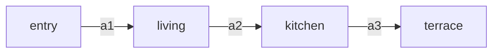

# Pre-production — the world plan, the floor plan, and the camera

This is the file the build lives or dies on, and it is the one everybody skips because
it produces no pixels.

## The premise nobody states

In this pipeline **the scene still is not a picture of the scene. It is the camera's
frame 0.** And every leg's last frame is the next leg's frame 0. So the finished film is
not "N images stitched together" — it is **one camera moving continuously through one
space**, and the stills are simply the frames where that camera happened to start.

Which means the ordering everybody reaches for is backwards:

> ❌ generate pretty scenes → ask a video model to invent a route between them
> ✅ design the camera's route through a space → sample it at N points → those samples
>    are your stills

Do it backwards and the model is handed six photographs shot from six unrelated
positions and asked to fly between them. It will comply. It will also invent geometry
that contradicts itself at every seam, and no amount of frame-locking fixes that,
because frame-locking guarantees *pixel* continuity, not *spatial* continuity. The seam
will be technically perfect and the building will still be impossible.

**Nothing is generated until `docs/scroll-world.md` exists and passes §8.**

---

## 1. Classify the space first — it decides the camera, not taste

The upstream version of this skill asks the user which camera feel they want, as pure
preference. That is one question too early. **The space constrains which camera
architectures are even physically coherent**; preference then picks among the survivors.

| World type | What it is | Typical subjects | Map form | Coherent architecture |
|---|---|---|---|---|
| **Bounded interior** | one structure; rooms joined by real apertures | architecture, interior design, real estate, hotel, restaurant, retail, gallery, clinic | **floor plan** | **A only.** Doors are the seams. |
| **Continuous terrain** | one landscape traversed on a route | travel, campus, farm-to-table, logistics, festival, resort grounds | **route map** | **A.** Thresholds (gate, ridge, treeline) are the seams. |
| **Archipelago** | discrete islands floating in abstract space | diorama/miniature, B2B value chain, SaaS process, "how it's made" | **island layout** | **B.** Sky is the seam. A also works if you add connecting ground. |
| **Hybrid** | a bounded interior *inside* a terrain, or one aerial hop in an otherwise grounded film | mixed-use, campus-with-buildings | both | A, with named **exception seams** (§5) |

Two rules that fall straight out of this and save entire builds:

- **Architecture B inside a bounded interior is a bug.** B pulls the camera up and out
  between scenes. In a diorama that reads as "zoom out to the map." Inside a
  photorealistic house it reads as the camera flying up through the ceiling. If the user
  asks for B on an interior, show them this row and get an explicit override.
- **Architecture A across an archipelago needs ground.** A never pulls back, so islands
  floating in a void give it nothing to travel over. Either add a connecting surface to
  the world (a road, a boardwalk, a shared plinth) or use B.

Record as `WORLD_TYPE`.

---

## 2. Draw the map

The map is the artifact that makes every later question answerable instead of arguable.
It is cheap — it is text — and it is the only place where "can the camera physically get
from scene 3 to scene 4" is a question with an answer.

### 2a. Bounded interior — the floor plan

**If the user has a real floor plan** (an architect's PDF, a listing image, a CAD
export), read it and transcribe it into the two tables below. Do not eyeball the camera
path off the drawing — transcribe first, then design on the table. Ask for the plan
before assuming there isn't one; on architecture and real-estate work there almost
always is, and it is the single highest-value input the user can hand over.

**If there is no plan**, author one. A plausible plan you wrote down beats an implicit
plan you didn't, and it takes ten minutes.

Coordinates: **x east, y north, z up, metres**, origin at the building's south-west
corner. Headings in **compass degrees** (0 = north, 90 = east). This is not pedantry —
§5's seam rule is arithmetic on these numbers, and you cannot do arithmetic on "sort of
towards the kitchen."

**Rooms**

| id | name | footprint (x0,y0)–(x1,y1) | ceiling | window wall | key props |
|---|---|---|---|---|---|
| `entry` | Entrance hall | (0,0)–(4,6) | 3.2 | none | oak bench, stone floor, tall mirror |
| `living` | Living room | (4,0)–(12,7) | 4.0 | south, full-height glass | low sofa, travertine hearth, olive tree |
| `kitchen` | Kitchen | (12,0)–(18,7) | 3.0 | east | island, brass pendants, open shelving |

**Apertures** — the seams live here, so they get their own table

| id | from → to | position | width | type | camera passes at |
|---|---|---|---|---|---|
| `a1` | `entry` → `living` | (4, 3) | 2.4 | wide opening | z 1.55, heading 90° |
| `a2` | `living` → `kitchen` | (12, 4) | 1.8 | glass pocket door | z 1.55, heading 90° |

**Adjacency** — draw it, then look at it



### 2b. Continuous terrain — the route map

Same idea, waypoints instead of rooms: `wp | name | position | elevation | what's visible
from here | threshold to next`. The "aperture" equivalent is a **threshold** — a gate, a
ridge crest, a treeline, a tunnel mouth. Seams belong at thresholds, never in open
ground, because a threshold gives the model an occluder to hide the handoff behind.

### 2c. Archipelago — the island layout

`island | name | grid cell | approx size | orientation | what the camera dives toward`.
Lay the islands out on an actual 2D grid and keep the aerial hops short and mostly in one
direction — a connector that flies back over an island the visitor already saw reads as
getting lost.

### 2d. The path must be walkable

Now the check that makes the map worth drawing. **Walk the story order along the
adjacency graph.** Every consecutive pair of scenes must be joined by an aperture or a
threshold.

When the story order and the geometry disagree — and they will, because the story wants
to end on the master suite and the master suite is next to the entrance — you have
exactly four honest moves:

1. **Reorder the story** to follow the building. Usually right, and usually resisted.
2. **Insert a transit leg** — a corridor, a stair, a courtyard. Costs one more clip and
   is almost always the best answer, because circulation space is what a real building
   uses to solve the same problem.
3. **Split a room into two legs** — one room, two camera moves. Free spatially: the seam
   is mid-room, and mid-room seams are the easiest ones to hold.
4. **Declare an exception seam** (§5) and pay for it with an explicit device.

What you may not do is put the seam there anyway and hope. That's the pop.

### 2e. Render it, and let the render check itself

The tables carry coordinates, so the map can be drawn rather than imagined:

```bash
python3 scripts/plan_map.py docs/scroll-world.md            # -> docs/scroll-world.svg
python3 scripts/plan_map.py --lang ja                       # chrome in ja/ko/zh-CN/es; default en
```

Room footprints, apertures as diamonds on the walls they pierce, the numbered camera
path, a heading tick at each leg start, north, the sun's direction, and a scale bar.
Room and scene names render in whatever language the plan is written in; only the
chrome labels are translated.

It also runs two checks on the way past, because they are arithmetic on numbers already
in the tables and no human should be doing them by hand:

- **`pos end` of leg *i* equals `pos start` of leg *i+1`** (§5). A gap means the camera
  teleports.
- **Δheading at each seam is within 15°** (§6 law 2). A bigger turn has to happen inside
  the outgoing leg.

It exits non-zero when either fails, so it can gate a build, and it draws the map anyway
— a picture of the broken plan is exactly what you want while fixing it.

That covers two lines of §8's checklist mechanically. The rest still need a person,
because "is the story order right" is not arithmetic.

---

## 3. Fix the invariants — one line each, and never revisited

Four numbers that apply to the whole film. They belong at the top of the plan, and if any
of them changes mid-film the audience reads a cut even when the frames are locked.

| Invariant | Choose once | Why it can't drift |
|---|---|---|
| **Eye height `z`** | walkthrough 1.55 m · gliding 2.4 m · drone 30–60 m · diorama god's-eye 80 m | Height changes read as the viewer changing species. Ramp it *inside* a leg if you must, never at a seam. |
| **Lens** | 24 mm interiors · 35 mm product/craft · 18 mm for scale · 50 mm+ for intimacy | Focal length change = a cut, full stop. Perspective distortion is the most legible continuity break there is. |
| **Time of day + sun azimuth** | e.g. "16:30, sun at 250° (WSW), low and warm" | §4. |
| **Motion speed** | metres per second, e.g. 0.8 m/s walking glide | Velocity mismatch across a seam is the "stutter" gotcha in mechanical form. |

State these in every prompt. Yes, in every one, verbatim — the same reason the style
preamble is byte-identical.

---

## 4. Light continuity — the tell that gives away a fake building

**The sun does not move during a 45-second walkthrough.** So light direction is not a
per-scene aesthetic choice; it is a *consequence* of the fixed sun azimuth and the
camera's current heading, and it must be computed per leg rather than picked.

```
light_in_frame = sun_azimuth − camera_heading
```

| Result (deg) | Where the light lands | How to say it in the prompt |
|---|---|---|
| ≈ 0 (±40) | behind the subject | "strongly backlit, the window blowing out behind, long shadows reaching toward camera" |
| ≈ 90 | from frame right | "raking light entering from the right, shadows falling left" |
| ≈ 180 | behind the camera | "frontally lit, shadows falling away from camera, flat and even" |
| ≈ 270 | from frame left | "raking light entering from the left, shadows falling right" |

Add the derived clause to the light row of every leg in the shot list. A build where
scene 2 is backlit and scene 3 — reached by walking straight ahead — is also backlit is a
build the eye rejects without being able to say why.

Interiors with no window get the same treatment through the *artificial* key: name the
fixture, its position, and its colour temperature once, and keep it.

---

## 5. The shot list — one row per leg, and it is a contract

This is the storyboard, in the only form the pipeline can actually consume.

| # | scene | dur | pos start | head start | pos end | head end | move | focal point | exit through | light |
|---|---|---|---|---|---|---|---|---|---|---|
| 0 | `entry` | 8s | (2.0, 1.0, 1.55) | 90° | (3.6, 3.0, 1.55) | 90° | plain forward glide | the mirror, then past it | `a1` | 160° → frontal, flat |
| 1 | `living` | 10s | (3.6, 3.0, 1.55) | 90° | (11.4, 4.0, 1.55) | 90° | slow half-orbit around the hearth, resolve forward | travertine hearth | `a2` | 160° → frontal |
| 2 | `kitchen` | 8s | (11.4, 4.0, 1.55) | 90° | (16.0, 4.0, 1.55) | 75° | low lateral track along the island | brass pendants | `a3` | 175° → frontal, warm |

Reading the table, three things are now true that were guesses before:

- **`pos end` of leg *i* is `pos start` of leg *i+1`.** Literally the same numbers. If
  they differ, the camera teleported.
- **`exit through` names a real aperture from §2**, so the leg prompt can say *which*
  opening to head for, and the last-frame check has something specific to verify.
- **`move` comes from the concept**, but it always resolves back to forward drift before
  the seam (§6).

### Mid-leg move library

Reversals are safe *inside* a leg — one leg is one continuous render, there is no seam to
break. Only a seam may never reverse.

| Concept | Move |
|---|---|
| Product / luxury retail | slow half-orbit around the hero object, then continue past it |
| Real estate / hospitality | steadicam glide through the aperture; gentle crane-up in double-height space |
| Industrial / process / logistics | low lateral track alongside the line, foreground parallax |
| Travel / outdoors / campus | drone rise-and-reveal, then a descending swoop |
| Food / craft / detail | push in close to the craft moment, ease back, carry on |
| Gallery / museum | slow lateral track past the wall, pausing on one work |
| Miniature (arch. B) | dive in; the aerial connector *is* the grammar |
| Anything where the room is the star | plain forward glide. Zero risk, and frequently the right answer. |

Expressive moves raise re-roll odds — a fancy move can end in a pose that isn't a clean
forward drift, which poisons every leg after it. Budget one extra re-roll per expressive
leg, and check the last frame before chaining (§7).

**Locked-iso variant:** skip the library, pin the view — "the camera keeps exactly the
same high isometric angle throughout, no rotation, no orbit, no tilt; it only travels
straight and level, the world sliding past beneath the same view." Calmest look, cheapest
re-rolls, closest to the Emons reference.

---

## 6. The seam contract — where builds actually fail

One row per seam. Fill it before generating, check against it after.

| seam | aperture | Δheading | Δheight | outgoing frame must show | incoming frame must show | shared anchors |
|---|---|---|---|---|---|---|
| 0→1 | `a1` | 0° | 0 m | the opening filling frame centre, hearth edge just visible beyond | the same hearth edge, now centre-left; the opening's jamb at frame edge | travertine hearth · south window glare |
| 1→2 | `a2` | 0° | 0 m | pocket door open, island silhouette beyond | island in centre, door jamb trailing at frame left | island slab · brass pendant |

**The two-anchor rule.** At every seam, **at least two elements visible in the outgoing
frame must still be visible in the incoming frame**, and one of them should be a light
source or a large material surface rather than a small prop. Two anchors is what makes
the eye read "same place, camera moved" instead of "different place, cut." It costs
nothing — it is a sentence in two prompts — and it is the difference between a seam that
survives the drift a generative model inevitably introduces and one that doesn't.

**Seam laws, in priority order:**

1. **Velocity never reverses across a seam.** Forward into the seam, forward out of it.
   This is the whole reason architecture A exists.
2. **Δheading ≤ 15°** at a seam under normal circumstances; up to 45° only when the
   camera is passing through a narrow aperture that occludes the turn. A 90° turn at a
   seam needs the turn to happen *inside* the outgoing leg, finishing before the handoff.
3. **Δheight = 0** at a seam. Ramp height inside a leg.
4. **Lens and speed are invariant** (§3).
5. **Two anchors** carry across.

**Exception seams.** Sometimes the story genuinely needs a jump the geometry can't
support — a cut from the model suite to the rooftop. Don't pretend it's continuous.
Declare it, and pay for it with a device the audience reads as intentional: pass through
a full-frame occluder (a wall, a closing door, a passing column), a white/black bloom, or
in a diorama the aerial pull-out. Exception seams must be listed in the plan with the
device named. One per film is a flourish; three is a slideshow.

---

## 7. Approve on paper, then on stills, then spend on video

Three gates, cheapest first. Most of the money in a bad build is spent between gate 1 and
gate 2 by someone who skipped gate 1.

| Gate | Artifact | Cost | Kills |
|---|---|---|---|
| **1. Plan** | `docs/scroll-world.md` — map, invariants, shot list, seam contract | free | impossible geometry, backwards story order, sun that moves |
| **2. Storyboard** | the N stills, in order, as a contact sheet | ~N image gens (cheap) | style drift, wrong camera pose, a scene that doesn't read |
| **3. Previz** | the whole chain at the cheapest tier / lowest resolution | ~⅕–¼ of final | motion that doesn't obey, seams that don't hold, a journey that drags |

Show the user gate 1 and gate 2 output and get an explicit go each time. Gate 3 is
optional when N is small and the budget is comfortable; it is mandatory when the build is
over ~8 clips or the user's balance is tight, because re-rendering a 12-clip chain at
full resolution because leg 4 turned the wrong way is the expensive mistake this skill
exists to prevent.

**Between gate 2 and gate 3, one more check that costs nothing:** lay the stills side by
side in path order and ask whether a person could walk from each one into the next. If
you can't, the model can't either.

---

## 8. Validation gate — check before spending

Do not generate video until every line is true. Write the checked plan to
`docs/scroll-world.md`.

- [ ] `WORLD_TYPE` recorded, and the chosen architecture is coherent with it (§1)
- [ ] Every consecutive scene pair is joined by a named aperture/threshold — or is a
      declared exception seam with a named device (§2d, §6)
- [ ] `pos end` of every leg equals `pos start` of the next, numerically (§5) — `plan_map.py` checks this
- [ ] No seam reverses velocity; every Δheading ≤ 15° (or ≤ 45° through an occluding
      aperture); every Δheight = 0 (§6) — `plan_map.py` checks the heading
- [ ] Eye height, lens, sun azimuth, and speed fixed once and stated in every prompt (§3)
- [ ] Every leg's light clause is *derived* from `sun_azimuth − heading`, not chosen (§4)
- [ ] Every seam names two shared anchors, one of them a light source or large surface (§6)
- [ ] Every leg names the aperture it exits through, and that aperture appears in the
      leg's last-frame requirement (§5, §6)
- [ ] Every still prompt carries its camera pose from the shot list — no still is
      prompted without one (§9)
- [ ] Clip count `(2N−1)` desktop, `×2` if mobile, `+15%` re-roll headroom — costed
      against the chosen backend's actual per-clip price and approved by the user
- [ ] `docs/scroll-world.svg` rendered (§2e), exits clean, and shown to the user
- [ ] Total runtime ≈ Σ durations. Over ~70 s, cut a scene rather than speed everything up

Five to seven scenes is the working range. Under four there is no journey; over eight the
visitor stops scrolling before the payoff and you have paid for clips nobody sees.

---

## 9. Handing the plan to the prompts

Every prompt in `prompts.md` has slots that this plan fills. The still prompt gains a
camera block, and it is not optional — a still generated without a stated camera pose is
a still generated from a pose the model invented, which is the failure §0 describes.

```
Camera: [LENS]mm equivalent, [Z]m above the floor, standing at [POS_START] facing
[HEADING as a description: "toward the far glass wall", "down the length of the island"],
level horizon, no tilt.
Light: [TIME_OF_DAY], [derived light clause from §4].
```

And the leg prompt's closing clause names the real aperture instead of gesturing at one:

```
In the final second, settle into a slow, steady forward glide toward [APERTURE_DESC],
which sits [POSITION IN FRAME]. [Two anchors] remain visible as the camera arrives.
```

That last sentence is the seam contract, expressed as a prompt. It is three extra clauses
and it is the highest-leverage text in the whole build.

---

## 10. The plan template

Copy `assets/templates/scroll-world.md` into the project's `docs/` and fill it. It is the
same eight sections as above, empty, with the tables pre-drawn. If the project already
has `docs/brand.md` (from `superforge-brand`), the palette, tone, and art direction come
from there rather than being re-decided here — colour and type are decided once in this
suite, never twice.
