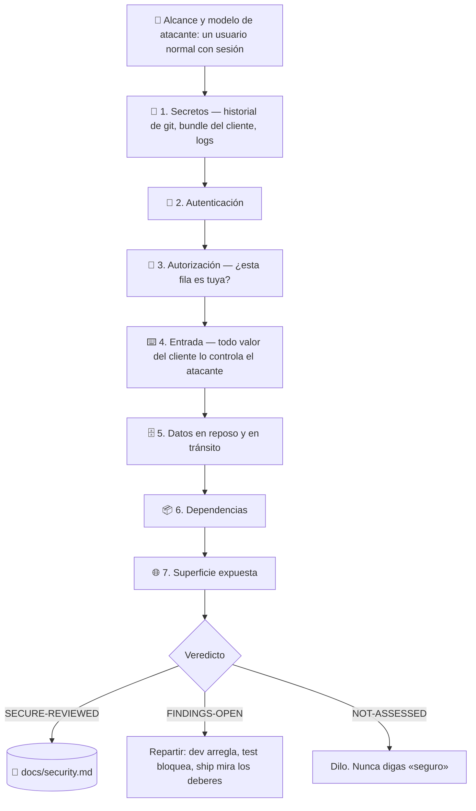

# 🔐 superforge-secure

[](https://opensource.org/licenses/MIT)
[](https://claude.com/claude-code)
[](https://github.com/takaoumehara/superforge-skill)

[English](README.md) · [日本語](README.ja.md) · [简体中文](README.zh-CN.md) · **Español** · [한국어](README.ko.md)

> **El producto funciona perfectamente. Y cualquier usuario con sesión iniciada puede cambiar un número en la URL y leer los datos de otro.**

---

## 🔰 ¿Qué es esto?

Casi nada de lo que sale mal en un producto pequeño es sofisticado.

Es una clave de servicio subida al repositorio hace tres meses y eliminada en un commit posterior — lo cual no la elimina del repositorio. Es una clave puesta en una variable de entorno con prefijo `NEXT_PUBLIC_`, que significa *compilada dentro del cliente*, que significa pública. Es un endpoint que comprueba con cuidado quién eres y nunca comprueba si el registro que has pedido es tuyo.

Esos tres explican una parte muy grande de los incidentes reales a esta escala, y ninguno lo encuentra un escáner de dependencias — que es justo lo que la mayoría quiere decir cuando dice que ya lo ha comprobado.

Esta skill ejecuta siete pasadas, ordena cada hallazgo por **lo que el atacante consigue de verdad**, y escribe un registro que `superforge-ship` lee antes de una release. Nunca informa de que algo es seguro, porque ese no es un estado que una revisión pueda establecer.

---

## 📐 Arquitectura



Los hallazgos están en las pasadas 1 y 3. Si falta tiempo, ejecuta esas dos bien en lugar de las siete por encima — y dilo en el informe.

---

## ✨ Puntos clave

### 🚫 Nunca dice «seguro»
«Seguro» es la ausencia de todo fallo desconocido, y ningún proceso puede demostrar eso. Una revisión solo puede decir: estas pasadas se ejecutaron sobre esta superficie en esta fecha, esto encontraron y esto no cubrieron. Los códigos son `SECURE-REVIEWED` / `FINDINGS-OPEN` / `NOT-ASSESSED`. A quien le dicen «lo hemos comprobado, es seguro» deja de mirar, y ahí está lo caro de un aprobado falso.

### 👥 La prueba de dos cuentas
Crea dos cuentas, coge el ID de un registro de la primera y úsalo con la sesión de la segunda. Hazlo con cada tipo de recurso. Lleva alrededor de una hora y es **la hora más rentable de toda esta skill** — porque el producto parece completamente correcto mientras estás con tu propia cuenta, y por eso este fallo sobrevive hasta producción tan a menudo.

### 🔑 Las claves se filtran por el historial de git y el bundle del cliente, no por los archivos de configuración
Borrar el archivo no borra el secreto: sigue en cada clon y en cada fork. Minificar no es cifrar. Un prefijo `NEXT_PUBLIC_` / `VITE_` / `EXPO_PUBLIC_` significa *esto se compila dentro del cliente*, y una clave de servicio ahí es pública de inmediato. Los repositorios públicos se escanean continuamente — «solo estuvo una hora» no es una mitigación.

### 🎯 El modelo de atacante es un usuario normal con sesión iniciada
No un estado-nación. Ese valor por defecto es lo que hace esto útil a esta escala, porque apunta la revisión a los fallos realmente alcanzables en vez de a una amenaza interesante que nadie va a ejecutar.

### 📋 Los hallazgos se ordenan por lo que consigue el atacante, y luego se reparten
No por una puntuación genérica calibrada para software empresarial. «IDOR en /api/orders» es una etiqueta; «cualquier usuario con sesión puede cambiar `?id=` y leer la dirección de otro cliente» es un hallazgo sobre el que alguien actúa hoy. Y cada uno va a algún sitio: `superforge-dev` a arreglarlo, `superforge-test` a bloquearlo, `superforge-ship` para lo que traiga un deber de notificación. Un hallazgo que se queda en el archivo es un hallazgo que nadie arregló.

### 🚨 Cubre también lo que pasa cuando ya ha ocurrido
Contener antes de diagnosticar — el instinto de entender *cómo* primero es el que deja al atacante dentro un día más. Emite la credencial nueva antes de revocar la vieja, o le sumas una caída a un incidente. Reconstruye el alcance desde unos registros que probablemente descubrirás que nunca guardaste, y dilo con honestidad en vez de estimar generosamente hacia donde te deja más tranquilo.

---

## 🔄 Antes / Después

| | Antes | Después |
|---|---|---|
| «¿Es seguro?» | «Creo que sí» | Siete pasadas, cada una ejecutada / razonada / no evaluada |
| Qué se comprobó | `npm audit` | Las pasadas donde están los hallazgos de verdad |
| Autorización | Se asume, porque la app funciona | Probada con una segunda cuenta, en cada tipo de recurso |
| Secretos | Se miró el árbol actual | El historial de git y el bundle del cliente ya construido |
| Severidad | Un número de un escáner | Lo que consigue el atacante, escrito en una frase |
| El veredicto | «seguro» | `SECURE-REVIEWED` / `FINDINGS-OPEN` / `NOT-ASSESSED` |
| Una clave filtrada | Borrar el commit | Rotar en el orden correcto; limpiar el historial es higiene, no la solución |

---

## 🚀 Instalación y uso

### 🖥️ Instalar las catorce skills (una vez)

```bash
git clone https://github.com/takaoumehara/superforge-skill
cd superforge-skill
./install.sh
```

Opciones completas, instalación individual y la vía de subida a claude.ai están en el [README de la suite](../../README.es.md).

### ⌨️ Invocarla

```
/superforge-secure
```

Ejecútala antes de `superforge-ship` — `docs/security.md` es una condición previa allí, y un Critical sin resolver es `BLOCK`. Si ya se ha filtrado una clave, dilo y va directa al procedimiento de contención en lugar de a la revisión.

---

## ⚠️ Lo que no es

No es un test de penetración ni una certificación de cumplimiento. Para un producto que maneja pagos en volumen, datos de salud o datos de menores, te dice que has llegado a la línea donde toma el relevo un profesional — no finge serlo. Y no aplica arreglos en silencio: un arreglo de seguridad aplicado sin entenderlo es cómo una vulnerabilidad se mueve en vez de cerrarse.

---

## 📄 Licencia

MIT — ver [LICENSE](../../LICENSE). El cuerpo de la skill está en [SKILL.md](SKILL.md); las siete pasadas en detalle en [references/attack-surface.md](references/attack-surface.md) y el procedimiento de incidente en [references/when-it-happens.md](references/when-it-happens.md). Visión general de la suite: [superforge-skill](../../README.es.md).
