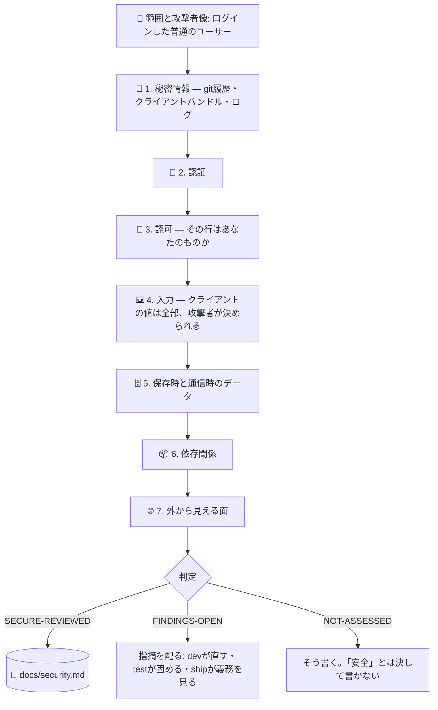

# 🔐 superforge-secure

[](https://opensource.org/licenses/MIT)
[](https://claude.com/claude-code)
[](https://github.com/takaoumehara/superforge-skill)

[English](README.md) · **日本語** · [简体中文](README.zh-CN.md) · [Español](README.es.md) · [한국어](README.ko.md)

> **プロダクトは完璧に動く。そしてログインした誰でも、URLの数字を1つ変えれば他人のデータが読める。**

---

## 🔰 これは何?

小さなプロダクトで実際に起きることの大半は、高度な攻撃ではありません。

3ヶ月前にコミットしてしまったサービスキー。後のコミットで消した——でもリポジトリからは消えていない。`NEXT_PUBLIC_` の接頭辞をつけた環境変数に入れた鍵。この接頭辞は「クライアントにコンパイルして埋め込む」という意味で、つまり公開です。そして、あなたが誰かは丁寧に確認するのに、そのレコードがあなたのものかは一度も確認しないエンドポイント。

この3つで、この規模の実際の事故のかなりの割合が説明できます。そしてどれも、依存関係スキャナでは見つかりません——「セキュリティは確認した」と言うとき、多くの人が指しているのはそのスキャナです。

このスキルは7つのパスを走らせ、すべての指摘を**攻撃者が実際に何を得るか**で並べ、`superforge-ship` がリリース前に読む台帳を書きます。「安全です」とは決して報告しません。それはレビューで確立できる状態ではないからです。

---

## 📐 構造



指摘があるのはパス1と3です。時間が足りないなら、7つを浅く回すより、その2つをちゃんと回して、報告書にそう書く。

---

## ✨ 強み

### 🚫 「安全です」とは絶対に書かない
「安全」とは、未知の欠陥がひとつも無いことであり、それを示せる手続きは存在しません。レビューが言えるのは「この面に対して、この日に、これらのパスを走らせ、こう出た。そしてここは見ていない」だけです。判定コードは `SECURE-REVIEWED` / `FINDINGS-OPEN` / `NOT-ASSESSED`。「確認済み、安全です」と言われたユーザーは見るのをやめます。誤った安心が高くつくのはそこです。

### 👥 二アカウント試験
アカウントを2つ作り、1つ目のレコードIDを取って、2つ目でログインしたまま使う。リソースの種類ごとに全部やる。1時間ほどで終わり、**このスキル全体で最も価値の高い1時間**です。自分でログインしている限りプロダクトは完全に正しく見える——だからこのバグは本番まで生き残ります。

### 🔑 鍵が漏れるのは設定ファイルではなく、git履歴とクライアントバンドル
ファイルを消しても秘密は消えません。すべてのクローンと、誰かが作ったフォークに残っています。minify は暗号化ではありません。`NEXT_PUBLIC_` / `VITE_` / `EXPO_PUBLIC_` は「クライアントに埋め込む」という意味で、そこに置いたサービスキーは即座に公開です。公開リポジトリは常時スキャンされています——「1時間しか上がってなかった」は緩和策ではありません。

### 🎯 攻撃者像は「ログインした普通のユーザー」
国家レベルの攻撃者ではありません。この既定値こそが、この規模でこのスキルを役に立たせている理由です。実際に届く欠陥のほうにレビューを向けられるからで、誰も実行しない面白い脅威のほうではなく。

### 📋 指摘は「攻撃者が何を得るか」で並べ、そのあと配る
エンタープライズ向けに較正された汎用スコアではなく。「/api/orders に IDOR」はラベルです。「ログインした誰でも `?id=` を変えれば他の顧客の住所が読める」は、今日誰かが動く指摘です。そして各指摘には行き先があります——直すのは `superforge-dev`、固めるのは `superforge-test`、開示義務が絡むものは `superforge-ship`。ファイルに残ったままの指摘は、誰も直さなかった指摘です。

### 🚨 「もう起きてしまった後」まで面倒を見る
原因究明より先に封じ込め——「まず how を理解したい」という本能が、攻撃者をもう1日中に置いておく本能です。新しい鍵を先に発行してから古いのを失効させる。逆にやると、事故の上に自分で障害を足すことになります。影響範囲は、たぶん残っていないと気づくログから組み直す。そして、気が楽になる方向に多めに見積もるのではなく、分からなかったと正直に書く。

---

## 🔄 Before / After

| | Before | After |
|---|---|---|
| 「安全ですか?」 | 「たぶん」 | 7つのパスそれぞれに 実行 / 推論 / 未評価 |
| 何を見たか | `npm audit` | 実際に指摘があるパス |
| 認可 | 動いているから大丈夫 | 2つ目のアカウントで、リソース種別ごとに検証 |
| 秘密情報 | 今のツリーを見た | git履歴と、ビルド後のクライアントバンドル |
| 深刻度 | スキャナの数値 | 攻撃者が何を得るか、を1文で |
| 判定 | 「安全」 | `SECURE-REVIEWED` / `FINDINGS-OPEN` / `NOT-ASSESSED` |
| 鍵が漏れた | コミットを消す | 正しい順で差し替える。履歴の掃除は衛生であって、対処ではない |

---

## 🚀 導入と使い方

### 🖥️ 14個のスキルをまとめて入れる（一度だけ）

```bash
git clone https://github.com/takaoumehara/superforge-skill
cd superforge-skill
./install.sh
```

オプション、単体インストール、claude.ai へのアップロード方法は [スイートのREADME](../../README.ja.md) にあります。

### ⌨️ 呼び出す

```
/superforge-secure
```

`superforge-ship` の前に走らせてください。`docs/security.md` はあちらの前提条件で、未解決の Critical があれば `BLOCK` です。すでに鍵が漏れている場合はそう言えば、レビューではなく封じ込めの手順に直行します。

---

## ⚠️ これは何ではないか

ペネトレーションテストではなく、コンプライアンス認証でもありません。決済を大量に扱う、医療データを扱う、子ども向けである——そういうプロダクトに対しては「ここから先は専門家の領域です」と伝えます。専門家のふりはしません。そして、修正を黙って当てることもしません。理解しないまま当てたセキュリティ修正は、脆弱性を塞ぐのではなく移動させるだけです。

---

## 📄 ライセンス

MIT — [LICENSE](../../LICENSE) を参照。スキル本体は [SKILL.md](SKILL.md)、7つのパスの詳細は [references/attack-surface.md](references/attack-surface.md)、事故対応は [references/when-it-happens.md](references/when-it-happens.md) にあります。スイート全体: [superforge-skill](../../README.ja.md)。
