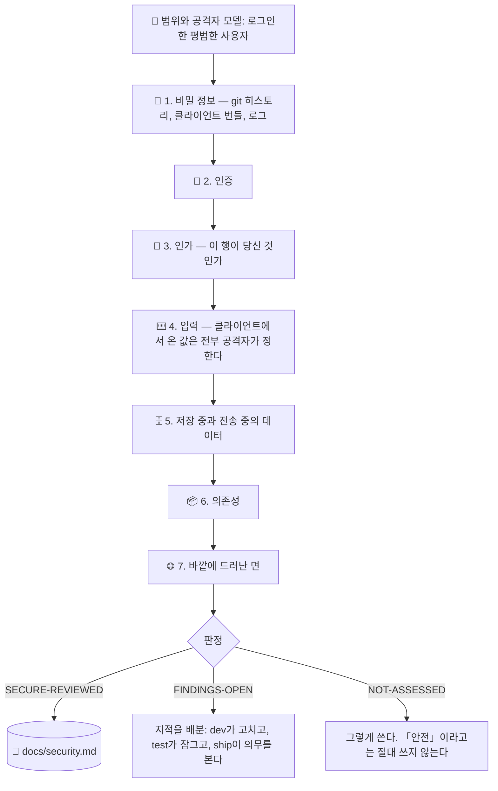

# 🔐 superforge-secure

[](https://opensource.org/licenses/MIT)
[](https://claude.com/claude-code)
[](https://github.com/takaoumehara/superforge-skill)

[English](README.md) · [日本語](README.ja.md) · [简体中文](README.zh-CN.md) · [Español](README.es.md) · **한국어**

> **제품은 완벽하게 돌아간다. 그리고 로그인한 아무나 URL의 숫자 하나만 바꾸면 남의 데이터를 읽는다.**

---

## 🔰 이게 뭔가요?

작은 제품에서 실제로 터지는 일은 대부분 정교하지 않습니다.

석 달 전에 커밋해 버린 서비스 키. 나중 커밋에서 지웠지만 — 저장소에서 사라진 것은 아닙니다. `NEXT_PUBLIC_` 접두사가 붙은 환경 변수에 넣은 키. 이 접두사는 「클라이언트에 컴파일해 넣는다」는 뜻이고, 곧 공개라는 뜻입니다. 그리고 당신이 누구인지는 꼼꼼히 확인하면서, 그 레코드가 당신 것인지는 한 번도 확인하지 않는 엔드포인트.

이 세 가지로 이 규모에서 벌어지는 실제 사고의 상당 부분이 설명됩니다. 그리고 셋 다 의존성 스캐너로는 잡히지 않습니다 — 「보안은 확인했다」고 말할 때 많은 사람이 가리키는 것이 바로 그 스캐너입니다.

이 스킬은 일곱 개의 패스를 돌리고, 모든 지적을 **공격자가 실제로 무엇을 얻는지**로 줄 세우며, `superforge-ship`이 릴리스 전에 읽는 대장을 씁니다. 「안전합니다」라고는 절대 보고하지 않습니다. 그건 리뷰가 확립할 수 있는 상태가 아니기 때문입니다.

---

## 📐 구조



지적이 나오는 곳은 패스 1과 3입니다. 시간이 모자라면 일곱 개를 얕게 도는 것보다 그 둘을 제대로 돌고, 보고서에 그렇게 했다고 적으세요.

---

## ✨ 강점

### 🚫 「안전하다」고는 절대 쓰지 않는다
「안전」이란 알려지지 않은 결함이 하나도 없다는 뜻이고, 그것을 증명할 수 있는 절차는 없습니다. 리뷰가 말할 수 있는 것은 「이 면에 대해, 이 날짜에, 이 패스들을 돌렸고, 이렇게 나왔으며, 여기는 보지 않았다」뿐입니다. 판정 코드는 `SECURE-REVIEWED` / `FINDINGS-OPEN` / `NOT-ASSESSED`. 「확인했고 안전합니다」라는 말을 들은 사용자는 더 이상 보지 않습니다. 잘못된 통과가 비싼 이유가 거기 있습니다.

### 👥 두 계정 테스트
계정을 두 개 만들고, 첫 번째의 레코드 ID를 가져와, 두 번째로 로그인한 채로 써 봅니다. 리소스 종류마다 전부. 한 시간쯤 걸리고, **이 스킬 전체에서 가장 값이 나가는 한 시간**입니다. 내 계정으로 보는 한 제품은 완벽하게 정상으로 보이니까 — 그래서 이 버그가 프로덕션까지 살아남습니다.

### 🔑 키가 새는 곳은 설정 파일이 아니라 git 히스토리와 클라이언트 번들
파일을 지워도 비밀은 지워지지 않습니다. 모든 클론과 누군가 떠 간 포크에 그대로 있습니다. 압축은 암호화가 아닙니다. `NEXT_PUBLIC_` / `VITE_` / `EXPO_PUBLIC_`은 「클라이언트에 넣는다」는 뜻이고, 거기 둔 서비스 키는 그 즉시 공개입니다. 공개 저장소는 계속 스캔되고 있습니다 — 「한 시간밖에 안 올라가 있었다」는 완화책이 아닙니다.

### 🎯 공격자 모델은 「로그인한 평범한 사용자」
국가급 공격자가 아닙니다. 이 기본값이야말로 이 규모에서 이 스킬을 쓸모 있게 만드는 이유입니다. 실제로 손이 닿는 결함 쪽으로 리뷰를 향하게 하니까요. 아무도 실행하지 않을 흥미로운 위협 쪽이 아니라.

### 📋 공격자가 무엇을 얻는지로 줄 세우고, 그다음 배분한다
엔터프라이즈 소프트웨어에 맞춰 보정된 범용 점수가 아니라. 「/api/orders에 IDOR」은 라벨입니다. 「로그인한 아무나 `?id=`만 바꾸면 다른 고객의 주소를 읽는다」는 오늘 누군가가 움직이는 지적입니다. 그리고 지적마다 갈 곳이 있습니다 — 고치는 건 `superforge-dev`, 잠그는 건 `superforge-test`, 공개 의무가 걸린 건 `superforge-ship`. 파일에 남아 있는 지적은 아무도 고치지 않은 지적입니다.

### 🚨 「이미 벌어진 다음」까지 다룬다
원인 파악보다 봉쇄가 먼저 — 「어떻게 뚫렸는지부터 알고 싶다」는 본능이 공격자를 하루 더 안에 두는 본능입니다. 새 키를 먼저 발급하고 옛 것을 폐기하세요. 반대로 하면 사고 위에 스스로 만든 장애를 얹게 됩니다. 영향 범위는 아마 남겨 두지 않았다는 걸 알게 될 로그에서 재구성하고, 마음이 편해지는 쪽으로 넉넉히 잡는 대신 확인하지 못했다고 정직하게 적으세요.

---

## 🔄 Before / After

| | Before | After |
|---|---|---|
| 「안전한가요?」 | 「아마도」 | 일곱 개 패스에 각각 실행 / 추론 / 미평가 |
| 무엇을 봤나 | `npm audit` | 실제로 지적이 나오는 패스들 |
| 인가 | 잘 돌아가니까 괜찮다 | 두 번째 계정으로, 리소스 종류마다 검증 |
| 비밀 정보 | 지금 트리를 봤다 | git 히스토리와 빌드된 클라이언트 번들 |
| 심각도 | 스캐너가 준 숫자 | 공격자가 무엇을 얻는지, 한 문장으로 |
| 판정 | 「안전」 | `SECURE-REVIEWED` / `FINDINGS-OPEN` / `NOT-ASSESSED` |
| 키가 샜다 | 그 커밋을 지운다 | 올바른 순서로 교체한다. 히스토리 정리는 위생이지 조치가 아니다 |

---

## 🚀 설치와 사용

### 🖥️ 열네 개 스킬 한 번에 설치

```bash
git clone https://github.com/takaoumehara/superforge-skill
cd superforge-skill
./install.sh
```

전체 옵션, 개별 스킬 설치, claude.ai 업로드 방법은 [스위트 README](../../README.ko.md)에 있습니다.

### ⌨️ 호출

```
/superforge-secure
```

`superforge-ship` 앞에 돌리세요. `docs/security.md`는 그쪽의 전제 조건이고, 미해결 Critical이 있으면 `BLOCK`입니다. 이미 키가 샜다면 그렇게 말하면, 리뷰가 아니라 봉쇄 절차로 곧장 갑니다.

---

## ⚠️ 이것이 아닌 것

침투 테스트가 아니고 컴플라이언스 인증도 아닙니다. 결제를 대량으로 다루거나, 건강 데이터를 다루거나, 아동 대상인 제품이라면 「여기부터는 전문가의 영역」이라고 알려 줍니다 — 전문가인 척하지 않습니다. 그리고 수정을 조용히 적용하지도 않습니다. 이해하지 못한 채 적용한 보안 수정은 취약점을 막는 게 아니라 옮기는 것입니다.

---

## 📄 라이선스

MIT — [LICENSE](../../LICENSE) 참조. 스킬 본문은 [SKILL.md](SKILL.md), 일곱 개 패스의 상세는 [references/attack-surface.md](references/attack-surface.md), 사고 대응은 [references/when-it-happens.md](references/when-it-happens.md)에 있습니다. 스위트 전체: [superforge-skill](../../README.ko.md).
