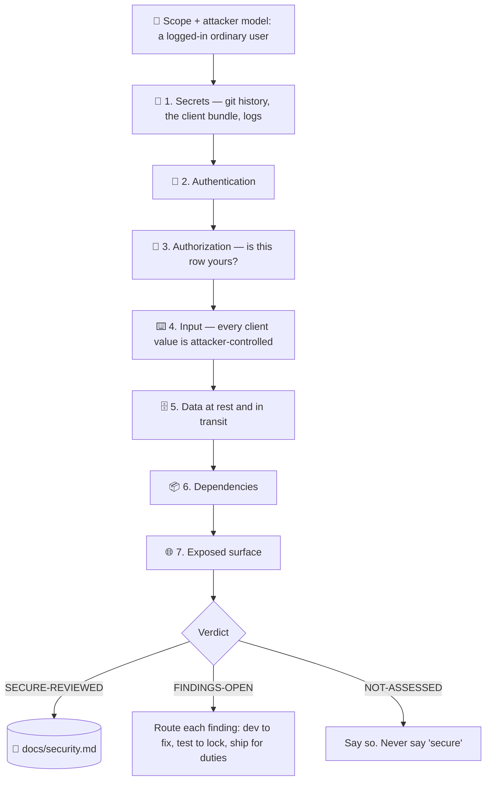

# 🔐 superforge-secure

[](https://opensource.org/licenses/MIT)
[](https://claude.com/claude-code)
[](https://github.com/takaoumehara/superforge-skill)

**English** · [日本語](README.ja.md) · [简体中文](README.zh-CN.md) · [Español](README.es.md) · [한국어](README.ko.md)

> **The product works perfectly. Any logged-in user can change a number in the URL and read someone else's data.**

---

## 🔰 What is this?

Almost nothing that goes wrong for a small product is sophisticated.

It is a service key committed to a repository three months ago and removed in a later commit — which does not remove it from the repository. It is a key placed in an environment variable with a `NEXT_PUBLIC_` prefix, which means *compiled into the client*, which means public. It is an endpoint that carefully checks who you are and never checks whether the record you asked for is yours.

Those three account for a very large share of real incidents at this scale, and none of them are found by a dependency scanner — which is the thing most people mean when they say they checked.

This skill runs seven passes, ranks every finding by **what an attacker actually gets**, and writes a ledger that `superforge-ship` reads before a release. It never reports that something is secure, because that is not a state a review can establish.

---

## 📐 Architecture



Passes 1 and 3 are where the findings are. If time is short, run those two properly rather than all seven shallowly — and say in the report that you did.

---

## ✨ Features

### 🚫 It never says "secure"
"Secure" is the absence of every unknown flaw, which no process can demonstrate. A review can only say: these passes ran against this surface on this date, and here is what they found and what they did not cover. The verdict codes are `SECURE-REVIEWED` / `FINDINGS-OPEN` / `NOT-ASSESSED`. A user told "we checked, it's secure" stops looking, which is the expensive part of a false clearance.

### 👥 The two-account test
Create two accounts, take a record ID from the first, use it while logged in as the second. Do it for every resource type. It takes about an hour and it is the single highest-value hour in this entire skill — because the product looks completely correct while you are logged in as yourself, which is why this bug survives to production so often.

### 🔑 Secrets leak from git history and the client bundle, not from config files
Deleting the file does not remove the secret: it is still in every clone and every fork. Minification is not encryption. A `NEXT_PUBLIC_` / `VITE_` / `EXPO_PUBLIC_` prefix means *this is compiled into the client*, and a service key placed there is public immediately. Public repositories are scanned continuously — "it was only up for an hour" is not a mitigation.

### 🎯 The attacker model is a logged-in ordinary user
Not a nation state. That default is what makes this useful at this scale, because it points the review at the flaws that are actually reachable rather than at an interesting threat nobody will execute.

### 📋 Findings are ranked by what the attacker gets, and then routed
Not by a generic score calibrated for enterprise software. "IDOR on /api/orders" is a label; "any logged-in user can change `?id=` and read another customer's address" is a finding someone will act on today. Then each one goes somewhere: `superforge-dev` to fix, `superforge-test` to lock, `superforge-ship` for anything with a disclosure duty. A finding that stays in the file is a finding nobody fixed.

### 🚨 It covers the part after it has already happened
Containment before diagnosis — the instinct to understand *how* first is the one that leaves the attacker inside for another day. Issue the new credential before revoking the old one, or you add an outage to an incident. Reconstruct the blast radius from logs you will probably discover you never kept, and say so honestly rather than guessing generously.

---

## 🔄 Before / After

| | Before | After |
|---|---|---|
| "Is it secure?" | "I think so" | Seven passes, each executed / reasoned / not assessed |
| What was checked | `npm audit` | The passes where the findings actually are |
| Authorization | Assumed, because the app works | Tested with a second account, on every resource type |
| Secrets | Looked at the current tree | Git history and the built client bundle |
| Severity | A number from a scanner | What an attacker gets, written as a sentence |
| The verdict | "secure" | `SECURE-REVIEWED` / `FINDINGS-OPEN` / `NOT-ASSESSED` |
| A leaked key | Delete the commit | Rotate in the right order; history cleanup is hygiene, not the fix |

---

## 🚀 Install & Usage

### 🖥️ Install all fourteen skills (once)

```bash
git clone https://github.com/takaoumehara/superforge-skill
cd superforge-skill
./install.sh
```

Full options, single-skill installs, and the claude.ai upload route are in the [suite README](../../README.md).

### ⌨️ Call it

```
/superforge-secure
```

Run it before `superforge-ship` — `docs/security.md` is a precondition there, and an unresolved Critical is a `BLOCK`. If a key has already leaked, say so and it goes straight to the containment procedure instead of the review.

---

## ⚠️ What this is not

It is not a penetration test, and it is not a compliance certification. For a product handling payments at volume, health data, or children's data it tells you that you have reached the line where a professional takes over — it does not pretend to be one. And it does not silently apply fixes: a security fix applied without being understood is how a vulnerability moves rather than closes.

---

## 📄 License

MIT — see [LICENSE](../../LICENSE). The skill body is in [SKILL.md](SKILL.md); the seven passes in detail are in [references/attack-surface.md](references/attack-surface.md) and the incident procedure in [references/when-it-happens.md](references/when-it-happens.md). Suite overview: [superforge-skill](../../README.md).
