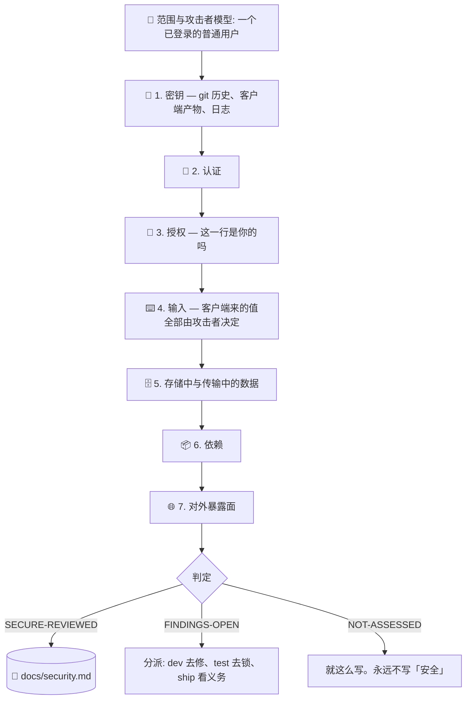

# 🔐 superforge-secure

[](https://opensource.org/licenses/MIT)
[](https://claude.com/claude-code)
[](https://github.com/takaoumehara/superforge-skill)

[English](README.md) · [日本語](README.ja.md) · **简体中文** · [Español](README.es.md) · [한국어](README.ko.md)

> **产品跑得好好的。而任何一个已登录的用户，把 URL 里的数字改一下，就能读到别人的数据。**

---

## 🔰 这是什么?

小产品真正出事的地方，几乎都不高深。

三个月前提交进仓库的一个服务密钥，后来的提交里删掉了——但它并没有从仓库里消失。放进了带 `NEXT_PUBLIC_` 前缀的环境变量里的密钥，这个前缀的意思就是「编译进客户端」，也就是公开。以及那个仔细核对了你是谁、却从来没核对过这条记录是不是你的接口。

这三样就能解释这个体量上相当大比例的真实事故。而它们没有一个能被依赖扫描发现——多数人说「我检查过安全」的时候，指的正是那个扫描。

这个技能跑七道检查，把每一条发现按**攻击者实际能拿到什么**来排，并写下一份 `superforge-ship` 会在发布前读的台账。它从不报告「这是安全的」，因为那不是一次评审能确立的状态。

---

## 📐 结构



发现集中在第 1 和第 3 道。时间不够，就把那两道认真跑完，而不是七道都浅浅走一遍——并在报告里说清楚你是这么做的。

---

## ✨ 亮点

### 🚫 它从不写「安全」
「安全」意味着不存在任何未知缺陷，没有任何流程能证明这一点。评审能说的只有：在这个面上、这一天、跑了这些检查、结果如此、以及哪些没有覆盖。判定码是 `SECURE-REVIEWED` / `FINDINGS-OPEN` / `NOT-ASSESSED`。被告知「我们查过了，是安全的」的用户就不再看了——错误的放行贵就贵在这里。

### 👥 双账号测试
建两个账号，拿第一个账号的记录 ID，在第二个账号登录状态下用它。每一种资源都做一遍。大约一小时，而且是**整个技能里性价比最高的一小时**。因为只要你是用自己的账号在看，产品就完全正常——这正是这类 bug 能活到线上的原因。

### 🔑 密钥泄漏来自 git 历史和客户端产物，而不是配置文件
删掉文件并不会删掉密钥：它还在每一份克隆和别人 fork 出去的副本里。压缩不是加密。`NEXT_PUBLIC_` / `VITE_` / `EXPO_PUBLIC_` 的意思就是「编译进客户端」，放进去的服务密钥当场就是公开的。公开仓库被持续扫描——「只挂了一小时」不是缓解措施。

### 🎯 攻击者模型是「一个已登录的普通用户」
不是国家级对手。正是这个默认值让它在这个体量上有用：它把评审指向真正够得着的缺陷，而不是那些有意思但没人会执行的威胁。

### 📋 按攻击者能拿到什么来排，然后分派出去
不是照搬为企业软件校准的通用分数。「/api/orders 存在 IDOR」是个标签；「任何已登录用户改一下 `?id=` 就能读到另一位客户的地址」是今天就会有人动手处理的发现。而且每一条都有去处：`superforge-dev` 去修，`superforge-test` 去锁，涉及披露义务的交给 `superforge-ship`。留在文件里的发现，就是没人修的发现。

### 🚨 也管「已经发生之后」
先止血，再查因——「我想先搞清楚怎么发生的」这个本能，正是让攻击者多待一天的那个本能。先签发新密钥，再吊销旧的；反过来做，就是在事故上再加一次自己造成的宕机。影响范围要从日志里重建，而你多半会发现自己压根没留。然后诚实写下没能确定的部分，而不是往让自己好受的方向估。

---

## 🔄 Before / After

| | Before | After |
|---|---|---|
| 「安全吗?」 | 「应该吧」 | 七道检查，每道标注 已执行 / 已推理 / 未评估 |
| 查了什么 | `npm audit` | 真正有发现的那几道 |
| 授权 | 能用，所以没问题 | 用第二个账号，按资源类型逐个验证 |
| 密钥 | 看了当前代码树 | git 历史，以及构建出来的客户端产物 |
| 严重度 | 扫描器给的数字 | 攻击者能拿到什么，一句话写清 |
| 判定 | 「安全」 | `SECURE-REVIEWED` / `FINDINGS-OPEN` / `NOT-ASSESSED` |
| 密钥泄漏了 | 删掉那次提交 | 按正确顺序轮换。清理历史是卫生，不是处置 |

---

## 🚀 安装与使用

### 🖥️ 一次性安装全部十四个技能

```bash
git clone https://github.com/takaoumehara/superforge-skill
cd superforge-skill
./install.sh
```

完整选项、单个技能安装、以及 claude.ai 上传方式，见 [套件 README](../../README.zh-CN.md)。

### ⌨️ 调用

```
/superforge-secure
```

在 `superforge-ship` 之前跑。`docs/security.md` 是那边的前置条件，存在未解决的 Critical 就是 `BLOCK`。如果密钥已经泄漏了，直接说，它会跳过评审直奔止血流程。

---

## ⚠️ 它不是什么

不是渗透测试，也不是合规认证。对于大量处理支付、处理健康数据、或者面向儿童的产品，它会告诉你已经到了该交给专业人士的那条线——而不是假装自己是。它也不会默默替你打补丁：没弄明白就打上的安全补丁，只是把漏洞挪了个位置，而不是堵上。

---

## 📄 许可

MIT — 见 [LICENSE](../../LICENSE)。技能正文在 [SKILL.md](SKILL.md)，七道检查的细节在 [references/attack-surface.md](references/attack-surface.md)，事故处置在 [references/when-it-happens.md](references/when-it-happens.md)。套件总览：[superforge-skill](../../README.zh-CN.md)。
