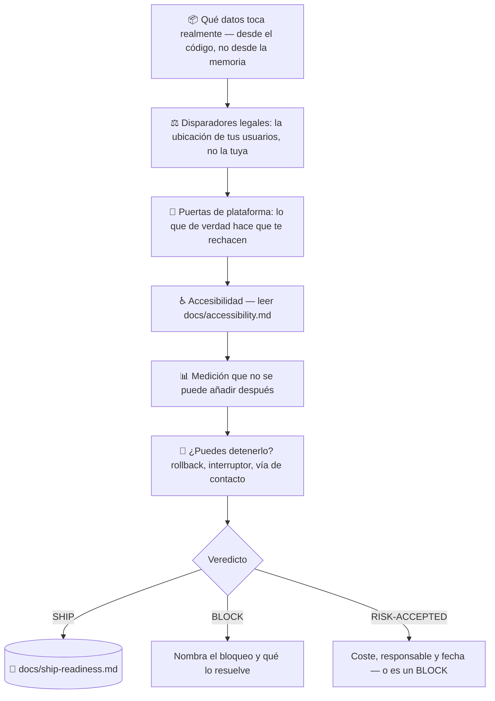

# 🚢 superforge-ship

[](https://opensource.org/licenses/MIT)
[](https://claude.com/claude-code)
[](https://github.com/takaoumehara/superforge-skill)

[English](README.md) · [日本語](README.ja.md) · [简体中文](README.zh-CN.md) · **Español** · [한국어](README.ko.md)

> **«Funciona» y «podemos publicarlo» son veredictos distintos, y normalmente solo uno de los dos se ha comprobado.**

---

## 🔰 ¿Qué es esto?

Las pruebas pasan. La app corre en un dispositivo real. `superforge-verify` dio el visto bueno con evidencia adjunta.

Y aun así no se puede publicar: porque un SDK de analítica transmite datos que la política de privacidad nunca menciona; porque el borrado de cuenta solo existe en un buzón de soporte; porque el muro de pago enseña el precio y esconde la renovación; porque no hay instrumentación y el primer mes producirá sensaciones en lugar de hechos; o porque si algo sale mal no hay forma de apagarlo.

Nada de eso es un bug. Y cada una de esas cosas detiene un lanzamiento.

Esta skill es la segunda puerta. Pregunta **qué obligaciones ha activado el propio comportamiento del producto**, qué provocará realmente un rechazo, qué medición no se puede añadir después y si el lanzamiento se puede revertir — y devuelve **un único código**, nunca prosa.

---

## 📐 Arquitectura



---

## ✨ Puntos clave

### ⚖️ La jurisdicción sigue a tus usuarios, no a tu dirección
Este es el hecho que hace universal esta puerta. Alguien en Nueva York, en Tokio o en cualquier otro sitio afronta el mismo conjunto de obligaciones, determinado por **dónde están las personas que usan el producto** y **qué datos se tocan**. «No estamos en Europa» nunca ha sido una respuesta a una pregunta sobre el RGPD: basta con un usuario en la UE.

### 📝 Identifica obligaciones. No redacta textos legales.
Sin artículos, sin plantillas, sin política de privacidad generada — deliberadamente. Un texto legal congelado en un repositorio caduca en silencio, y una plantilla rellenada de memoria describe **las prácticas de datos de otra persona**. Establecer qué es *cierto sobre este producto* es la parte que de verdad te corresponde. Por encima de un conjunto explícito de condiciones de parada — datos de salud, menores, biometría, una carta de un regulador — la skill cede el paso a un profesional en vez de improvisar.

### 🌍 La base universal
Casi todos los regímenes de privacidad exigen las mismas cuatro cosas: **informar, limitar el uso, dar una salida y ser localizable**. Con esas cuatro estarás alineado a grandes rasgos en casi todas partes; después verifica las variaciones locales de los mercados donde realmente tienes usuarios. El orden importa: las cuatro son caras de añadir a posteriori y las variaciones no.

### 📊 La medición que no se recupera
Cohortes, el embudo como cinco eventos separados, atribución, errores etiquetados por versión y el evento de activación: todo es barato antes de publicar e imposible después. Publicar sin ellos deja el lanzamiento permanentemente inmedible — sabrás cómo se sintió, no cómo fue.

### 🛑 Un lanzamiento que no puedes revertir es una apuesta
Camino de rollback, un interruptor **para la parte arriesgada en concreto**, una vía de contacto que llegue a una persona, y alguien con nombre vigilando las primeras 48 horas. «Ya veremos cómo va» significa que nadie está mirando.

### 🚦 Un veredicto, nunca prosa
`SHIP` / `BLOCK` / `RISK-ACCEPTED`. Un riesgo aceptado sin coste, sin responsable y sin fecha es un `BLOCK` con mejores modales. Y una puerta que nunca ha devuelto `BLOCK` es una puerta que no se está ejecutando.

---

## 🔄 Antes / Después

| | Antes | Después |
|---|---|---|
| La decisión de publicar | «Creo que estamos bien» | Un código, con el bloqueo nombrado |
| Declaración de datos | Escrita de memoria | Construida desde el código y sus dependencias; los SDK cuentan |
| Alcance legal | «No estamos en la UE» | Determinado por dónde están los usuarios |
| Política de privacidad | Generada desde una plantilla | Primero los hechos; la redacción se delega y se escala cuando toca |
| Accesibilidad | Un extra de calidad | Una puerta de lanzamiento donde la ley aplica |
| Instrumentación | Añadida tras la primera semana confusa | Lista antes del lanzamiento; las cohortes no se rellenan hacia atrás |
| Si algo sale mal | Publicar un fix y confiar en la velocidad de revisión | Interruptor, rollback y alguien vigilando |

---

## 🚀 Instalación y uso

### 🖥️ Instala las trece skills (una vez)

```bash
git clone https://github.com/takaoumehara/superforge-skill
cd superforge-skill
./install.sh
```

Opciones completas, instalación individual y la vía de subida a claude.ai en el [README de la suite](../../README.es.md).

### ⌨️ Invócala

```
/superforge-ship
```

Ejecútala después de `superforge-verify` y antes de enviar. El veredicto queda en `docs/ship-readiness.md`. Pregúntale «¿qué nos está bloqueando?» y devuelve el camino más corto hasta `SHIP`.

---

## ⚠️ No es asesoramiento legal

Esta skill mapea el comportamiento del producto a las preguntas que ahora debes responder, y al punto en el que un profesional tiene que tomar el relevo. No es un abogado, no certifica que cumplas, y se detiene en las condiciones de parada de [references/legal-triggers.md](references/legal-triggers.md) §7 en lugar de seguir adivinando.

---

## 📄 Licencia

MIT — ver [LICENSE](../../LICENSE). El cuerpo de la skill está en [SKILL.md](SKILL.md); los disparadores de obligaciones en [references/legal-triggers.md](references/legal-triggers.md), y la instrumentación previa al lanzamiento junto al bucle posterior en [references/launch-metrics.md](references/launch-metrics.md). Visión general de la suite: [superforge-skill](../../README.es.md).
