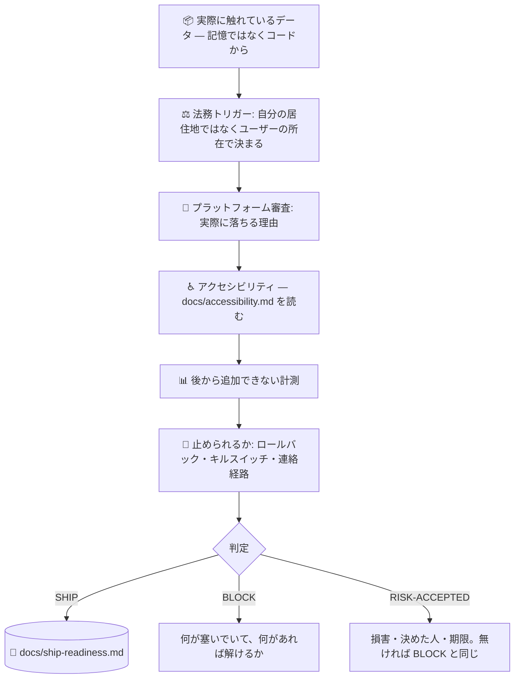

# 🚢 superforge-ship

[](https://opensource.org/licenses/MIT)
[](https://claude.com/claude-code)
[](https://github.com/takaoumehara/superforge-skill)

[English](README.md) · **日本語** · [简体中文](README.zh-CN.md) · [Español](README.es.md) · [한국어](README.ko.md)

> **「動く」と「出していい」は別の判定です。そして普通、確認されているのは前者だけです。**

---

## 🔰 これは何？

テストは通っている。実機でも動く。`superforge-verify` が証拠付きで OK を出した。

それでも出せないことがあります。解析SDKがプライバシーポリシーに書いていないデータを送信している。アカウント削除がサポート宛のメールにしか存在しない。ペイウォールが価格は見せて自動更新を隠している。計測が入っていないので最初の1ヶ月から出てくるのが数字ではなく気分になる。何かあった時に止める手段が無い。

どれもバグではありません。そして、どれもリリースを止めます。

このスキルは2枚目のゲートです。**この製品自身の振る舞いがどの義務を発火させたか**、何が実際に審査で落ちるか、後から絶対に取れない計測は何か、リリースを取り消せるかを確認し、最後に**コードを1つだけ**返します。文章では返しません。

---

## 📐 全体像



---

## ✨ 強み

### 📡 気づけるか、直せるか、戻せるか
一人でやっているプロダクトの初期状態は、**ユーザーが監視システムをやっている**状態です。直すのに要るのは3つで、それぞれ半日：DBに触るURLへの死活監視（静的なヘルスページではだめ——本当にまずい障害では緑のままです）、エラー収集、そして「プロダクトが動いていない」を意味するアラート1本。そこで止める。行動しないアラートを増やすと、本物を無視する訓練になるからです。一度試したロールバックと、一度復元したバックアップは、ここでは磨き込みではなく `BLOCK` 条件です。試していないバックアップは、ファイルについての信念であってバックアップではありません。

### ⚖️ 法域は「自分がどこにいるか」ではなく「ユーザーがどこにいるか」で決まる
このゲートが誰にでも使える理由がこれです。ニューヨークにいても東京にいても、義務の内容は同じで、決めるのは**製品を使う人の所在と、触れたデータ**です。「うちは EU に出していないので」は GDPR の質問への答えになりません。EU のユーザーが1人いれば発火します。

### 📝 義務を特定します。法律文書は書きません。
条文も、雛形も、生成されたプライバシーポリシーもありません。意図的にです。リポジトリに凍結された法律文面は静かに古くなり、記憶で埋めたテンプレートは**他社のデータ実務**を説明する文書になります。この製品について何が事実かを確定させる作業こそが、あなたにしかできない部分です。そして健康データ・子ども・生体認証・規制当局からの連絡といった**停止条件**を越えたら、推測せずに専門家へ渡します。

### 🌍 どこでも概ね正しい4つの土台
ほぼすべてのプライバシー法制が、形は違っても同じ4つを求めます — **知らせる / 目的を限る / 出口を作る / 連絡がつく**。この4つを最初から満たしておけば、大半の法域で概ね正しい状態になります。その上で、実際にユーザーがいる市場の個別要件を確認する。順序が重要で、4つは後から入れると高くつき、個別要件はそうではありません。

### 📊 後から絶対に取り戻せない計測
コホート、5つに分けたファネル、流入経路、バージョン付きのエラー、そしてアクティベーション地点。すべて出す前なら安く、出した後では不可能です。入れずに出すと、そのローンチは永久に測定不能になります。どうだったかではなく、どう感じたかしか残りません。

### 🛑 取り消せないリリースは、賭けです
ロールバック手段、**一番危ない機能だけを止めるキルスイッチ**、人間に届く連絡経路、そして最初の48時間を見る人の名前。「様子を見ましょう」は「誰も見ていない」という意味です。

### 🚦 判定は1つ、文章では返さない
`SHIP` / `BLOCK` / `RISK-ACCEPTED`。損害の想定・決めた人・直す期限が揃っていないリスク受容は、言い方が丁寧なだけの `BLOCK` です。そして一度も `BLOCK` を返したことのないゲートは、走っていません。

---

## 🔄 Before / After

| | Before | After |
|---|---|---|
| 出荷判断 | 「たぶん大丈夫」 | コード1つ + 塞いでいるものの名前 |
| データ開示 | 記憶で書く | コードと依存関係から。SDKも自分の収集として数える |
| 法域の判定 | 「EU には出していないから」 | ユーザーがどこにいるかで決まる |
| プライバシーポリシー | テンプレートから生成 | 先に事実を確定。作文は委譲し、必要なら専門家へ |
| アクセシビリティ | できたら良い品質項目 | 法が適用される市場では出荷ブロッカー |
| 計測 | 最初の1ヶ月に困ってから足す | 出す前に。コホートは後から作れない |
| 問題が起きたら | 修正を出して審査の速さを祈る | キルスイッチ・ロールバック・見ている人 |

---

## 🚀 導入と使い方

### 🖥️ 14スキルをまとめて入れる（一度だけ）

```bash
git clone https://github.com/takaoumehara/superforge-skill
cd superforge-skill
./install.sh
```

オプション、単体インストール、claude.ai へのアップロード方法は [スイートのREADME](../../README.ja.md) にあります。

### ⌨️ 呼び出す

```
/superforge-ship
```

`superforge-verify` の後、提出の前に走らせてください。判定は `docs/ship-readiness.md` に残ります。「何が止めてる？」と聞けば、`SHIP` までの最短経路を返します。

---

## ⚠️ 法的助言ではありません

このスキルは、製品の振る舞いを「答えを出す義務が生じた質問」に対応づけ、専門家に渡すべき地点を示すものです。弁護士ではなく、適法だと保証もしません。[references/legal-triggers.md](references/legal-triggers.md) §7 の停止条件に達したら、推測で先へ進まずそこで止まります。

---

## 📄 ライセンス

MIT — [LICENSE](../../LICENSE) を参照。本体は [SKILL.md](SKILL.md)、義務のトリガーは [references/legal-triggers.md](references/legal-triggers.md)、出す前の計測とローンチ後のループは [references/launch-metrics.md](references/launch-metrics.md) にあります。スイート全体: [superforge-skill](../../README.ja.md)。
