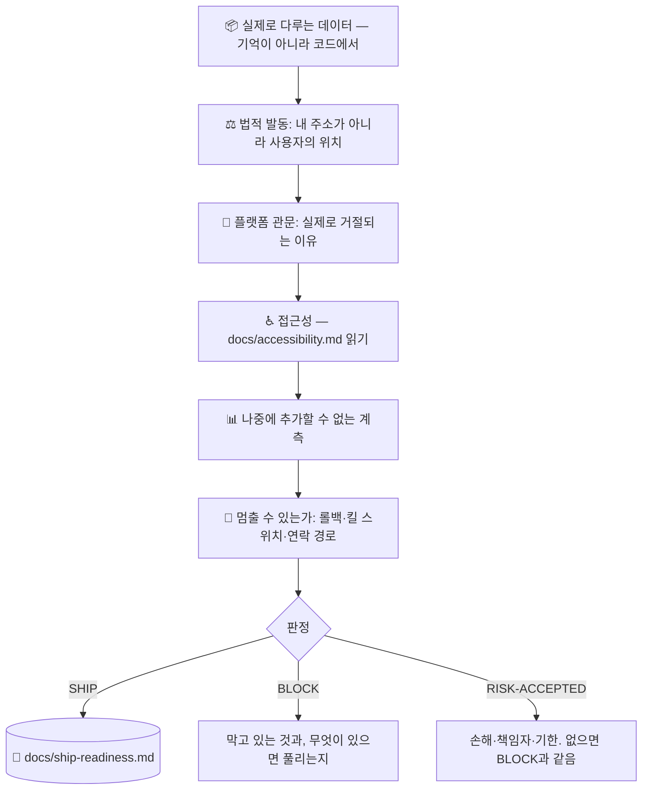

# 🚢 superforge-ship

[](https://opensource.org/licenses/MIT)
[](https://claude.com/claude-code)
[](https://github.com/takaoumehara/superforge-skill)

[English](README.md) · [日本語](README.ja.md) · [简体中文](README.zh-CN.md) · [Español](README.es.md) · **한국어**

> **「돌아간다」와 「출시해도 된다」는 서로 다른 판정이고, 보통 확인된 것은 앞의 하나뿐입니다.**

---

## 🔰 이게 뭔가요?

테스트는 통과했습니다. 실제 기기에서도 돌아갑니다. `superforge-verify`가 증거를 붙여 승인했습니다.

그런데도 출시할 수 없습니다. 분석 SDK가 개인정보처리방침에 없는 데이터를 전송하고 있어서. 계정 삭제가 고객지원 메일함에만 존재해서. 페이월이 가격은 보여주고 자동갱신은 숨겨서. 계측이 없어서 첫 달에 나오는 것이 사실이 아니라 느낌이어서. 문제가 생겼을 때 끌 방법이 없어서.

이 중 어느 것도 버그가 아닙니다. 그리고 하나하나가 출시를 멈춥니다.

이 스킬은 두 번째 관문입니다. **제품 자신의 동작이 어떤 의무를 발동시켰는지**, 무엇이 실제로 심사에서 거절당하는지, 나중에는 절대 채울 수 없는 계측이 무엇인지, 이 릴리스를 되돌릴 수 있는지를 확인하고 — 마지막에 **코드 하나**만 돌려줍니다. 서술문으로는 돌려주지 않습니다.

---

## 📐 구조



---

## ✨ 강점

### ⚖️ 관할은 내 주소가 아니라 사용자를 따라간다
이 관문이 누구에게나 통용되는 이유입니다. 뉴욕에 있든 도쿄에 있든, 마주하는 의무는 같고, 그것을 정하는 것은 **제품을 쓰는 사람이 어디 있는가**와 **어떤 데이터를 건드리는가**입니다. 「우리는 유럽에 진출 안 했는데요」는 GDPR 질문에 대한 답이 된 적이 없습니다. EU 사용자 한 명이면 충분합니다.

### 📝 의무를 식별합니다. 법률 문서를 작성하지는 않습니다.
조문도, 양식도, 생성된 개인정보처리방침도 없습니다. 의도적입니다. 저장소에 얼어붙은 법률 문구는 조용히 낡아가고, 기억으로 채운 템플릿은 **남의 데이터 실무**를 설명하는 문서가 됩니다. 이 제품에 대해 무엇이 사실인지를 확정하는 일이야말로 실제로 당신 몫입니다. 그리고 건강 데이터·아동·생체인식·규제기관의 연락 같은 **정지 조건**을 넘어서면, 추측하지 않고 전문가에게 넘깁니다.

### 🌍 어디서나 대체로 맞는 네 가지 토대
거의 모든 개인정보 규범이 형태만 다를 뿐 같은 네 가지를 요구합니다 — **알린다 / 목적을 한정한다 / 나갈 길을 만든다 / 연락이 닿는다**. 이 넷을 처음부터 갖추면 대부분의 법역에서 대체로 정렬된 상태가 됩니다. 그다음 실제로 사용자가 있는 시장의 개별 요건을 확인하십시오. 순서가 중요합니다 — 넷은 나중에 넣으면 비싸고, 개별 요건은 그렇지 않습니다.

### 📊 되돌릴 수 없는 계측
코호트, 다섯 개로 쪼갠 퍼널, 유입 경로, 버전 태그가 붙은 오류, 그리고 활성화 지점. 모두 출시 전에는 싸고 출시 후에는 불가능합니다. 없이 내보내면 그 출시는 영원히 측정 불가가 됩니다. 어땠는지가 아니라 어떻게 느꼈는지만 남습니다.

### 🛑 되돌릴 수 없는 릴리스는 도박입니다
롤백 경로, **가장 위험한 기능만 끄는 킬 스위치**, 사람에게 닿는 연락 경로, 그리고 첫 48시간을 지켜볼 사람의 이름. 「일단 지켜보죠」는 「아무도 안 보고 있다」는 뜻입니다.

### 🚦 판정은 하나, 서술문은 안 됩니다
`SHIP` / `BLOCK` / `RISK-ACCEPTED`. 손해 추정도, 책임자도, 기한도 없는 위험 수용은 말투만 정중한 `BLOCK`입니다. 그리고 한 번도 `BLOCK`을 낸 적 없는 관문은, 실행되고 있지 않은 관문입니다.

---

## 🔄 Before / After

| | 이전 | 이후 |
|---|---|---|
| 출시 판단 | 「아마 괜찮을 거예요」 | 코드 하나 + 막고 있는 것의 이름 |
| 데이터 고지 | 기억으로 작성 | 코드와 의존성에서 도출. SDK도 내 수집으로 계산 |
| 법적 범위 | 「우린 EU가 아니라서」 | 사용자가 어디 있는지로 결정 |
| 개인정보처리방침 | 템플릿에서 생성 | 사실을 먼저 확정. 작성은 위임하고, 필요하면 전문가로 |
| 접근성 | 여유 되면 하는 품질 항목 | 법이 적용되는 시장에서는 출시 차단 요소 |
| 계측 | 혼란스러운 첫 주가 지나고 추가 | 출시 전에 준비. 코호트는 소급해서 만들 수 없음 |
| 문제가 생기면 | 수정본 내고 심사 속도를 기도 | 킬 스위치·롤백·지켜보는 사람 |

---

## 🚀 설치와 사용

### 🖥️ 13개 스킬 한 번에 설치

```bash
git clone https://github.com/takaoumehara/superforge-skill
cd superforge-skill
./install.sh
```

전체 옵션, 단일 스킬 설치, claude.ai 업로드 방법은 [스위트 README](../../README.ko.md)에 있습니다.

### ⌨️ 호출

```
/superforge-ship
```

`superforge-verify` 다음, 제출 전에 실행하십시오. 판정은 `docs/ship-readiness.md`에 남습니다. 「뭐가 막고 있어?」라고 물으면 `SHIP`까지의 최단 경로를 돌려줍니다.

---

## ⚠️ 법률 자문이 아닙니다

이 스킬은 제품의 동작을 「이제 답해야 할 질문」에 대응시키고, 전문가가 넘겨받아야 하는 지점을 알려줍니다. 변호사가 아니며, 적법하다고 보증하지도 않습니다. [references/legal-triggers.md](references/legal-triggers.md) §7의 정지 조건에 도달하면 추측으로 나아가지 않고 거기서 멈춥니다.

---

## 📄 라이선스

MIT — [LICENSE](../../LICENSE) 참조. 스킬 본문은 [SKILL.md](SKILL.md), 의무 발동 조건은 [references/legal-triggers.md](references/legal-triggers.md), 출시 전 계측과 출시 후 루프는 [references/launch-metrics.md](references/launch-metrics.md)에 있습니다. 스위트 개요: [superforge-skill](../../README.ko.md).
