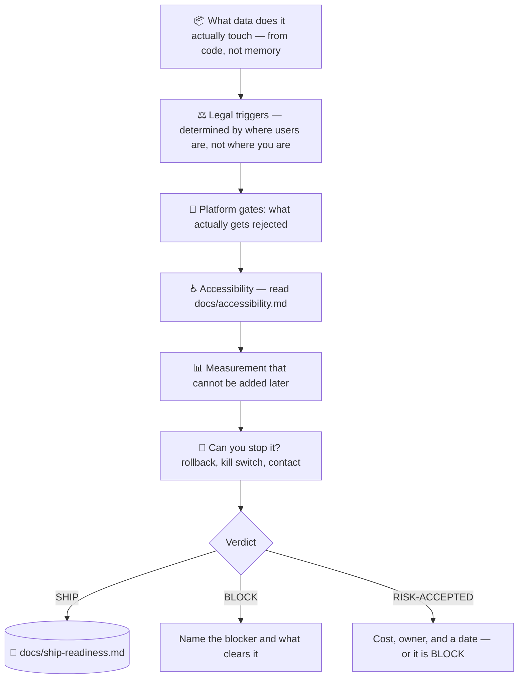

# 🚢 superforge-ship

[](https://opensource.org/licenses/MIT)
[](https://claude.com/claude-code)
[](https://github.com/takaoumehara/superforge-skill)

**English** · [日本語](README.ja.md) · [简体中文](README.zh-CN.md) · [Español](README.es.md) · [한국어](README.ko.md)

> **"It works" and "we are allowed to release it" are different verdicts, and only one of them has ever been tested.**

---

## 🔰 What is this?

Your tests pass. The app runs on a real device. `superforge-verify` signed off with evidence attached.

And it still cannot ship — because an analytics SDK transmits data the privacy policy never mentions, because account deletion exists only in a support inbox, because the paywall shows a price and hides the renewal, because nothing is instrumented so the first month will produce feelings instead of facts, or because if it goes wrong there is no way to turn it off.

None of those are bugs. Every one of them stops a launch.

This skill is the second gate. It asks what obligations the product's own behaviour has triggered, what will actually get it rejected, what measurement cannot be added later, and whether the release can be reversed — then returns **one code**, never prose.

---

## 📐 Architecture



---

## ✨ Features

### ⚖️ Jurisdiction follows your users, not your address
This is the fact that makes the gate universal. A developer in New York, in Tokyo, or anywhere else faces the same obligations, determined by where the people using the product are and what data is touched. "We're not in Europe" has never been an answer to a GDPR question — one EU user is enough.

### 📝 It identifies obligations. It does not draft legal text.
No statutes, no boilerplate, no generated privacy policy — deliberately. Frozen legal wording in a repository goes stale silently, and a template filled in from memory describes someone else's data practices. Establishing what is *true about this product* is the part that is actually yours to do. Above a named set of stop conditions — health data, children, biometrics, a regulator's letter — the skill hands over to a professional instead of improvising.

### 🌍 The universal baseline
Nearly every privacy regime demands the same four things: tell them, limit it, let them out, be reachable. Build those four and you are broadly aligned nearly everywhere; verify local variations for the markets you actually have users in. That order matters — the four are expensive to retrofit and the variations are not.

### 📊 The measurement you cannot recover
Cohorts, funnel steps as separate events, attribution, version-tagged errors, and the activation event are all cheap before shipping and impossible after. Ship without them and the launch is unmeasurable forever — you will know how it felt, not how it went.

### 🛑 A release you cannot reverse is a bet
Rollback path, a kill switch on the risky part specifically, a contact route that reaches a human, and a named person watching for the first 48 hours. "We'll see how it goes" means nobody is looking.

### 🚦 One verdict, never prose
`SHIP` / `BLOCK` / `RISK-ACCEPTED`. A risk accepted without a cost, an owner, and a date is `BLOCK` with better manners. And a gate that has never returned `BLOCK` is not being run.

---

## 🔄 Before / After

| | Before | After |
|---|---|---|
| The release decision | "I think we're good" | One code, with the blocker named |
| Data disclosure | Written from memory | Built from the code and its dependencies, SDKs counted |
| Legal scope | "We're not in the EU" | Determined by where users are |
| Privacy policy | Generated from a template | Facts established first; drafting delegated, and escalated when required |
| Accessibility | A quality nice-to-have | A release gate where the law applies |
| Instrumentation | Added after the first confusing week | In place before launch, because cohorts cannot be backfilled |
| If it goes wrong | Ship a fix and hope for review speed | Kill switch, rollback path, someone watching |

---

## 🚀 Install & Usage

### 🖥️ Install all thirteen skills (once)

```bash
git clone https://github.com/takaoumehara/superforge-skill
cd superforge-skill
./install.sh
```

Full options, single-skill installs, and the claude.ai upload route are in the [suite README](../../README.md).

### ⌨️ Call it

```
/superforge-ship
```

Run it after `superforge-verify`, before submission. The verdict lands in `docs/ship-readiness.md`. Say "what's blocking us" and it returns the shortest path to `SHIP`.

---

## ⚠️ Not legal advice

This skill maps product behaviour to the questions you now owe an answer to, and to the point where a professional has to take over. It is not a lawyer, it does not tell you that you are compliant, and it stops at the escalation lines in [references/legal-triggers.md](references/legal-triggers.md) §7 rather than guessing past them.

---

## 📄 License

MIT — see [LICENSE](../../LICENSE). The skill body is in [SKILL.md](SKILL.md); the obligation triggers are in [references/legal-triggers.md](references/legal-triggers.md) and the pre-launch instrumentation and post-launch loop in [references/launch-metrics.md](references/launch-metrics.md). Suite overview: [superforge-skill](../../README.md).
