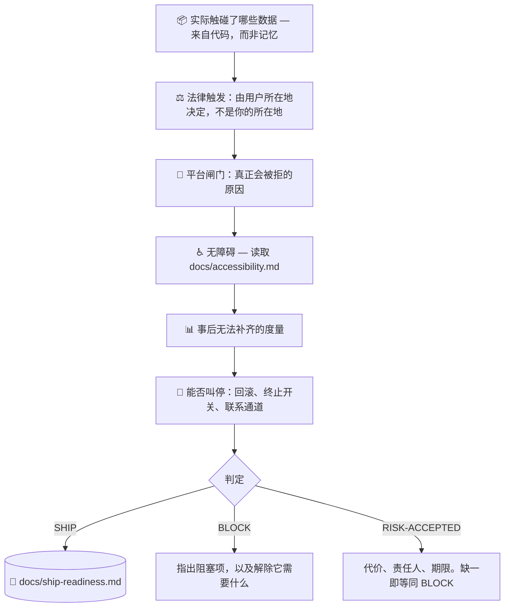

# 🚢 superforge-ship

[](https://opensource.org/licenses/MIT)
[](https://claude.com/claude-code)
[](https://github.com/takaoumehara/superforge-skill)

[English](README.md) · [日本語](README.ja.md) · **简体中文** · [Español](README.es.md) · [한국어](README.ko.md)

> **「能跑」和「可以发布」是两个判断，而通常只有前者被验证过。**

---

## 🔰 这是什么？

测试通过了。真机上跑起来了。`superforge-verify` 带着证据签了字。

但它仍然发布不了——因为某个分析 SDK 正在传输隐私政策里从未提到的数据；因为账号删除只存在于客服邮箱里；因为付费墙展示了价格却藏起了自动续订；因为没有埋点，上线第一个月产出的是感觉而不是事实；因为一旦出事，没有任何办法把它关掉。

这些都不是 bug。而它们每一个都能拦住发布。

这个技能是第二道闸门。它追问：**产品自身的行为触发了哪些义务**、什么会真正导致审核被拒、哪些度量事后再也补不回来、这次发布能否撤销——然后只返回**一个代码**，绝不返回一段说辞。

---

## 📐 架构



---

## ✨ 亮点

### ⚖️ 管辖跟着用户走，不跟着你的地址走
这正是这道闸门对所有人通用的原因。开发者在纽约、在东京、或在任何地方，面对的义务集合都相同，由**使用产品的人在哪里**以及**触碰了什么数据**决定。「我们又没进欧洲」从来不是 GDPR 问题的答案——有一个欧盟用户就够了。

### 📝 它识别义务，但不撰写法律文本
没有法条、没有样板、没有生成的隐私政策——这是刻意的。冻结在仓库里的法律措辞会悄无声息地过期，而凭记忆填写的模板描述的是**别人家的数据实践**。把「关于这个产品什么是事实」确定下来，才是真正属于你的那部分工作。一旦越过明确列出的停止条件——健康数据、儿童、生物识别、监管机构的来函——技能会交给专业人士，而不是自行发挥。

### 🌍 通用基线
几乎所有隐私法规都要求同样的四件事：**告知、限定用途、留出出口、可被联系到**。做好这四条，你在绝大多数法域都大体合规；之后再针对真正有用户的市场核实本地差异。顺序很重要——这四条事后补建代价高昂，而本地差异不是。

### 📊 补不回来的度量
留存队列、拆成五个事件的漏斗、来源归因、带版本标记的错误，以及激活事件——在发布前都很便宜，发布后则不可能。缺了它们上线，这次发布就永久无法度量：你只会知道它感觉如何，而不知道它究竟如何。

### 🛑 无法撤销的发布是一场赌博
回滚路径、**只针对最危险那部分功能的终止开关**、能触达真人的联系通道，以及头 48 小时指定的盯守人。「先看看情况」的意思是没有人在看。

### 🚦 一个判定，绝不是一段说辞
`SHIP` / `BLOCK` / `RISK-ACCEPTED`。没有代价评估、没有责任人、没有期限的风险接受，只是措辞更客气的 `BLOCK`。而一道从未返回过 `BLOCK` 的闸门，说明它根本没有在运行。

---

## 🔄 Before / After

| | 之前 | 之后 |
|---|---|---|
| 发布决策 | 「我觉得没问题」 | 一个代码 + 阻塞项的名字 |
| 数据披露 | 凭记忆写 | 由代码与依赖得出，SDK 计入自己的收集 |
| 法律范围 | 「我们不在欧盟」 | 由用户所在地决定 |
| 隐私政策 | 用模板生成 | 先确定事实；撰写外包，必要时升级给专业人士 |
| 无障碍 | 有余力再做的品质项 | 在法律适用的市场是发布阻塞项 |
| 埋点 | 上线后困惑了一周才补 | 发布前就位，因为队列数据无法回填 |
| 出事之后 | 发个修复版，祈祷审核快一点 | 终止开关、回滚路径、盯守的人 |

---

## 🚀 安装与使用

### 🖥️ 一次性安装全部十三个技能

```bash
git clone https://github.com/takaoumehara/superforge-skill
cd superforge-skill
./install.sh
```

完整选项、单技能安装与 claude.ai 上传方式见 [套件 README](../../README.zh-CN.md)。

### ⌨️ 调用

```
/superforge-ship
```

在 `superforge-verify` 之后、提交审核之前运行。判定写入 `docs/ship-readiness.md`。问它「什么在拦着我们」，它会给出通往 `SHIP` 的最短路径。

---

## ⚠️ 这不是法律建议

本技能把产品行为映射到「你现在必须回答的问题」，并指出何处必须交给专业人士。它不是律师，也不会保证你合规；到达 [references/legal-triggers.md](references/legal-triggers.md) §7 的停止条件时，它会停下，而不是靠猜测继续往前。

---

## 📄 许可证

MIT — 见 [LICENSE](../../LICENSE)。技能主体在 [SKILL.md](SKILL.md)；义务触发条件在 [references/legal-triggers.md](references/legal-triggers.md)，发布前埋点与上线后循环在 [references/launch-metrics.md](references/launch-metrics.md)。套件总览：[superforge-skill](../../README.zh-CN.md)。
