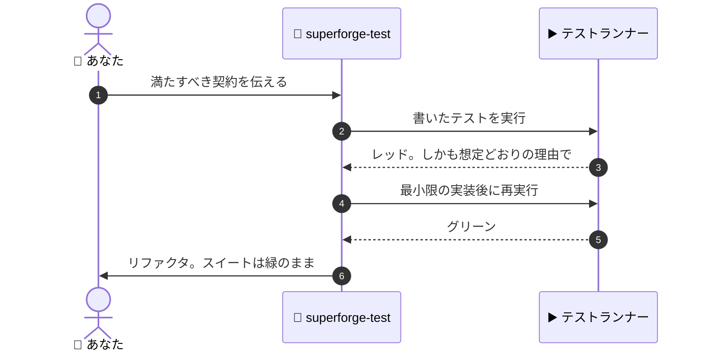

# 🧪 superforge-test

[](https://opensource.org/licenses/MIT)
[](https://claude.com/claude-code)
[](https://github.com/takaoumehara/superforge-skill)

[English](README.md) · **日本語** · [简体中文](README.zh-CN.md) · [Español](README.es.md) · [한국어](README.ko.md)

> **レッド・グリーン・リファクタ。各ステップでテストランナーを想像せず、実際に走らせる。**

---

## 🔰 これは何？

クライマーはロープに体重を預ける前に、必ず一度引っ張ります。ロープが弱そうだからではありません。「持つはずだ」と「持った」はまったく別の知識で、地面に落ちずに済むのは後者だけだからです。

このスキルはそれをコードでやります。先にテストを書いて実行し、「意図したとおりの理由で」落ちるのを目で見ます。そこで初めてコードを書き、もう一度走らせて通るのを見ます。両方とも観測します。想像で済ませません。

---

## 📐 システム概念図



誰も見ていないレッドはレッドではありません。このスキルが絶対に飛ばさないのがステップ3です。

---

## ✨ 強み

### 🎯 何をテストするかを、テストを書く前に決める
全部テストすれば、遅くて壊れやすい、誰も回さないスイートになる。何もテストしなければ、誰も触れないコードになる。判断はほぼ一行で済む——**人間がすぐには気づかない失敗を捕まえられるなら、そのテストは元が取れる。** 金額・日付・タイムゾーン・境界値・すでに直したバグは書く。フレームワークの挙動、素通しのgetter、ピクセル一致は書かない。

### 🔴 失敗を「想定」ではなく「確認」する
テストを書いた直後にランナーを走らせ、出力を読んで、落ちた理由が意図どおりかを確かめます。タイプミスでも import 漏れでもパス設定ミスでもないこと。間違った理由で通るテストは、テストが無いより悪いからです。

### 📱 1つのサイクルで3プラットフォーム
Web は Jest / Vitest / Playwright、iOS は Swift Testing / XCTest / `swift test`、Android は `./gradlew test` と `./gradlew connectedCheck`。規律は3つとも同じで、変わるのはコマンドだけです。

### 🧾 テストがそのまま証跡になる
`docs/plan.md` がある場合、各タスクの証跡行に「それを示す正確なコマンド」を書き込みます。これがあるから、無人実行が人間に出力の解釈を頼まずに自分で検証できます。

---

## 🔄 導入前 / 導入後

| | 導入前 | 導入後 |
|---|---|---|
| テストを書く時期 | 実装の後、余裕があれば | 実装の前、必ず |
| レッドの状態 | たぶん落ちているはず | 実行して読み、理由まで確認 |
| リファクタリング | 壊れていないことを祈る | スイートが答えを出す |
| 「終わりました」 | メッセージ上の主張 | 誰でも再実行できるコマンド |

---

## 🚀 インストールと使い方

### 🖥️ 12個まとめて入れる（最初の1回だけ）

クローンしてインストーラを走らせるだけです。マシンの中にあるスキル用フォルダを全部探して、14個をまとめてリンクします（Claude Code / Codex CLI / Gemini CLI / Antigravity）。

```bash
git clone https://github.com/takaoumehara/superforge-skill
cd superforge-skill
./install.sh
```

オプション、1個だけ入れる方法、claude.ai へのアップロード手順は [スイート全体の README](../../README.ja.md) にあります。

### ⌨️ 呼び出す

```
/superforge-test
```

プロジェクト側に動くテストランナーが必要です。このスキルは新たに導入せず、プロジェクト自身のコマンドを使います。

---

## 📄 ライセンス

MIT — [LICENSE](../../LICENSE) を参照してください。サイクル全体とプラットフォーム別のランナーコマンドは [SKILL.md](SKILL.md) にあります。スイート全体の説明は [superforge-skill](../../README.ja.md) へ。
