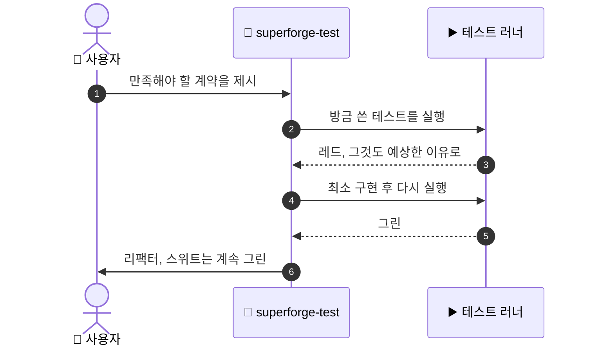

# 🧪 superforge-test

[](https://opensource.org/licenses/MIT)
[](https://claude.com/claude-code)
[](https://github.com/takaoumehara/superforge-skill)

[English](README.md) · [日本語](README.ja.md) · [简体中文](README.zh-CN.md) · [Español](README.es.md) · **한국어**

> **레드, 그린, 리팩터 — 각 단계에서 테스트 러너를 상상하지 않고 실제로 돌립니다.**

---

## 🔰 이게 뭔가요?

클라이머는 로프에 체중을 싣기 전에 반드시 한 번 당겨 봅니다. 로프가 약해 보여서가 아니라, "버틸 것이다"와 "버텼다"는 서로 다른 종류의 앎이고, 땅에 떨어지지 않게 해 주는 쪽은 후자뿐이기 때문입니다.

이 스킬은 그것을 코드에 적용합니다. 테스트를 먼저 쓰고 실제로 돌려서 의도한 이유로 실패하는지 눈으로 확인합니다. 그다음에야 코드를 쓰고, 다시 돌려 통과하는 것을 확인합니다. 두 쪽 모두 관찰하며, 추측으로 넘기지 않습니다.

---

## 📐 시스템 구조



아무도 보지 않은 레드는 레드가 아닙니다. 이 스킬이 절대 건너뛰지 않는 단계가 3번입니다.

---

## ✨ 강점

### 🎯 테스트를 쓰기 전에, 무엇을 테스트할지부터 정한다
전부 테스트하면 느리고 잘 깨져서 아무도 돌리지 않는 스위트가 되고, 아무것도 테스트하지 않으면 아무도 손대지 못하는 코드가 된다. 판단은 거의 한 줄이다 — **사람이 즉시 알아차리지 못할 실패를 잡아낸다면, 그 테스트는 값을 한다.** 금액·날짜·타임존·경계값, 그리고 이미 고친 모든 버그는 쓴다. 프레임워크의 동작, 그냥 넘겨주는 getter, 픽셀 일치는 쓰지 않는다.

### 🔴 실패는 가정하지 않고 확인합니다
테스트를 쓰자마자 러너를 돌리고 출력을 읽어, 실패한 이유가 의도한 그것인지 확인합니다. 오타도, 빠진 import도, 잘못된 경로 설정도 아니어야 합니다. 엉뚱한 이유로 통과하는 테스트는 없는 것만 못합니다.

### 📱 하나의 사이클, 세 개의 플랫폼
웹은 Jest / Vitest / Playwright, iOS는 Swift Testing / XCTest / `swift test`, Android는 `./gradlew test`와 `./gradlew connectedCheck`. 규율은 세 곳 모두 동일하고 바뀌는 것은 명령어뿐입니다.

### 🧾 테스트가 그대로 증거가 됩니다
`docs/plan.md`가 있으면 각 작업의 증거 줄에 그것을 증명하는 정확한 명령을 채워 넣습니다. 덕분에 무인 실행이 사람에게 출력 해석을 부탁하지 않고 스스로 검증할 수 있습니다.

---

## 🔄 도입 전 / 도입 후

| | 도입 전 | 도입 후 |
|---|---|---|
| 테스트를 쓰는 시점 | 구현 뒤, 여유가 있으면 | 구현 전, 반드시 |
| 레드 상태 | 실패했겠거니 | 돌리고 읽어 이유까지 확인 |
| 리팩터링 | 안 깨졌기를 바라기 | 스위트가 답을 줍니다 |
| "다 됐습니다" | 메시지 속의 주장 | 누구나 다시 돌릴 수 있는 명령 |

---

## 🚀 설치 및 사용법

### 🖥️ 열네 개를 한 번에 설치 (처음 한 번만)

저장소를 클론하고 설치 스크립트를 실행하면 됩니다. 이 머신의 모든 스킬 디렉터리를 찾아 열네 개를 한 번에 링크합니다(Claude Code / Codex CLI / Gemini CLI / Antigravity).

```bash
git clone https://github.com/takaoumehara/superforge-skill
cd superforge-skill
./install.sh
```

옵션 전체와 스킬 하나만 설치하는 방법, claude.ai 업로드 절차는 [스위트 README](../../README.ko.md)에 있습니다.

### ⌨️ 호출하기

```
/superforge-test
```

프로젝트에 동작하는 테스트 러너가 있어야 합니다. 이 스킬은 러너를 새로 설치하지 않고 프로젝트 자체의 명령을 사용합니다.

---

## 📄 라이선스

MIT — [LICENSE](../../LICENSE)를 참고하세요. 전체 사이클과 플랫폼별 러너 명령은 [SKILL.md](SKILL.md)에 있습니다. 스위트 전체 소개는 [superforge-skill](../../README.ko.md)을 보세요.
