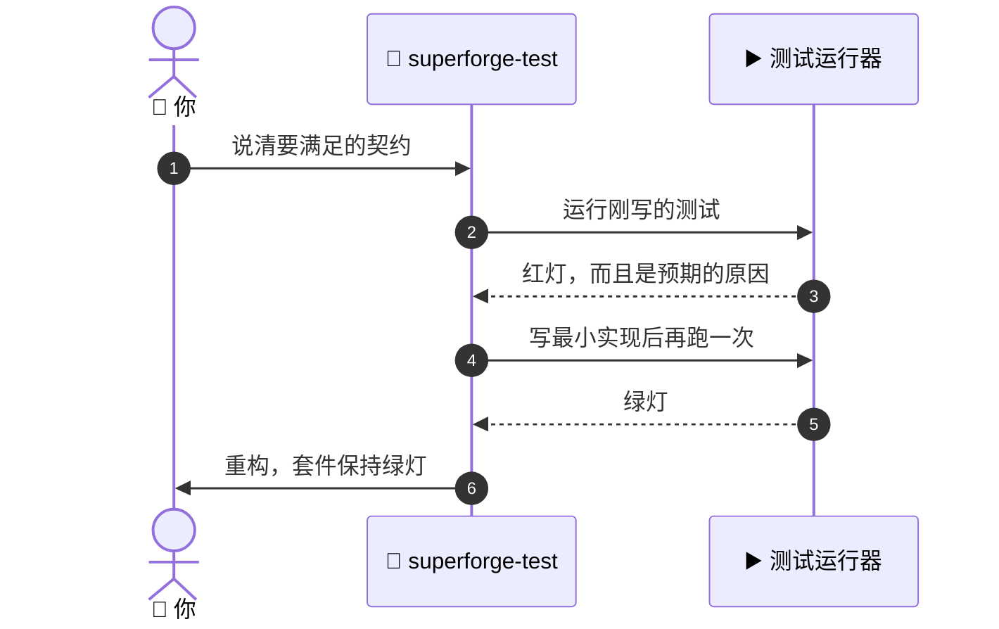

# 🧪 superforge-test

[](https://opensource.org/licenses/MIT)
[](https://claude.com/claude-code)
[](https://github.com/takaoumehara/superforge-skill)

[English](README.md) · [日本語](README.ja.md) · **简体中文** · [Español](README.es.md) · [한국어](README.ko.md)

> **红、绿、重构——每一步都真的把测试跑一遍，而不是在脑子里跑。**

---

## 🔰 这是什么？

攀岩的人在把体重交给绳子之前，一定会先拽一下。不是因为绳子看着不结实，而是因为"应该能承住"和"承住了"是两种不同的知识，只有后者能让你不落地。

这个技能把这件事搬到代码上。先写测试并真的跑一遍，亲眼看它按预期的原因失败；然后才写实现，再跑一遍看它通过。两边都要看见，不靠推测。

---

## 📐 系统架构



没人看过的红灯不算红灯。这个技能绝不跳过的就是第 3 步。

---

## ✨ 三大亮点

### 🔴 失败要"确认"，不能"假定"
测试一写出来就立刻跑，并读输出确认失败原因正是预期的那个——不是拼写错误、漏了 import 或路径配错。一个因为错误原因而通过的测试，比没有测试更糟。

### 📱 一套循环，三个平台
Web 用 Jest / Vitest / Playwright，iOS 用 Swift Testing / XCTest / `swift test`，Android 用 `./gradlew test` 和 `./gradlew connectedCheck`。三者的纪律完全一致，变的只是命令。

### 🧾 测试本身就是证据
项目里存在 `docs/plan.md` 时，每个任务的证据行会被填上能证明它完成的确切命令。正因为如此，无人值守的运行才能自我验证，而不必让人去解读输出。

---

## 🔄 使用前 / 使用后

| | 使用前 | 使用后 |
|---|---|---|
| 什么时候写测试 | 实现之后，有空再说 | 实现之前，一定写 |
| 红灯状态 | 大概是失败了吧 | 跑起来读输出，连原因一起确认 |
| 重构 | 祈祷没弄坏什么 | 由测试套件给出答案 |
| "做完了" | 消息里的一句话 | 任何人都能重跑的一条命令 |

---

## 🚀 安装与使用

### 🖥️ 一次装好全部 11 个技能（只需一次）

克隆仓库并运行安装脚本。它会找出本机所有技能目录，把 11 个技能一次性链接进去（Claude Code / Codex CLI / Gemini CLI / Antigravity）。

```bash
git clone https://github.com/takaoumehara/superforge-skill
cd superforge-skill
./install.sh
```

完整选项、只装单个技能的方法，以及 claude.ai 的上传步骤，都在[整套 README](../../README.zh-CN.md)。

### ⌨️ 调用它

```
/superforge-test
```

项目里需要有能跑的测试运行器；这个技能不会替你装一个，而是直接用项目自己的命令。

---

## 📄 许可证

MIT — 见 [LICENSE](../../LICENSE)。完整循环和各平台的运行命令都在 [SKILL.md](SKILL.md)。整套说明见 [superforge-skill](../../README.zh-CN.md)。
