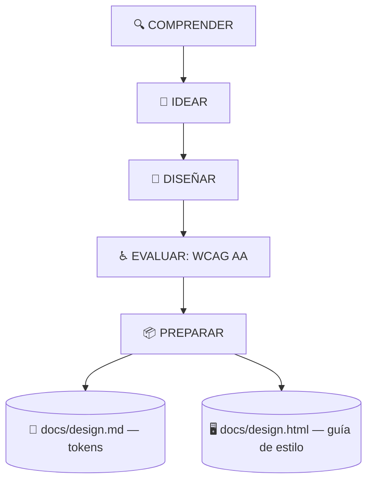

# 🎨 superforge-ui

[](https://opensource.org/licenses/MIT)
[](https://claude.com/claude-code)
[](https://github.com/takaoumehara/superforge-skill)

[English](README.md) · [日本語](README.ja.md) · [简体中文](README.zh-CN.md) · **Español** · [한국어](README.ko.md)

> **Diseña una interfaz que una persona pueda revisar y un agente pueda construir, desde una única fuente incapaz de contradecirse.**

---

## 🔰 ¿Qué es esto?

Un estudio de arquitectura entrega dos cosas: los planos con los que trabaja la obra y una maqueta que el cliente puede rodear. Ambas describen el mismo edificio y, si no coinciden, alguien lo va a pasar mal en la obra.

Esta skill produce las dos para una interfaz. `docs/design.md` lleva los tokens que el agente interpreta; `docs/design.html` es un único archivo autocontenido que abres en el navegador y muestra cada token, componente y estado renderizado de verdad. El HTML lee los tokens en lugar de redibujarlos, así que estructuralmente no pueden separarse.

---

## 📐 Arquitectura



Si editas uno de los artefactos, el otro se regenera en el mismo turno. Nunca se les permite discrepar.

---

## ✨ 3 puntos clave

### 🎛️ Siete estados antes de dar un componente por terminado
Default, hover, focus, active, disabled, loading y error se especifican uno a uno, incluidos el anillo de foco de teclado y la salida desde el estado de error. «En reposo se ve bien» no es un componente terminado.

### 🪞 Una guía de estilo que se abre y ya
`docs/design.html` renderiza todos los tokens y estados desde `file://`, con las ratios de contraste medidas y su distintivo de aprobado o suspenso al lado. La revisión se hace mirando, no leyendo una tabla de códigos hexadecimales e imaginándola.

### 📱 Reglas de plataforma, no reglas web pegadas sobre móvil
Apple HIG para SwiftUI (Dynamic Type, SF Symbols, `.presentationDetents`, háptica) y Material 3 para Compose (color dinámico, gesto de volver predictivo, objetivos de 48dp), junto a las reglas de movimiento web: animar solo `transform` y `opacity`.

---

## 🔄 Antes / Después

| | Antes | Después |
|---|---|---|
| Especificación de componente | El estado por defecto y a rezar | Los siete estados por escrito |
| Revisión de diseño | Capturas pegadas en un hilo | Un archivo HTML abierto en el navegador |
| Contraste | Se da por bueno | Medido, con distintivo de aprobado |
| Valores en el código | Hexadecimales escritos a mano | Solo tokens; los nuevos quedan registrados |

---

## 🚀 Instalación y uso

Solo hacen falta `git` y una herramienta de AI que cargue skills desde un directorio.

### 🖥️ Claude Code (CLI)

Clona la suite donde quieras y enlaza solo esta skill:

```bash
git clone https://github.com/takaoumehara/superforge-skill ~/src/superforge-skill
ln -s ~/src/superforge-skill/skills/superforge-ui ~/.claude/skills/superforge-ui
```

Reinicia Claude Code e invócala:

```
/superforge-ui
```

Al terminar, abre `docs/design.html` en el navegador: deberías ver cada token y cada estado renderizados, con los distintivos de contraste junto a las parejas de color.

### 🔗 Codex CLI / Gemini CLI / Antigravity

El mismo enlace, otro directorio. O deja que el instalador busque todos los directorios de skills de la máquina y enlace las once de una vez:

```bash
cd ~/src/superforge-skill
./install.sh
```

Es idempotente, solo toca sus propios enlaces simbólicos y acepta `--dry-run` y `--uninstall`.

### 🌐 claude.ai (navegador)

Comprime la carpeta de esta skill y súbela en los ajustes de skills de tu cuenta:

```bash
cd ~/src/superforge-skill/skills/superforge-ui
zip -r superforge-ui.zip .
```

La interfaz del navegador acepta una skill por vez, así que repite el proceso para cada una.

---

## 📄 Licencia

MIT — consulta [LICENSE](../../LICENSE). El cuerpo de la skill está en [SKILL.md](SKILL.md); los pasos de diseño, los cuatro estados de datos y la lista de calidad están en [references/design-process.md](references/design-process.md), y la especificación de los dos artefactos en [references/design-system-output.md](references/design-system-output.md). Visión general de la suite: [superforge-skill](../../README.md).
