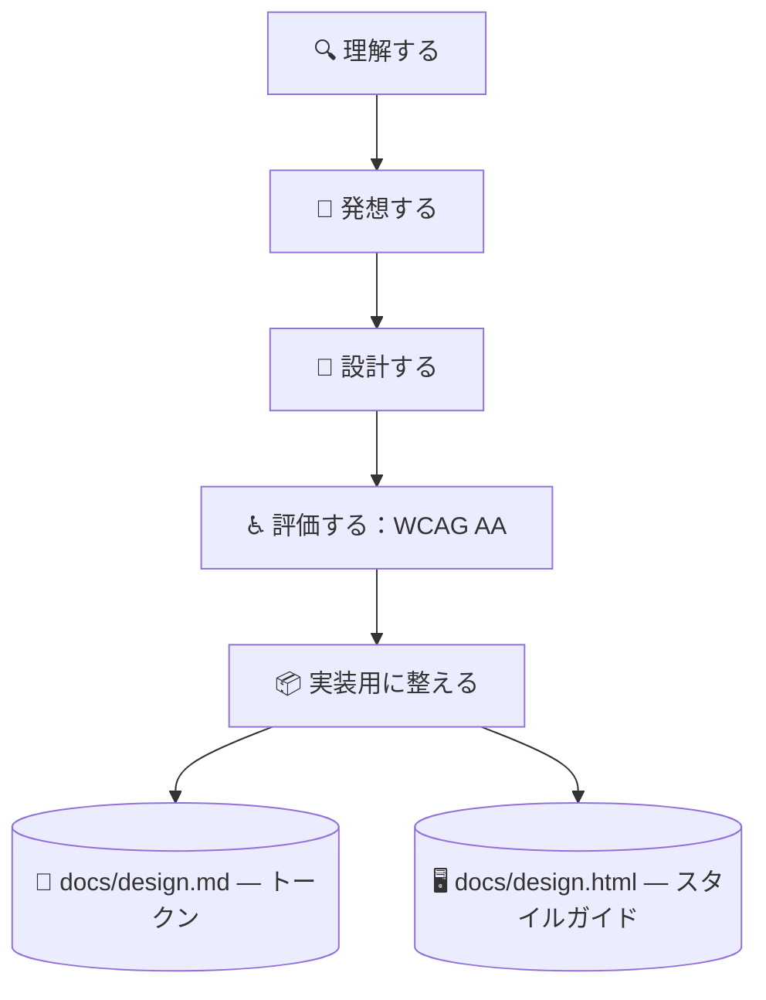

# 🎨 superforge-ui

[](https://opensource.org/licenses/MIT)
[](https://claude.com/claude-code)
[](https://github.com/takaoumehara/superforge-skill)

[English](README.md) · **日本語** · [简体中文](README.zh-CN.md) · [Español](README.es.md) · [한국어](README.ko.md)

> **人がレビューでき、エージェントが実装できるインターフェイスを、食い違いようのない一つの源から設計する。**

---

## 🔰 これは何？

建築家は2つを納品します。職人が見て作る図面と、施主が歩いて確かめられる模型です。どちらも同じ建物を表していて、両者が食い違えば現場で誰かが不幸になります。

このスキルはインターフェイスでその2つを作ります。`docs/design.md` はエージェントが解釈するトークン、`docs/design.html` はブラウザで開くだけで全トークン・全コンポーネント・全状態が実物として並ぶ自己完結ファイルです。HTMLはトークンを読んで描画するので、2つが構造的にずれません。

---

## 📐 システム概念図



片方を直したら、同じターンでもう片方を作り直します。両者のずれは許しません。

---

## ✨ 強み

### ⚡ パフォーマンスと多言語は、後で出てくる問題ではなくレイアウトの決定
ヒーロー動画も、4つのフォントウェイトも、レイアウトを起こすプロパティのアニメーションも、全部デザインの段階で選ばれている。そして誰かが計測する頃には、その上にコンポーネントが積まれている。だから予算の数字を3つ、トークンと一緒に `docs/design.md` に書く。超えたときにどうするかも一緒に。言語も同じで、ドイツ語は30〜40%長くなり、**短い文字列ほど伸び率が大きいので、最初に壊れるのはボタン**。コンテナを今のテキストに合わせてはいけない。今やればほぼタダで、後からやるのは作り直しです。

### 🎛️ 7つの状態が揃うまでコンポーネントは完成しない
Default / Hover / Focus / Active / Disabled / Loading / Error を1つずつ仕様化します。キーボードのフォーカスリングも、エラーからの復帰導線も含みます。「静止状態で見た目が良い」は完成ではありません。

### 🪞 人がそのまま開けるスタイルガイド
`docs/design.html` は `file://` から開くだけで全トークンと全状態を描画し、色の組み合わせの横に実測のコントラスト比と合否バッジを並べます。レビューは16進数の表を読んで想像するのではなく、見て行います。

### 📱 モバイルにWebの作法を貼らない
SwiftUI には Apple HIG（Dynamic Type、SF Symbols、`.presentationDetents`、触覚フィードバック）、Compose には Material 3（ダイナミックカラー、予測型「戻る」、48dpのタップ領域）。Web側のモーション規則は、アニメーションを `transform` と `opacity` に限定します。

### 💰 「売るためのページ」専用の作法
ランディングページはプロダクト画面とは別の基準で評価されます——タスクを終えるリピーターではなく、ワンタップで離脱できる初対面の他人が相手です。セクション順を「論の運び」として設計し、ファーストビューには専用の規則を課し、モバイルはデスクトップを縮めたものではなく別のページとして作ります。

---

## 🔄 導入前 / 導入後

| | 導入前 | 導入後 |
|---|---|---|
| コンポーネント仕様 | 通常状態だけ、あとは祈る | 7状態すべてを明記 |
| デザインレビュー | スクショをスレッドに貼る | HTMLを1枚ブラウザで開く |
| コントラスト | 大丈夫だろうと思う | 実測して合否バッジを表示 |
| コード中の値 | 16進数を直接書く | トークンのみ。新規は記録する |

---

## 🚀 インストールと使い方

### 🖥️ 12個まとめて入れる（最初の1回だけ）

クローンしてインストーラを走らせるだけです。マシンの中にあるスキル用フォルダを全部探して、14個をまとめてリンクします（Claude Code / Codex CLI / Gemini CLI / Antigravity）。

```bash
git clone https://github.com/takaoumehara/superforge-skill
cd superforge-skill
./install.sh
```

オプション、1個だけ入れる方法、claude.ai へのアップロード手順は [スイート全体の README](../../README.ja.md) にあります。

### ⌨️ 呼び出す

```
/superforge-ui
```

実行が終わったら `docs/design.html` をブラウザで開いてください。全トークンと全状態が描画され、色の組み合わせの横にコントラストのバッジが並びます。

---

### 🧬 モデルの平均値ではなく、実在の根拠から始めるデザイン
どのモデルも「いい感じにして」と言われると、**見てきたもの全部の平均**を返します。中央寄せのヒーロー、3枚の機能カード、グラデーションの塊。個々に間違いはないのに、**何ひとつ選ばれていない**。モデルを上位にしても、うまく作られた平均が返ってくるだけです。

だからこのスキルは、方向性を自分の外から取ってくるところから始めます。あなたが憧れるサイト、あるいは Claude Design・Google Stitch・Figma・v0 で既に作った画面。そこから**6つの層でシステムだけを抽出**します——セクションの構造と尺、余白の比、タイポの比、色は「役割」であってHEXではなく、モーションの性格、画像の処理。**中身は取りません。** そして**参照は3件以上**：1件だと模倣になり、3件あると共通する原理を探さざるを得なくなる。出典と、そこから意図的に外した点が `docs/design.md` に残るので、後から説明できます。

### 🚪 誰も設計しない30秒
ランディングページは見知らぬ人を説得します。プロダクト画面は戻ってきた人を助けます。**その間にあるのが、どちらの投資が報われるかを決める瞬間**で、たいていの場合そこには誰も読まないカルーセルが置かれています。初回起動の目的は製品を説明することではなく、**最小の判断回数で、ユーザーを1つの本物の成果まで運ぶこと**です。説明なしで成果が出せるなら、その説明は親切の衣を着た摩擦にすぎません。

特に罠なのが権限です。理由を理解する前に出た許可ダイアログは「拒否」を意味し、モバイルではその拒否が**恒久的**になることがあります。ユーザーがその機能をやろうとした直後に、**自前の前置き画面**を挟んでから聞くこと——自分の画面は何度でも出せますが、OSのダイアログは二度と出せないからです。

---

## 📄 ライセンス

MIT — [LICENSE](../../LICENSE) を参照してください。スキル本体は [SKILL.md](SKILL.md)、参照から方向性を取る手順は [references/design-sourcing.md](references/design-sourcing.md)、モーションの時間と描画パイプラインは [references/motion-system.md](references/motion-system.md)、設計ステップと4つのデータ状態、品質チェックリストは [references/design-process.md](references/design-process.md)、2つの成果物の仕様は [references/design-system-output.md](references/design-system-output.md)、売るためのランディングページ設計は [references/landing-page.md](references/landing-page.md)、入った直後の30秒（初回起動・権限要求・アクティベーション）は [references/first-run.md](references/first-run.md) にあります。スイート全体の説明は [superforge-skill](../../README.ja.md) へ。
