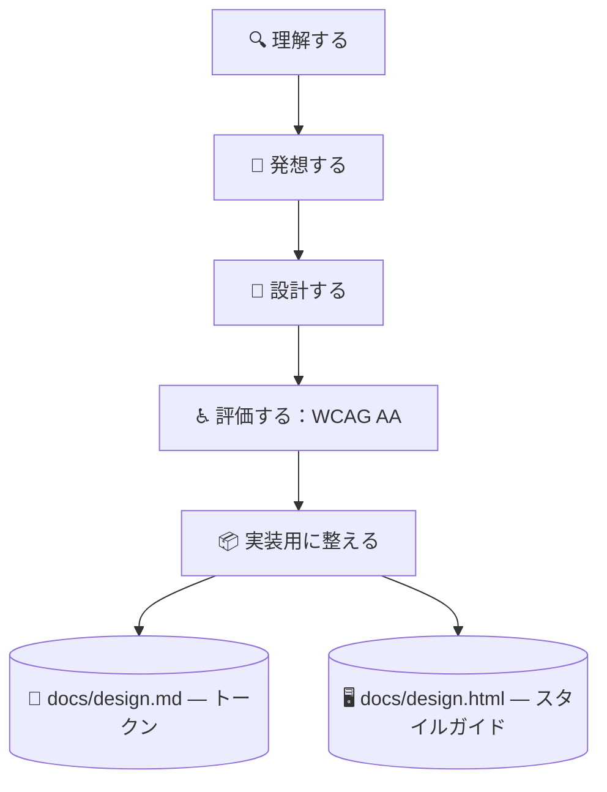

# 🎨 superforge-ui

[](https://opensource.org/licenses/MIT)
[](https://claude.com/claude-code)
[](https://github.com/takaoumehara/superforge-skill)

[English](README.md) · **日本語** · [简体中文](README.zh-CN.md) · [Español](README.es.md) · [한국어](README.ko.md)

> **人がレビューでき、エージェントが実装できるインターフェイスを、食い違いようのない一つの源から設計する。**

---

## 🔰 これは何？

建築家は2つを納品します。職人が見て作る図面と、施主が歩いて確かめられる模型です。どちらも同じ建物を表していて、両者が食い違えば現場で誰かが不幸になります。

このスキルはインターフェイスでその2つを作ります。`docs/design.md` はエージェントが解釈するトークン、`docs/design.html` はブラウザで開くだけで全トークン・全コンポーネント・全状態が実物として並ぶ自己完結ファイルです。HTMLはトークンを読んで描画するので、2つが構造的にずれません。

---

## 📐 システム概念図



片方を直したら、同じターンでもう片方を作り直します。両者のずれは許しません。

---

## ✨ 3つの強み

### 🎛️ 7つの状態が揃うまでコンポーネントは完成しない
Default / Hover / Focus / Active / Disabled / Loading / Error を1つずつ仕様化します。キーボードのフォーカスリングも、エラーからの復帰導線も含みます。「静止状態で見た目が良い」は完成ではありません。

### 🪞 人がそのまま開けるスタイルガイド
`docs/design.html` は `file://` から開くだけで全トークンと全状態を描画し、色の組み合わせの横に実測のコントラスト比と合否バッジを並べます。レビューは16進数の表を読んで想像するのではなく、見て行います。

### 📱 モバイルにWebの作法を貼らない
SwiftUI には Apple HIG（Dynamic Type、SF Symbols、`.presentationDetents`、触覚フィードバック）、Compose には Material 3（ダイナミックカラー、予測型「戻る」、48dpのタップ領域）。Web側のモーション規則は、アニメーションを `transform` と `opacity` に限定します。

---

## 🔄 導入前 / 導入後

| | 導入前 | 導入後 |
|---|---|---|
| コンポーネント仕様 | 通常状態だけ、あとは祈る | 7状態すべてを明記 |
| デザインレビュー | スクショをスレッドに貼る | HTMLを1枚ブラウザで開く |
| コントラスト | 大丈夫だろうと思う | 実測して合否バッジを表示 |
| コード中の値 | 16進数を直接書く | トークンのみ。新規は記録する |

---

## 🚀 インストールと使い方

### 🖥️ 11個まとめて入れる（最初の1回だけ）

クローンしてインストーラを走らせるだけです。マシンの中にあるスキル用フォルダを全部探して、11個をまとめてリンクします（Claude Code / Codex CLI / Gemini CLI / Antigravity）。

```bash
git clone https://github.com/takaoumehara/superforge-skill
cd superforge-skill
./install.sh
```

オプション、1個だけ入れる方法、claude.ai へのアップロード手順は [スイート全体の README](../../README.ja.md) にあります。

### ⌨️ 呼び出す

```
/superforge-ui
```

実行が終わったら `docs/design.html` をブラウザで開いてください。全トークンと全状態が描画され、色の組み合わせの横にコントラストのバッジが並びます。

---

## 📄 ライセンス

MIT — [LICENSE](../../LICENSE) を参照してください。スキル本体は [SKILL.md](SKILL.md)、設計ステップと4つのデータ状態、品質チェックリストは [references/design-process.md](references/design-process.md)、2つの成果物の仕様は [references/design-system-output.md](references/design-system-output.md) にあります。スイート全体の説明は [superforge-skill](../../README.ja.md) へ。
