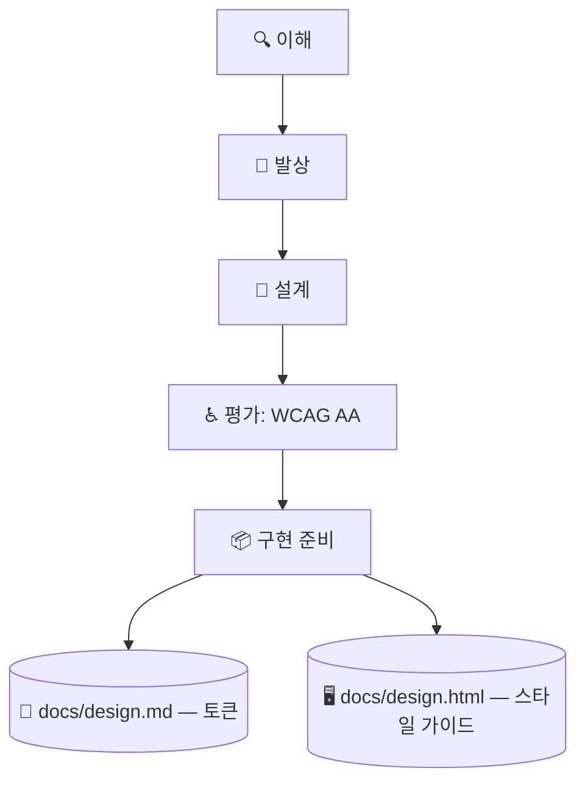

# 🎨 superforge-ui

[](https://opensource.org/licenses/MIT)
[](https://claude.com/claude-code)
[](https://github.com/takaoumehara/superforge-skill)

[English](README.md) · [日本語](README.ja.md) · [简体中文](README.zh-CN.md) · [Español](README.es.md) · **한국어**

> **사람이 검토할 수 있고 에이전트가 구현할 수 있는 인터페이스를, 서로 어긋날 수 없는 하나의 원천에서 설계합니다.**

---

## 🔰 이게 뭔가요?

건축가는 두 가지를 넘깁니다. 시공자가 보고 짓는 도면과, 건축주가 둘러볼 수 있는 모형입니다. 둘은 같은 건물을 설명하며, 서로 어긋나면 현장에서 누군가 곤란해집니다.

이 스킬은 인터페이스에서 그 두 가지를 만듭니다. `docs/design.md`는 에이전트가 해석하는 토큰이고, `docs/design.html`은 브라우저로 열기만 하면 모든 토큰과 컴포넌트, 모든 상태가 실제로 그려지는 자체 완결 파일입니다. HTML은 토큰을 읽어서 그리기 때문에 둘이 구조적으로 어긋날 수 없습니다.

---

## 📐 시스템 구조



한쪽을 고치면 같은 턴에 다른 쪽을 다시 만듭니다. 둘이 어긋나는 상태는 허용하지 않습니다.

---

## ✨ 강점

### ⚡ 성능과 두 번째 언어는 나중 문제가 아니라 레이아웃 단계의 결정
히어로 영상도, 네 가지 폰트 굵기도, 레이아웃을 유발하는 속성에 건 애니메이션도 전부 디자인에서 정해진다. 그리고 누군가 프로파일링할 때쯤이면 그 위에 컴포넌트가 쌓여 있다. 그래서 예산 숫자 세 개를 토큰과 함께 `docs/design.md`에 적고, 넘겼을 때 무엇을 할지도 같이 적는다. 언어도 마찬가지다. 독일어는 30~40% 길어지고 **짧은 문자열일수록 더 많이 늘어나므로 버튼이 먼저 깨진다.** 컨테이너를 지금 텍스트에 맞춰 재지 말 것 — 지금 하면 거의 공짜고, 나중에 하면 다시 만드는 일이다.

### 🎛️ 일곱 가지 상태가 갖춰져야 컴포넌트가 끝납니다
Default, hover, focus, active, disabled, loading, error를 하나씩 명세합니다. 키보드 포커스 링과 오류 상태에서 빠져나오는 경로까지 포함합니다. "가만히 있을 때 보기 좋다"는 완성이 아닙니다.

### 🪞 사람이 그냥 열어 보는 스타일 가이드
`docs/design.html`은 `file://`로 열기만 하면 모든 토큰과 상태를 렌더링하고, 색 조합 옆에 실측 명도 대비와 통과·미통과 배지를 붙입니다. 검토는 16진수 표를 읽고 상상하는 대신 눈으로 봅니다.

### 📱 모바일에 웹 규칙을 덧붙이지 않습니다
SwiftUI에는 Apple HIG(Dynamic Type, SF Symbols, `.presentationDetents`, 햅틱), Compose에는 Material 3(다이내믹 컬러, 예측형 뒤로 가기, 48dp 터치 영역)를 적용합니다. 웹 모션 규칙은 `transform`과 `opacity`만 애니메이션하도록 제한합니다.

### 💰 "팔기 위한 페이지"만의 별도 원칙
랜딩 페이지는 제품 화면과 다른 기준으로 평가됩니다 — 일을 끝내려는 재방문 사용자가 아니라, 한 번의 탭으로 떠날 수 있는 낯선 사람이 상대입니다. 섹션 순서를 하나의 논증으로 설계하고, 히어로 영역에는 별도 규칙을 적용하며, 모바일은 데스크톱을 축소한 것이 아니라 다른 페이지로 취급합니다.

---

## 🔄 도입 전 / 도입 후

| | 도입 전 | 도입 후 |
|---|---|---|
| 컴포넌트 명세 | 기본 상태만 두고 기대하기 | 일곱 가지 상태를 모두 기술 |
| 디자인 검토 | 스레드에 스크린숏 붙이기 | HTML 한 장을 브라우저로 열기 |
| 명도 대비 | 괜찮겠지 하고 넘김 | 실측하고 통과 여부를 표시 |
| 코드 속 값 | 16진수를 직접 입력 | 토큰만 사용, 새 토큰은 기록 |

---

## 🚀 설치 및 사용법

### 🖥️ 열네 개를 한 번에 설치 (처음 한 번만)

저장소를 클론하고 설치 스크립트를 실행하면 됩니다. 이 머신의 모든 스킬 디렉터리를 찾아 열네 개를 한 번에 링크합니다(Claude Code / Codex CLI / Gemini CLI / Antigravity).

```bash
git clone https://github.com/takaoumehara/superforge-skill
cd superforge-skill
./install.sh
```

옵션 전체와 스킬 하나만 설치하는 방법, claude.ai 업로드 절차는 [스위트 README](../../README.ko.md)에 있습니다.

### ⌨️ 호출하기

```
/superforge-ui
```

실행이 끝나면 `docs/design.html`을 브라우저로 열어 보세요. 모든 토큰과 상태가 그려지고, 색 조합 옆에 명도 대비 배지가 붙어 있어야 합니다.

---

### 🧬 모델의 평균이 아니라 실제 근거에서 시작하는 디자인
어떤 모델이든 "예쁘게 해줘"라고 하면 **본 것 전부의 평균**을 돌려줍니다. 가운데 정렬 히어로, 기능 카드 세 장, 그러데이션 덩어리. 하나하나는 틀리지 않았는데 **무엇도 선택되지 않았습니다**. 더 센 모델을 써도 더 잘 만들어진 평균이 나올 뿐입니다.

그래서 이 스킬은 방향을 자기 바깥에서 가져오는 것으로 시작합니다. 당신이 좋아하는 사이트, 혹은 Claude Design·Google Stitch·Figma·v0로 이미 만든 화면. 거기서 **여섯 층으로 시스템만 추출**합니다 — 섹션 구조와 리듬, 여백의 비, 타이포 스케일의 비, HEX가 아니라 색의 **역할**, 모션의 성격, 이미지 처리. **내용은 가져오지 않습니다.** 그리고 **레퍼런스는 셋 이상**: 하나면 모방이 되고, 셋이면 공통된 원리를 찾을 수밖에 없습니다. 출처와 의도적으로 벗어난 지점이 `docs/design.md`에 남습니다.

### 🚪 아무도 설계하지 않는 30초
랜딩 페이지는 낯선 사람을 설득하고, 제품 화면은 돌아온 사람을 돕습니다. **그 사이에 있는 것이 두 투자 중 어느 쪽이라도 회수될지를 결정하는 순간**이고, 보통 그 자리에는 아무도 읽지 않는 캐러셀이 놓여 있습니다. 첫 실행의 목표는 제품을 설명하는 것이 아니라 **가장 적은 판단으로 사용자를 하나의 진짜 결과까지 데려가는 것**입니다. 설명 없이도 결과를 낼 수 있다면, 그 설명은 친절의 옷을 입은 마찰일 뿐입니다.

특히 함정은 권한입니다. 이유를 이해하기 전에 뜬 허가 대화상자는 「거부」를 뜻하고, 모바일에서 그 거부는 종종 **영구적**입니다. 사용자가 그 기능을 막 시도한 직후에, **내 쪽의 사전 안내 화면**을 한 장 거쳐 묻는 것 — 내 화면은 다시 띄울 수 있지만 OS의 대화상자는 그럴 수 없기 때문입니다.

---

## 📄 라이선스

MIT — [LICENSE](../../LICENSE)를 참고하세요. 스킬 본문은 [SKILL.md](SKILL.md)에 있고, 레퍼런스에서 방향을 가져오는 절차는 [references/design-sourcing.md](references/design-sourcing.md)에, 모션 타이밍과 렌더 파이프라인은 [references/motion-system.md](references/motion-system.md)에, 설계 단계와 네 가지 데이터 상태·품질 체크리스트는 [references/design-process.md](references/design-process.md)에, 두 산출물의 명세는 [references/design-system-output.md](references/design-system-output.md)에, 판매용 랜딩 페이지 설계는 [references/landing-page.md](references/landing-page.md)에, 마음을 정한 직후의 30초(첫 실행·권한 요청·활성화)는 [references/first-run.md](references/first-run.md)에 있습니다. 스위트 전체 소개는 [superforge-skill](../../README.ko.md)을 보세요.
