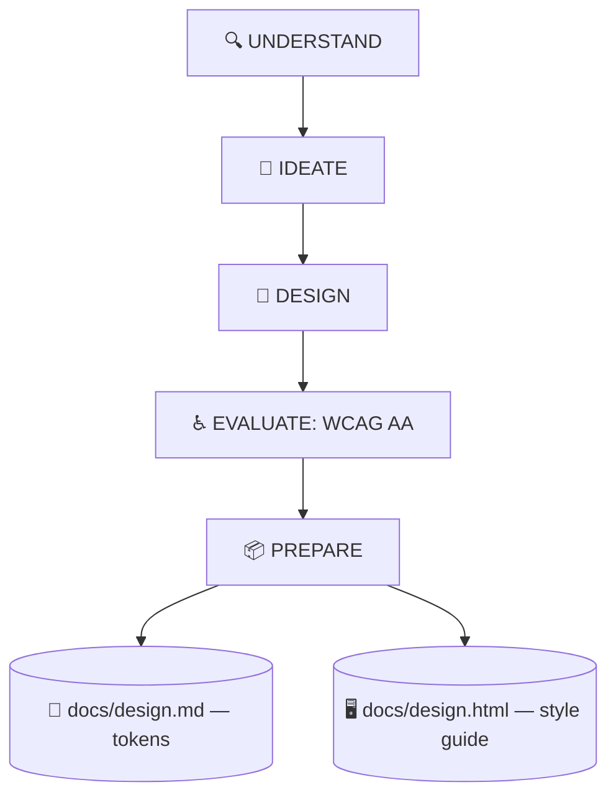

# 🎨 superforge-ui

[](https://opensource.org/licenses/MIT)
[](https://claude.com/claude-code)
[](https://github.com/takaoumehara/superforge-skill)

**English** · [日本語](README.ja.md) · [简体中文](README.zh-CN.md) · [Español](README.es.md) · [한국어](README.ko.md)

> **Design an interface a human can review and an agent can build — from one source that cannot disagree with itself.**

---

## 🔰 What is this?

An architect hands over two things: drawings the builders work from, and a scale model the client can walk around. Both describe the same building, and if they disagree, someone is going to be very unhappy on site.

This skill produces both for an interface. `docs/design.md` carries the tokens an agent parses; `docs/design.html` is a single self-contained file you open in a browser to see every token, component, and state rendered live. The HTML reads the tokens rather than redrawing them, so the two physically cannot drift apart.

---

## 📐 Architecture



Edit one artifact and the other is regenerated in the same turn. They are never allowed to disagree.

---

## ✨ Features

### 🎛️ Seven states before a component counts as finished
Default, hover, focus, active, disabled, loading, and error are each specified — including the keyboard focus ring and the recovery path from the error state. "It looks right at rest" is not a finished component.

### 🪞 A style guide a human can actually open
`docs/design.html` renders every token and state from `file://`, with measured contrast ratios and pass/fail badges next to them. Review happens by looking, not by reading a table of hex values and imagining it.

### 📱 Platform rules, not web rules pasted onto mobile
Apple HIG for SwiftUI (Dynamic Type, SF Symbols, `.presentationDetents`, haptics) and Material 3 for Compose (dynamic colour, predictive back, 48dp targets), alongside the web motion rules — animate only `transform` and `opacity`.

---

## 🔄 Before / After

| | Before | After |
|---|---|---|
| Component spec | The default state, and hope | All seven states written out |
| Design review | Screenshots pasted in a thread | One HTML file opened in a browser |
| Contrast | Assumed to be fine | Measured, with a pass/fail badge |
| Values in code | Hex codes typed inline | Tokens only; new ones get recorded |

---

## 🚀 Install & Usage

### 🖥️ Install all twelve skills (once)

Clone the repository and run the installer. It links every skill into every skills directory it finds on this machine — Claude Code, Codex CLI, Gemini CLI, Antigravity.

```bash
git clone https://github.com/takaoumehara/superforge-skill
cd superforge-skill
./install.sh
```

Full options, single-skill installs, and the claude.ai upload route are in the [suite README](../../README.md).

### ⌨️ Call it

```
/superforge-ui
```

When the run finishes, open `docs/design.html` in a browser: every token and state should render, with contrast badges beside the colour pairs.

---

## 📄 License

MIT — see [LICENSE](../../LICENSE). The full skill body is in [SKILL.md](SKILL.md); the design steps, the four data states, and the quality checklist are in [references/design-process.md](references/design-process.md), and the two-artifact spec is in [references/design-system-output.md](references/design-system-output.md). Suite overview: [superforge-skill](../../README.md).
