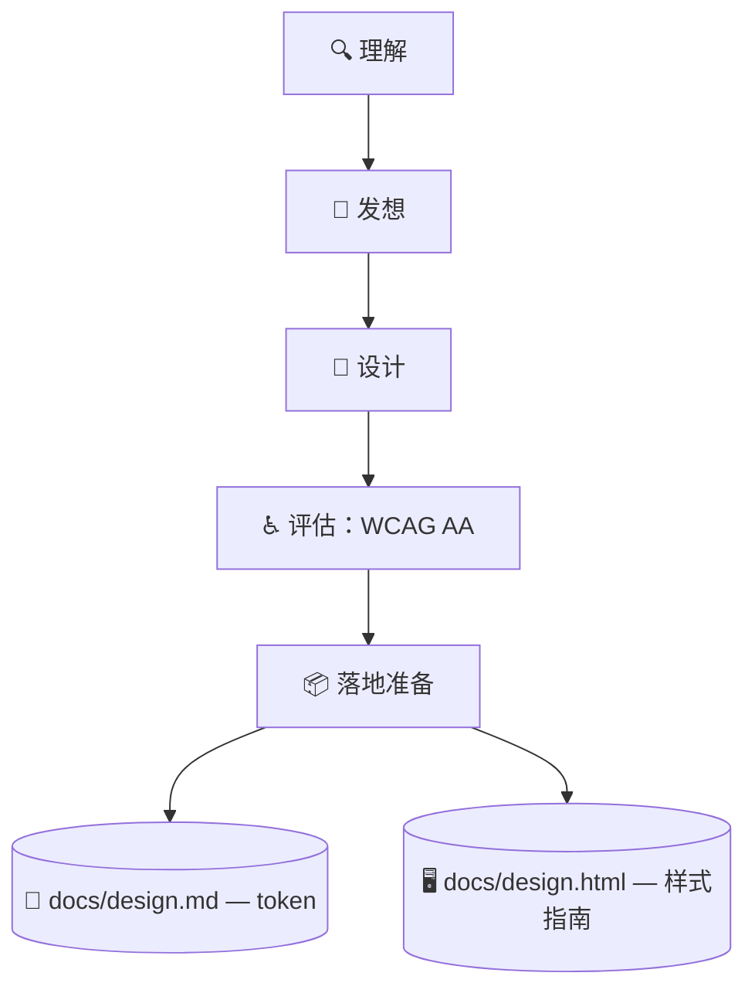

# 🎨 superforge-ui

[](https://opensource.org/licenses/MIT)
[](https://claude.com/claude-code)
[](https://github.com/takaoumehara/superforge-skill)

[English](README.md) · [日本語](README.ja.md) · **简体中文** · [Español](README.es.md) · [한국어](README.ko.md)

> **让人能评审、让 agent 能实现的界面，出自同一个不会自相矛盾的源头。**

---

## 🔰 这是什么？

建筑师交两样东西：工人照着施工的图纸，和业主可以绕着走一圈的模型。两者描述同一栋楼，一旦对不上，工地上就有人要倒霉。

这个技能为界面同时产出这两样。`docs/design.md` 装的是 agent 解析的 token，`docs/design.html` 是一份自包含文件，用浏览器打开就能看到每个 token、每个组件、每个状态的真实渲染。HTML 是读取 token 来渲染的，而不是照着重画，所以两者在结构上不可能跑偏。

---

## 📐 系统架构



改动其中一份，另一份会在同一轮里重新生成，绝不允许两者对不上。

---

## ✨ 三大亮点

### 🎛️ 七个状态齐了，组件才算做完
Default、Hover、Focus、Active、Disabled、Loading、Error 逐一写清楚，包括键盘焦点环和从错误状态返回的路径。"静止时看着不错"不等于组件完成。

### 🪞 人可以直接打开的样式指南
`docs/design.html` 从 `file://` 打开就渲染出全部 token 和状态，并在配色旁边标出实测对比度和通过/未通过徽章。评审靠看，而不是读一列十六进制值再脑补。

### 📱 移动端不套用 Web 的那一套
SwiftUI 走 Apple HIG（Dynamic Type、SF Symbols、`.presentationDetents`、触觉反馈），Compose 走 Material 3（动态取色、预测式返回、48dp 点击区域）。Web 侧的动效规则则只允许动 `transform` 和 `opacity`。

---

## 🔄 使用前 / 使用后

| | 使用前 | 使用后 |
|---|---|---|
| 组件规格 | 只有默认态，剩下靠祈祷 | 七个状态全部写明 |
| 设计评审 | 往会话里贴截图 | 用浏览器打开一份 HTML |
| 对比度 | 觉得应该没问题 | 实测，并标出通过与否 |
| 代码里的取值 | 直接写十六进制 | 只用 token，新增的会被记录 |

---

## 🚀 安装与使用

只需要 `git`，以及一个从目录加载技能的 AI 工具。

### 🖥️ Claude Code（CLI）

把整套克隆到任意位置，然后只链接这一个技能：

```bash
git clone https://github.com/takaoumehara/superforge-skill ~/src/superforge-skill
ln -s ~/src/superforge-skill/skills/superforge-ui ~/.claude/skills/superforge-ui
```

重启 Claude Code，然后调用：

```
/superforge-ui
```

跑完之后用浏览器打开 `docs/design.html`：所有 token 和状态都应该渲染出来，配色旁边带着对比度徽章。

### 🔗 Codex CLI / Gemini CLI / Antigravity

链接方式相同，只是目录不同。也可以交给安装脚本，它会找出本机所有技能目录，一次性链接全部 11 个技能：

```bash
cd ~/src/superforge-skill
./install.sh
```

脚本可重复执行，只处理自己创建的符号链接，并支持 `--dry-run` 预览和 `--uninstall` 卸载。

### 🌐 claude.ai（浏览器）

把这个技能的文件夹打包成 zip，在账号的技能设置里上传：

```bash
cd ~/src/superforge-skill/skills/superforge-ui
zip -r superforge-ui.zip .
```

浏览器端一次只能传一个技能，需要几个就重复几次。

---

## 📄 许可证

MIT — 见 [LICENSE](../../LICENSE)。技能正文在 [SKILL.md](SKILL.md)；设计步骤、四种数据状态和质量清单在 [references/design-process.md](references/design-process.md)，两份产物的规格在 [references/design-system-output.md](references/design-system-output.md)。整套说明见 [superforge-skill](../../README.zh-CN.md)。
