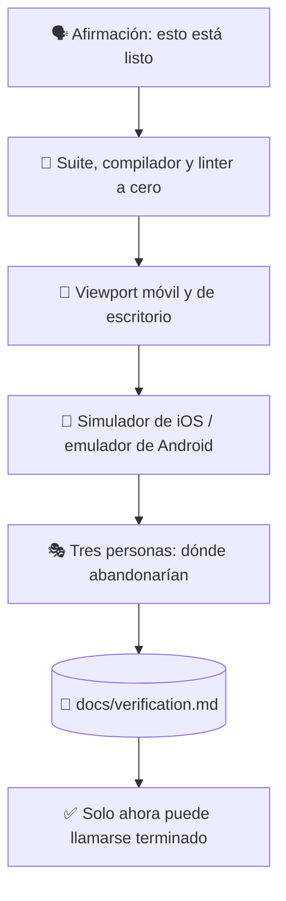

# ✅ superforge-verify

[](https://opensource.org/licenses/MIT)
[](https://claude.com/claude-code)
[](https://github.com/takaoumehara/superforge-skill)

[English](README.md) · [日本語](README.ja.md) · [简体中文](README.zh-CN.md) · **Español** · [한국어](README.ko.md)

> **«Está listo» se convierte en una afirmación con pruebas adjuntas, o no se dice.**

---

## 🔰 ¿Qué es esto?

La tripulación repasa la lista de comprobación antes de cada vuelo, incluso en rutas que ha hecho mil veces. No porque se le haya olvidado volar, sino porque el coste de equivocarse se paga en el peor momento posible.

Esta skill es esa lista antes de publicar. Antes de poder llamar a algo terminado, arreglado o completo, la suite se ejecuta de verdad, ambos viewports se abren de verdad, el simulador se lanza de verdad y la salida real se pega en un informe. Un informe de verificación sin pruebas es solo una afirmación, que es justo lo que esta skill existe para impedir.

---

## 📐 Arquitectura



Cada flecha es una puerta. Fallar una devuelve el trabajo hacia atrás, no hacia adelante.

---

## ✨ 3 puntos clave

### 🚦 Una puerta, no una lista que se ojea
Cero pruebas fallidas, cero errores de compilación en TypeScript, Swift o Kotlin, cero avisos del linter. Nada de «casi todo pasa»: las cifras se leen de la salida, no se estiman mirando el diff.

### 📱 Los dos viewports y el simulador de verdad
Por debajo de 640px: objetivos táctiles de 44px o más, sin desbordamiento horizontal, menús que responden al toque. Por encima de 1024px: varias columnas, navegación con `Tab` y `Enter`, estados hover. Las compilaciones nativas se ejecutan realmente en el simulador de iOS o el emulador de Android, y allí se comprueban Dynamic Type y el color dinámico de Material 3.

### 📋 La salida se pega, no se parafrasea
`docs/verification.md` registra cada comprobación, el comando exacto ejecutado y su salida real. «Las pruebas pasan» es una frase; una transcripción de terminal es un hecho.

---

## 🔄 Antes / Después

| | Antes | Después |
|---|---|---|
| «Arreglado» | Deducido de leer el diff | Deducido de ejecutarlo |
| Comprobación móvil | Imaginada encogiendo la ventana | Abierta por debajo de 640px y por encima de 1024px |
| Compilaciones nativas | «Debería compilar» | Ejecución en simulador o emulador confirmada |
| El informe | Un resumen con aplomo | Comandos con su salida real |

---

## 🚀 Instalación y uso

### 🖥️ Instala las doce skills (una sola vez)

Clona el repositorio y ejecuta el instalador. Enlaza las doce skills en todos los directorios de skills de tu máquina (Claude Code, Codex CLI, Gemini CLI, Antigravity).

```bash
git clone https://github.com/takaoumehara/superforge-skill
cd superforge-skill
./install.sh
```

Todas las opciones, la instalación de una sola skill y la ruta de subida a claude.ai están en el [README de la suite](../../README.es.md).

### ⌨️ Invócala

```
/superforge-verify
```

Usa los comandos de build y de pruebas del propio proyecto, así que esos deben funcionar antes. El resultado queda en `docs/verification.md`.

---

## 📄 Licencia

MIT — consulta [LICENSE](../../LICENSE). La lista completa está en [SKILL.md](SKILL.md), y el método de usabilidad con tres personas que toma prestado, en [evaluation-methods.md](../superforge-roast/references/evaluation-methods.md). Visión general de la suite: [superforge-skill](../../README.es.md).
