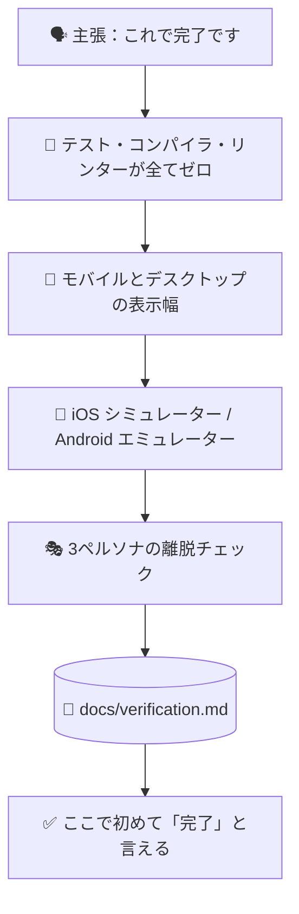

# ✅ superforge-verify

[](https://opensource.org/licenses/MIT)
[](https://claude.com/claude-code)
[](https://github.com/takaoumehara/superforge-skill)

[English](README.md) · **日本語** · [简体中文](README.zh-CN.md) · [Español](README.es.md) · [한국어](README.ko.md)

> **「終わりました」は証拠付きの主張になる。さもなければ口にしない。**

---

## 🔰 これは何？

パイロットは、千回飛んだ路線でも毎回チェックリストを回します。やり方を忘れたからではなく、間違いの代金を払う瞬間が最悪のタイミングだからです。

このスキルはリリース前のそのチェックリストです。「終わった」「直った」「完成した」と言う前に、テストを実際に走らせ、両方のビューポートを実際に開き、シミュレーターを実際に起動し、本物の出力をレポートに貼ります。証拠のない検証レポートはただの主張で、それこそがこのスキルが防ぐために存在するものです。

---

## 📐 システム概念図



矢印はすべてゲートです。1つでも落ちたら、先へは進まず差し戻します。

---

## ✨ 3つの強み

### 🚦 読み飛ばせるチェックリストではなく、ゲート
テスト失敗ゼロ、TypeScript / Swift / Kotlin のコンパイルエラーゼロ、リンター警告ゼロ。「だいたい通っている」は不可です。数字は差分を眺めて推測するのではなく、出力から読み取ります。

### 📱 両方の表示幅と、本物のシミュレーター
640px 未満ではタップ領域44px以上・横スクロールなし・タッチで開くメニュー。1024px 超ではマルチカラム・`Tab` と `Enter` での操作・ホバー状態。ネイティブは iOS シミュレーターや Android エミュレーターで実際に起動し、Dynamic Type と Material 3 のダイナミックカラーをそこで確認します。

### 📋 出力は要約せず貼り付ける
`docs/verification.md` には、実行したすべての確認項目と、正確なコマンドと、その実際の出力を記録します。「テストは通っています」は文章ですが、ターミナルの記録は事実です。

---

## 🔄 導入前 / 導入後

| | 導入前 | 導入後 |
|---|---|---|
| 「直りました」 | 差分を読んだ上での判断 | 実際に動かした上での判断 |
| モバイル確認 | 頭の中で幅を縮めて想像 | 640px未満と1024px超で実際に開く |
| ネイティブのビルド | 「たぶん通るはず」 | シミュレーター/エミュレーターで確認 |
| レポート | 自信のある要約 | コマンドと、その実際の出力 |

---

## 🚀 インストールと使い方

### 🖥️ 12個まとめて入れる（最初の1回だけ）

クローンしてインストーラを走らせるだけです。マシンの中にあるスキル用フォルダを全部探して、13個をまとめてリンクします（Claude Code / Codex CLI / Gemini CLI / Antigravity）。

```bash
git clone https://github.com/takaoumehara/superforge-skill
cd superforge-skill
./install.sh
```

オプション、1個だけ入れる方法、claude.ai へのアップロード手順は [スイート全体の README](../../README.ja.md) にあります。

### ⌨️ 呼び出す

```
/superforge-verify
```

プロジェクト自身のビルド・テストコマンドを使うため、それらが動く状態である必要があります。結果は `docs/verification.md` に残ります。

---

### 🚢 ここを通ったことは、出荷の許可ではありません
「動く」と「出していい」は、別の判定であり、必要な証拠も違います。このスキルの検査を全部通っても、解析SDKが開示していないデータを送信していれば、製品内に削除経路が無ければ、ロールバック手段が無ければ、リリースは止まります。その2枚目のゲートが [`superforge-ship`](../superforge-ship/README.ja.md) です。まずこちらを走らせ、それから向こうへ。

---

## 📄 ライセンス

MIT — [LICENSE](../../LICENSE) を参照してください。チェックリスト全体は [SKILL.md](SKILL.md)、借用している3ペルソナのユーザビリティ手法は [evaluation-methods.md](../superforge-roast/references/evaluation-methods.md) にあります。スイート全体の説明は [superforge-skill](../../README.ja.md) へ。
