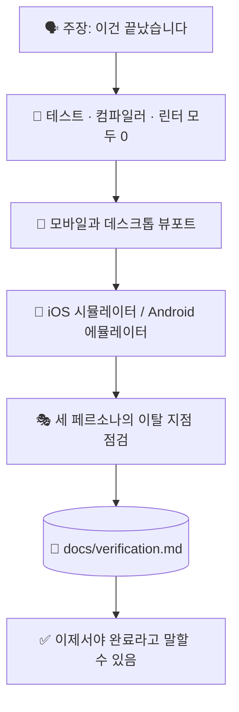

# ✅ superforge-verify

[](https://opensource.org/licenses/MIT)
[](https://claude.com/claude-code)
[](https://github.com/takaoumehara/superforge-skill)

[English](README.md) · [日本語](README.ja.md) · [简体中文](README.zh-CN.md) · [Español](README.es.md) · **한국어**

> **"다 됐습니다"는 증거를 붙인 주장이 되거나, 아예 입 밖에 내지 않습니다.**

---

## 🔰 이게 뭔가요?

조종사는 천 번을 날아 본 노선에서도 매번 체크리스트를 확인합니다. 방법을 잊어서가 아니라, 틀렸을 때의 대가를 가장 나쁜 순간에 치르기 때문입니다.

이 스킬은 출시 전의 그 체크리스트입니다. 무엇을 완료·수정·완성이라 부르기 전에, 테스트를 실제로 돌리고, 두 뷰포트를 실제로 열고, 시뮬레이터를 실제로 띄우고, 진짜 출력을 보고서에 붙입니다. 증거 없는 검증 보고서는 그저 주장일 뿐이고, 이 스킬은 바로 그것을 막으려고 존재합니다.

---

## 📐 시스템 구조



화살표 하나하나가 관문입니다. 하나라도 통과하지 못하면 앞이 아니라 뒤로 되돌립니다.

---

## ✨ 3가지 강점

### 🚦 훑고 지나갈 목록이 아니라 관문입니다
테스트 실패 0, TypeScript·Swift·Kotlin 컴파일 오류 0, 린터 경고 0. "대체로 통과"는 인정하지 않습니다. 숫자는 diff를 훑어 짐작하지 않고 출력에서 읽습니다.

### 📱 두 뷰포트와 진짜 시뮬레이터
640px 미만에서는 44px 이상의 터치 영역, 가로 넘침 없음, 터치에 반응하는 메뉴. 1024px 초과에서는 다단 레이아웃, `Tab`과 `Enter` 키보드 이동, hover 상태. 네이티브 빌드는 iOS 시뮬레이터나 Android 에뮬레이터에서 실제로 실행해 Dynamic Type과 Material 3 다이내믹 컬러까지 확인합니다.

### 📋 출력은 요약하지 않고 붙여 넣습니다
`docs/verification.md`에는 모든 점검 항목과 실행한 정확한 명령, 그리고 그 실제 출력을 기록합니다. "테스트가 통과합니다"는 문장이지만, 터미널 기록은 사실입니다.

---

## 🔄 도입 전 / 도입 후

| | 도입 전 | 도입 후 |
|---|---|---|
| "고쳤습니다" | diff를 읽고 내린 판단 | 실제로 돌려 보고 내린 판단 |
| 모바일 점검 | 머릿속으로 창을 줄여 상상 | 640px 미만과 1024px 초과를 실제로 열기 |
| 네이티브 빌드 | "빌드는 될 겁니다" | 시뮬레이터·에뮬레이터 실행으로 확인 |
| 보고서 | 자신 있는 요약 | 명령과 그 실제 출력 |

---

## 🚀 설치 및 사용법

`git`과 디렉터리에서 스킬을 불러오는 AI 도구만 있으면 됩니다.

### 🖥️ Claude Code (CLI)

원하는 위치에 전체 스위트를 클론한 뒤, 이 스킬 하나만 링크합니다.

```bash
git clone https://github.com/takaoumehara/superforge-skill ~/src/superforge-skill
ln -s ~/src/superforge-skill/skills/superforge-verify ~/.claude/skills/superforge-verify
```

Claude Code를 다시 시작하고 호출합니다.

```
/superforge-verify
```

프로젝트 자체의 빌드·테스트 명령을 사용하므로 그 명령들이 먼저 동작해야 합니다. 결과는 `docs/verification.md`에 남습니다.

### 🔗 Codex CLI / Gemini CLI / Antigravity

링크할 디렉터리만 다릅니다. 설치 스크립트에 맡기면 이 머신의 모든 스킬 디렉터리를 찾아 열한 개를 한 번에 링크합니다.

```bash
cd ~/src/superforge-skill
./install.sh
```

여러 번 실행해도 결과가 같고, 자기가 만든 심볼릭 링크만 건드리며, `--dry-run`과 `--uninstall`을 지원합니다.

### 🌐 claude.ai (브라우저)

이 스킬 폴더를 zip으로 묶어 계정의 스킬 설정에서 업로드합니다.

```bash
cd ~/src/superforge-skill/skills/superforge-verify
zip -r superforge-verify.zip .
```

브라우저에서는 한 번에 하나씩만 올릴 수 있으므로 필요한 스킬 수만큼 반복합니다.

---

## 📄 라이선스

MIT — [LICENSE](../../LICENSE)를 참고하세요. 전체 체크리스트는 [SKILL.md](SKILL.md)에 있고, 빌려 쓰는 3페르소나 사용성 기법은 [evaluation-methods.md](../superforge-roast/references/evaluation-methods.md)에 있습니다. 스위트 전체 소개는 [superforge-skill](../../README.md)을 보세요.
