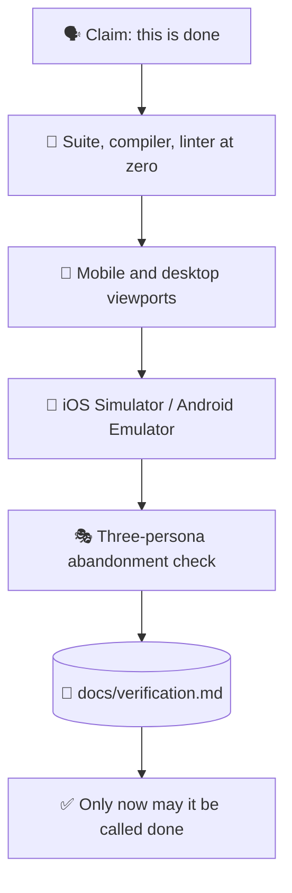

# ✅ superforge-verify

[](https://opensource.org/licenses/MIT)
[](https://claude.com/claude-code)
[](https://github.com/takaoumehara/superforge-skill)

**English** · [日本語](README.ja.md) · [简体中文](README.zh-CN.md) · [Español](README.es.md) · [한국어](README.ko.md)

> **"It's done" becomes a claim with evidence attached — or it does not get said.**

---

## 🔰 What is this?

Pilots run a checklist before every flight, including the ones they have flown a thousand times. Not because they have forgotten how, but because the cost of being wrong is paid at the worst possible moment.

This skill is that checklist for shipping. Before anything may be called done, fixed, or complete, the suite is actually run, both viewports are actually opened, the simulator is actually launched, and the real output is pasted into a report. A verification report without evidence is just an assertion, which is the exact thing this exists to stop.

---

## 📐 Architecture



Every arrow is a gate. Failing one sends the work back, not forward.

---

## ✨ Features

### 🚦 A gate, not a checklist you can skim past
Zero test failures, zero TypeScript, Swift, or Kotlin compilation errors, zero linter warnings. Not "mostly passing" — the numbers are read from the output, not estimated from a glance at the diff.

### 📱 Both viewports, and the real simulator
Under 640px: tap targets at 44px or more, no horizontal overflow, menus that respond to touch. Over 1024px: multi-column layout, `Tab` and `Enter` navigation, hover states. Native builds are actually run in the iOS Simulator or the Android Emulator, and Dynamic Type and Material 3 dynamic colour are checked there.

### 📋 The output is pasted, not paraphrased
`docs/verification.md` records every check, the exact command that was run, and its real output. "Tests pass" is a sentence; a terminal transcript is a fact.

---

## 🔄 Before / After

| | Before | After |
|---|---|---|
| "Fixed" | Concluded from reading the diff | Concluded from running the thing |
| Mobile check | Imagined by resizing mentally | Under 640px and over 1024px, opened |
| Native builds | "It should compile" | Simulator or emulator run confirmed |
| The report | A confident summary | Commands with their real output |

---

## 🚀 Install & Usage

You need `git` and an AI tool that loads skills from a directory.

### 🖥️ Claude Code (CLI)

Clone the suite anywhere, then link this one skill:

```bash
git clone https://github.com/takaoumehara/superforge-skill ~/src/superforge-skill
ln -s ~/src/superforge-skill/skills/superforge-verify ~/.claude/skills/superforge-verify
```

Restart Claude Code, then invoke it:

```
/superforge-verify
```

It runs the project's own build and test commands, so those need to work first. The result lands in `docs/verification.md`.

### 🔗 Codex CLI / Gemini CLI / Antigravity

The same link, a different directory. Or let the installer find every skills directory on this machine and link all eleven skills at once:

```bash
cd ~/src/superforge-skill
./install.sh
```

It is idempotent, touches only its own symlinks, and accepts `--dry-run` and `--uninstall`.

### 🌐 claude.ai (browser)

Zip this skill's folder and upload it in your account's skill settings:

```bash
cd ~/src/superforge-skill/skills/superforge-verify
zip -r superforge-verify.zip .
```

The browser UI takes one skill at a time, so repeat it for each skill you want.

---

## 📄 License

MIT — see [LICENSE](../../LICENSE). The full checklist is in [SKILL.md](SKILL.md); the three-persona usability method it borrows is in [evaluation-methods.md](../superforge-roast/references/evaluation-methods.md). Suite overview: [superforge-skill](../../README.md).
