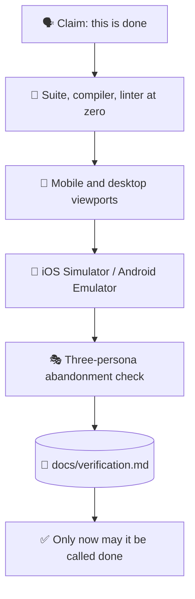

# ✅ superforge-verify

[](https://opensource.org/licenses/MIT)
[](https://claude.com/claude-code)
[](https://github.com/takaoumehara/superforge-skill)

**English** · [日本語](README.ja.md) · [简体中文](README.zh-CN.md) · [Español](README.es.md) · [한국어](README.ko.md)

> **"It's done" becomes a claim with evidence attached — or it does not get said.**

---

## 🔰 What is this?

Pilots run a checklist before every flight, including the ones they have flown a thousand times. Not because they have forgotten how, but because the cost of being wrong is paid at the worst possible moment.

This skill is that checklist for shipping. Before anything may be called done, fixed, or complete, the suite is actually run, both viewports are actually opened, the simulator is actually launched, and the real output is pasted into a report. A verification report without evidence is just an assertion, which is the exact thing this exists to stop.

---

## 📐 Architecture



Every arrow is a gate. Failing one sends the work back, not forward.

---

## ✨ Features

### 🏅 Evidence is graded, and an assertion is never enough
Reproducible, observed, derived, asserted. A conclusion must name the command or capture it rests on, and **a verification report may not contain a single assertion.** The quiet failure this catches is a conclusion written in the confident tone of a measurement: "mobile layout verified" is not evidence — "screenshot at 375px, attached" is. And `## 確認していないこと` is a required section.

### 🚦 A gate, not a checklist you can skim past
Zero test failures, zero TypeScript, Swift, or Kotlin compilation errors, zero linter warnings. Not "mostly passing" — the numbers are read from the output, not estimated from a glance at the diff.

### 📱 Both viewports, and the real simulator
Under 640px: tap targets at 44px or more, no horizontal overflow, menus that respond to touch. Over 1024px: multi-column layout, `Tab` and `Enter` navigation, hover states. Native builds are actually run in the iOS Simulator or the Android Emulator, and Dynamic Type and Material 3 dynamic colour are checked there.

### 📋 The output is pasted, not paraphrased
`docs/verification.md` records every check, the exact command that was run, and its real output. "Tests pass" is a sentence; a terminal transcript is a fact.

---

## 🔄 Before / After

| | Before | After |
|---|---|---|
| "Fixed" | Concluded from reading the diff | Concluded from running the thing |
| Mobile check | Imagined by resizing mentally | Under 640px and over 1024px, opened |
| Native builds | "It should compile" | Simulator or emulator run confirmed |
| The report | A confident summary | Commands with their real output |

---

## 🚀 Install & Usage

### 🖥️ Install all fourteen skills (once)

Clone the repository and run the installer. It links every skill into every skills directory it finds on this machine — Claude Code, Codex CLI, Gemini CLI, Antigravity.

```bash
git clone https://github.com/takaoumehara/superforge-skill
cd superforge-skill
./install.sh
```

Full options, single-skill installs, and the claude.ai upload route are in the [suite README](../../README.md).

### ⌨️ Call it

```
/superforge-verify
```

It runs the project's own build and test commands, so those need to work first. The result lands in `docs/verification.md`.

---

### 🚢 Passing here is not permission to ship
"It works" and "we are allowed to release it" are different verdicts with different evidence. A product can clear every check in this skill and still be blocked by an analytics SDK transmitting undisclosed data, a missing in-product deletion path, or no way to roll back. That second gate is [`superforge-ship`](../superforge-ship/README.md) — run this one first, then that one.

---

## 📄 License

MIT — see [LICENSE](../../LICENSE). The full checklist is in [SKILL.md](SKILL.md); the three-persona usability method it borrows is in [evaluation-methods.md](../superforge-roast/references/evaluation-methods.md). Suite overview: [superforge-skill](../../README.md).
