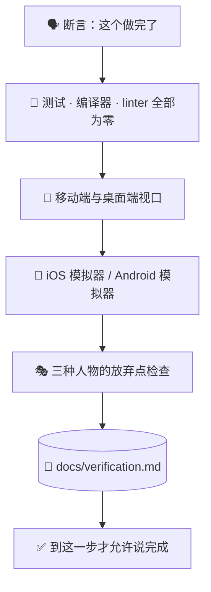

# ✅ superforge-verify

[](https://opensource.org/licenses/MIT)
[](https://claude.com/claude-code)
[](https://github.com/takaoumehara/superforge-skill)

[English](README.md) · [日本語](README.ja.md) · **简体中文** · [Español](README.es.md) · [한국어](README.ko.md)

> **"做完了"必须带着证据说出口，否则就别说。**

---

## 🔰 这是什么？

飞行员每次起飞前都要过一遍检查单，哪怕这条航线已经飞过一千次。不是因为忘了怎么飞，而是因为判断失误的代价总在最糟的时刻结算。

这个技能就是交付前的那份检查单。在说"做完了""修好了""完成了"之前，测试要真的跑，两种视口要真的打开，模拟器要真的启动，真实输出要贴进报告里。没有证据的验证报告只是一句断言，而这正是这个技能存在的意义所在。

---

## 📐 系统架构



每一根箭头都是一道关卡。任何一关不过，工作就退回去，而不是往前走。

---

## ✨ 三大亮点

### 🚦 是关卡，不是可以一眼扫过的清单
测试失败为零，TypeScript / Swift / Kotlin 编译错误为零，linter 警告为零。"基本都过了"不算。这些数字是从输出里读出来的，不是扫一眼 diff 估出来的。

### 📱 两种视口，加上真实模拟器
640px 以下：点击区域不小于 44px、无横向溢出、菜单能响应触摸。1024px 以上：多栏布局、`Tab` 与 `Enter` 键盘导航、hover 状态。原生构建会真的跑在 iOS 模拟器或 Android 模拟器里，并在那里检查 Dynamic Type 和 Material 3 动态取色。

### 📋 输出要粘贴，不能转述
`docs/verification.md` 记录每一项检查、执行的确切命令，以及它的真实输出。"测试通过了"是一句话，终端记录才是事实。

---

## 🔄 使用前 / 使用后

| | 使用前 | 使用后 |
|---|---|---|
| "修好了" | 读完 diff 得出的结论 | 真的跑起来得出的结论 |
| 移动端检查 | 在脑子里把窗口缩小 | 640px 以下和 1024px 以上都真的打开 |
| 原生构建 | "应该能编过" | 模拟器里跑起来确认 |
| 报告 | 一段自信的总结 | 命令加上它们的真实输出 |

---

## 🚀 安装与使用

只需要 `git`，以及一个从目录加载技能的 AI 工具。

### 🖥️ Claude Code（CLI）

把整套克隆到任意位置，然后只链接这一个技能：

```bash
git clone https://github.com/takaoumehara/superforge-skill ~/src/superforge-skill
ln -s ~/src/superforge-skill/skills/superforge-verify ~/.claude/skills/superforge-verify
```

重启 Claude Code，然后调用：

```
/superforge-verify
```

它会用项目自己的构建和测试命令，所以这些命令得先能跑通。结果会落在 `docs/verification.md`。

### 🔗 Codex CLI / Gemini CLI / Antigravity

链接方式相同，只是目录不同。也可以交给安装脚本，它会找出本机所有技能目录，一次性链接全部 11 个技能：

```bash
cd ~/src/superforge-skill
./install.sh
```

脚本可重复执行，只处理自己创建的符号链接，并支持 `--dry-run` 预览和 `--uninstall` 卸载。

### 🌐 claude.ai（浏览器）

把这个技能的文件夹打包成 zip，在账号的技能设置里上传：

```bash
cd ~/src/superforge-skill/skills/superforge-verify
zip -r superforge-verify.zip .
```

浏览器端一次只能传一个技能，需要几个就重复几次。

---

## 📄 许可证

MIT — 见 [LICENSE](../../LICENSE)。完整检查单在 [SKILL.md](SKILL.md)，它借用的三人物可用性方法在 [evaluation-methods.md](../superforge-roast/references/evaluation-methods.md)。整套说明见 [superforge-skill](../../README.zh-CN.md)。
