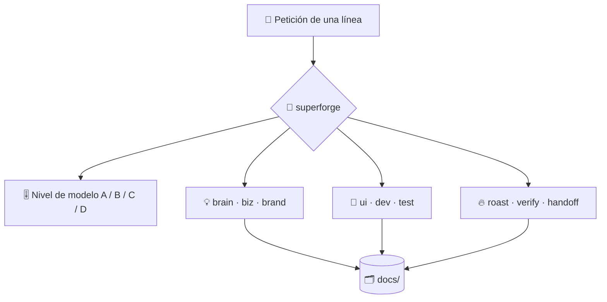

# ⚡ superforge

[](https://opensource.org/licenses/MIT)
[](https://claude.com/claude-code)
[](https://github.com/takaoumehara/superforge-skill)

[English](README.md) · [日本語](README.ja.md) · [简体中文](README.zh-CN.md) · **Español** · [한국어](README.ko.md)

> **Di qué quieres construir: la especialista adecuada empieza a trabajar, sobre el modelo que esa parte del trabajo realmente necesita.**

---

## 🔰 ¿Qué es esto?

Imagina la recepción de un taller grande. Cuentas qué quieres construir, alguien que conoce todos los bancos de trabajo te lleva al correcto y le pasa el encargo a la artesana cuyo oficio encaja, en vez de llamar siempre a la más cara.

`superforge` es esa recepción para las diez skills `superforge-*`. Lee la petición, decide el destino, asigna un nivel de modelo a cada subtarea antes de lanzar ningún agente y se asegura de que cada paso deje un archivo detrás.

---

## 📐 Arquitectura



Entra una petición; sale una skill especialista, un nivel de modelo elegido y un archivo en `docs/`.

---

## ✨ 3 puntos clave

### 🧭 Deriva en vez de preguntar
Diez especialistas cubren idea, negocio, marca, UI, implementación, pruebas, depuración, crítica, verificación y traspaso. El destino y el nivel se anuncian en una línea y el trabajo empieza. Solo se pide confirmación cuando dos caminos genuinamente distintos son igual de razonables.

### 🎚️ Un nivel por subtarea, decidido antes de lanzar agentes
El juicio va a Opus 5, el volumen a Sonnet 5, la rutina a Haiku 4.5, las ejecuciones largas sin supervisión a Fable 5, y el texto masivo que no toca el repositorio a la CLI local `gemini`. Nada se queda en el modelo por defecto de la sesión «por si acaso».

### 🗂️ Ninguna conclusión vive solo en el chat
Cada skill escribe su artefacto en `docs/` antes de informar, así que `/clear`, un cambio de modelo o simplemente el día siguiente no te cuestan nada de lo ya decidido.

---

## 🔄 Antes / Después

| | Antes | Después |
|---|---|---|
| Al arrancar | «¿Por dónde empiezo?» | Una frase, derivada en una línea |
| Elección de modelo | Todos los agentes en el modelo por defecto | Un nivel por subtarea, anunciado |
| Trabajo rutinario | Facturado a precio de modelo de juicio | Haiku 4.5, o fuera de Anthropic |
| Después de `/clear` | Se rediscute lo ya decidido | Se relee desde `docs/` |

---

## 🚀 Instalación y uso

### 🖥️ Instala las once skills (una sola vez)

Clona el repositorio y ejecuta el instalador. Enlaza las once skills en todos los directorios de skills de tu máquina (Claude Code, Codex CLI, Gemini CLI, Antigravity).

```bash
git clone https://github.com/takaoumehara/superforge-skill
cd superforge-skill
./install.sh
```

Todas las opciones, la instalación de una sola skill y la ruta de subida a claude.ai están en el [README de la suite](../../README.es.md).

### ⌨️ Invócala

```
/superforge
```

Antes de ponerse a trabajar anuncia en una línea el destino y el nivel de modelo.

---

## 📄 Licencia

MIT — consulta [LICENSE](../../LICENSE). El cuerpo de la skill está en [SKILL.md](SKILL.md), y las reglas que carga bajo demanda en [references/intake.md](references/intake.md), [references/artifacts.md](references/artifacts.md) y [references/wiring.md](references/wiring.md). Visión general de la suite: [superforge-skill](../../README.es.md).
