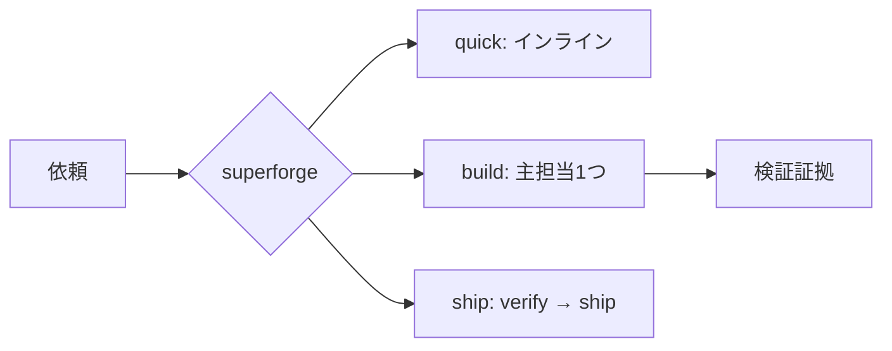

# ⚡ superforge

[](https://opensource.org/licenses/MIT)
[](https://claude.com/claude-code)

[English](README.md) · **日本語** · [简体中文](README.zh-CN.md) · [Español](README.es.md) · [한국어](README.ko.md)

> フェーズの最初に一度だけ呼び、その後は普通のフィードバックで続ける。

## これは何？

`superforge` は14個の `superforge-*` 専門スキルへつなぐ、薄い入口です。
依頼を Small / Medium / Large に分け、必要なときだけ主担当を1つ選び、
検証とリリース判定のゲートを残します。

細かな修正のたびに再起動するものではありません。作業フェーズが始まった
あとは、文章・CSS・テンプレートの追記を既存条件のまま続行します。



## 3つの入口

| 入口 | 使う場面 | 既定の動作 |
|---|---|---|
| `/superforge quick` | 範囲が限定された修正 | インライン。専門スキル・docs・logなし |
| `/superforge build` | 新機能やまとまった変更の開始 | 同時に主担当1つだけ |
| `/superforge ship` | 一般公開・課金開始の判断 | 先に検証し、その後リリース可否を判定 |

通常の `/superforge` は最小の安全な入口を推測します。毎メッセージに付ける
必要はありません。

## なぜ軽いのか

- 本体は最大100行で、モデル一覧を持ちません。
- intake・委譲・モデル・成果物・ログの詳細は、必要な場合だけ読みます。
- Small作業では調整コストを発生させません。
- UI系スキルを自動で重ねず、代替候補として1つを選びます。
- run log は訂正・失敗・再試行・リリースだけを記録します。

実際にエージェントを起動するときのモデル選択は残りますが、変化しやすい
情報は常時読む本体ではなく、オンデマンドのreferenceに置きます。

## インストール

```bash
git clone https://github.com/takaoumehara/superforge-skill
cd superforge-skill
./install.sh
```

大きなフェーズは `/superforge build` で始めます。担当領域が分かっている
場合は、専門スキルを直接呼んでも構いません。

## ファイル

- [SKILL.md](SKILL.md) — 薄いルーター本体
- [artifacts.md](references/artifacts.md) — 継続に必要な事実の保存方針
- [run-log.md](references/run-log.md) — 例外だけを残すログ
- [model-prompting.md](references/model-prompting.md) — ディスパッチ時だけ読む指針
- [wiring.md](references/wiring.md) — 追加スキルが本当に必要な場合の委譲

MIT — [LICENSE](../../LICENSE)。全体説明は [superforge-skill](../../README.ja.md) へ。
