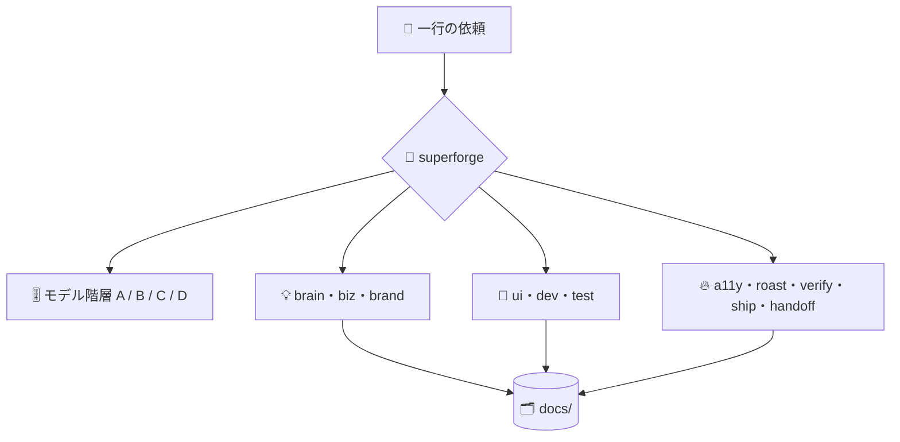

# ⚡ superforge

[](https://opensource.org/licenses/MIT)
[](https://claude.com/claude-code)
[](https://github.com/takaoumehara/superforge-skill)

[English](README.md) · **日本語** · [简体中文](README.zh-CN.md) · [Español](README.es.md) · [한국어](README.ko.md)

> **作りたいものを一言で言えば、担当のスキルが、その作業に見合ったモデルで動き出す。**

---

## 🔰 これは何？

大きな工房の受付を思い浮かべてください。作りたいものを伝えると、全部の作業台を知っている人が正しい台まで案内し、その仕事に合った職人に渡してくれます。毎回いちばん高い職人を呼びつけたりはしません。

`superforge` は、12個の `superforge-*` スキルに対するその受付です。依頼を読み、行き先を決め、エージェントを起動する前にサブタスクごとのモデル階層を割り当て、各ステップが必ずファイルを残すようにします。

---

## 📐 システム概念図



入力は依頼ひとつ。出力は、担当スキルと選ばれたモデル階層、そして `docs/` に残るファイルです。

---

## ✨ 3つの強み

### 🧭 聞き返さずに振り分ける
アイデア・ビジネス・ブランド・UI・実装・テスト・デバッグ・アクセシビリティ・批評・検証・出荷判定・引き継ぎの12領域を担当スキルがカバーします。行き先と階層を一行で宣言してから着手し、方向性がまったく異なる2案で本当に迷うときだけ確認します。

### 🎚️ ディスパッチ前にサブタスクごとの階層を決める
判断は Opus 5、量は Sonnet 5、雑務は Haiku 4.5、無人の長時間実行は Fable 5、リポジトリを触らない大量テキストはローカルの `gemini` CLI へ。「念のため」でセッションの既定モデルのままにはしません。

### 🗂️ 会話の中だけに残る結論を作らない
各スキルは報告の前に `docs/` へ成果物を書き出します。`/clear` してもモデルを切り替えても翌朝でも、決まったことをもう一度議論し直す必要はありません。

---

## 🔄 導入前 / 導入後

| | 導入前 | 導入後 |
|---|---|---|
| 着手時 | 「どこから手をつける？」 | 一言伝えれば一行で振り分け |
| モデル選択 | 全エージェントが既定モデル | サブタスクごとに階層を宣言 |
| 雑務のコスト | 判断用モデルの単価で処理 | Haiku 4.5、または Anthropic 外へ |
| `/clear` の後 | 決定事項を蒸し返す | `docs/` から読み直す |

---

## 🚀 インストールと使い方

### 🖥️ 12個まとめて入れる（最初の1回だけ）

クローンしてインストーラを走らせるだけです。マシンの中にあるスキル用フォルダを全部探して、13個をまとめてリンクします（Claude Code / Codex CLI / Gemini CLI / Antigravity）。

```bash
git clone https://github.com/takaoumehara/superforge-skill
cd superforge-skill
./install.sh
```

オプション、1個だけ入れる方法、claude.ai へのアップロード手順は [スイート全体の README](../../README.ja.md) にあります。

### ⌨️ 呼び出す

```
/superforge
```

動き出す前に、行き先とモデル階層が一行で表示されます。

---

## 📄 ライセンス

MIT — [LICENSE](../../LICENSE) を参照してください。スキル本体は [SKILL.md](SKILL.md)、必要なときだけ読み込まれるルールは [references/intake.md](references/intake.md)、[references/artifacts.md](references/artifacts.md)、[references/wiring.md](references/wiring.md) にあります。スイート全体の説明は [superforge-skill](../../README.ja.md) へ。
