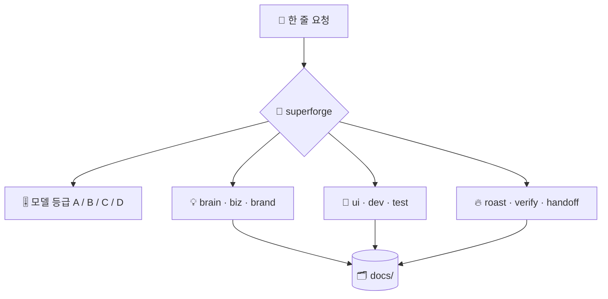

# ⚡ superforge

[](https://opensource.org/licenses/MIT)
[](https://claude.com/claude-code)
[](https://github.com/takaoumehara/superforge-skill)

[English](README.md) · [日本語](README.ja.md) · [简体中文](README.zh-CN.md) · [Español](README.es.md) · **한국어**

> **만들고 싶은 것을 한 줄로 말하면, 담당 스킬이 그 작업에 맞는 모델 위에서 바로 움직입니다.**

---

## 🔰 이게 뭔가요?

큰 공방의 안내 데스크를 떠올려 보세요. 무엇을 만들고 싶은지 말하면, 모든 작업대를 아는 사람이 알맞은 자리로 안내하고 솜씨가 맞는 장인에게 일을 넘깁니다. 매번 가장 비싼 사람을 부르지는 않습니다.

`superforge`는 열 개의 `superforge-*` 스킬을 위한 그 안내 데스크입니다. 요청을 읽고 목적지를 정하며, 에이전트를 띄우기 전에 하위 작업마다 모델 등급을 배정하고, 모든 단계가 파일을 남기도록 보장합니다.

---

## 📐 시스템 구조



들어가는 것은 요청 하나, 나오는 것은 담당 스킬과 선택된 모델 등급, 그리고 `docs/`에 남는 파일입니다.

---

## ✨ 3가지 강점

### 🧭 되묻지 않고 배분합니다
아이디어, 비즈니스, 브랜드, UI, 구현, 테스트, 디버깅, 비평, 검증, 인수인계까지 열 개의 전문 스킬이 담당합니다. 목적지와 등급을 한 줄로 알린 뒤 바로 시작하고, 전혀 다른 두 경로가 모두 타당할 때만 확인을 요청합니다.

### 🎚️ 배분 전에 하위 작업별 등급을 정합니다
판단은 Opus 5, 물량은 Sonnet 5, 잡무는 Haiku 4.5, 무인 장시간 실행은 Fable 5, 저장소를 건드리지 않는 대량 텍스트는 로컬 `gemini` CLI로 넘깁니다. 혹시 몰라서 세션 기본 모델에 그대로 두는 일은 없습니다.

### 🗂️ 결론이 대화 안에만 남지 않습니다
각 스킬은 보고하기 전에 산출물을 `docs/`에 씁니다. `/clear`를 하든 모델을 바꾸든 다음 날 아침에 다시 열든, 이미 정해진 것을 다시 논쟁할 필요가 없습니다.

---

## 🔄 도입 전 / 도입 후

| | 도입 전 | 도입 후 |
|---|---|---|
| 시작할 때 | "어디부터 손대지?" | 한 문장이면 한 줄로 배분 |
| 모델 선택 | 모든 에이전트가 세션 기본값 | 하위 작업마다 등급을 명시 |
| 잡무 비용 | 판단용 모델 단가로 처리 | Haiku 4.5 또는 Anthropic 밖에서 |
| `/clear` 이후 | 정해진 결정을 다시 논의 | `docs/`에서 다시 읽기 |

---

## 🚀 설치 및 사용법

`git`과 디렉터리에서 스킬을 불러오는 AI 도구만 있으면 됩니다.

### 🖥️ Claude Code (CLI)

원하는 위치에 전체 스위트를 클론한 뒤, 이 스킬 하나만 링크합니다.

```bash
git clone https://github.com/takaoumehara/superforge-skill ~/src/superforge-skill
ln -s ~/src/superforge-skill/skills/superforge ~/.claude/skills/superforge
```

Claude Code를 다시 시작하고 호출합니다.

```
/superforge
```

작업을 시작하기 전에 목적지와 모델 등급이 한 줄로 표시됩니다.

### 🔗 Codex CLI / Gemini CLI / Antigravity

링크할 디렉터리만 다릅니다. 설치 스크립트에 맡기면 이 머신의 모든 스킬 디렉터리를 찾아 열한 개를 한 번에 링크합니다.

```bash
cd ~/src/superforge-skill
./install.sh
```

여러 번 실행해도 결과가 같고, 자기가 만든 심볼릭 링크만 건드리며, `--dry-run`과 `--uninstall`을 지원합니다.

### 🌐 claude.ai (브라우저)

이 스킬 폴더를 zip으로 묶어 계정의 스킬 설정에서 업로드합니다.

```bash
cd ~/src/superforge-skill/skills/superforge
zip -r superforge.zip .
```

브라우저에서는 한 번에 하나씩만 올릴 수 있으므로 필요한 스킬 수만큼 반복합니다.

---

## 📄 라이선스

MIT — [LICENSE](../../LICENSE)를 참고하세요. 스킬 본문은 [SKILL.md](SKILL.md)에 있고, 필요할 때만 읽는 규칙은 [references/intake.md](references/intake.md), [references/artifacts.md](references/artifacts.md), [references/wiring.md](references/wiring.md)에 있습니다. 스위트 전체 소개는 [superforge-skill](../../README.ko.md)을 보세요.
