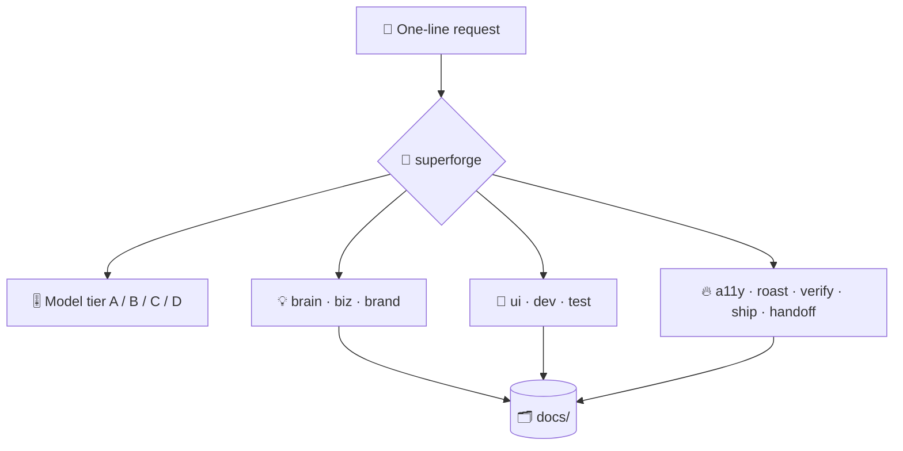

# ⚡ superforge

[](https://opensource.org/licenses/MIT)
[](https://claude.com/claude-code)
[](https://github.com/takaoumehara/superforge-skill)

**English** · [日本語](README.ja.md) · [简体中文](README.zh-CN.md) · [Español](README.es.md) · [한국어](README.ko.md)

> **Say what you want to make. The right specialist starts working — on the model that part of the job actually needs.**

---

## 🔰 What is this?

Think of the front desk of a large workshop. You describe what you want to make; someone who knows every bench walks you to the right one and hands the job to a craftsperson whose skill matches it — not to the most expensive person available, every time.

`superforge` is that front desk for the ten `superforge-*` skills. It reads the request, routes it, assigns a model tier to each subtask before any agent is dispatched, and makes sure every step leaves a file behind.

---

## 📐 Architecture



One request in; a routed specialist, a chosen model tier, and a file in `docs/` out.

---

## ✨ Features

### 🧭 Routes instead of asking
Twelve specialists cover idea, business, brand, UI, build, test, debug, accessibility, critique, verification, release readiness, and handoff. The route and the tier are announced in a single line, then work starts. Approval is requested only when two genuinely different paths are both plausible.

### 🎚️ A model tier per subtask, decided before dispatch
Judgment goes to Opus 5, volume to Sonnet 5, routine to Haiku 4.5, unattended long runs to Fable 5, and bulk text that needs no repository access to the local `gemini` CLI. Nothing stays on the session default just to be safe.

### 🗂️ Nothing lives only in the chat
Each skill writes its artifact under `docs/` before reporting back, so `/clear`, a model switch, or simply tomorrow morning costs you nothing that was already decided.

---

## 🔄 Before / After

| | Before | After |
|---|---|---|
| Starting a build | "Where do I even begin?" | One sentence, routed in one line |
| Model choice | Every agent on the session default | A tier per subtask, stated up front |
| Routine work | Billed at judgment-model rates | Haiku 4.5, or off Anthropic entirely |
| After `/clear` | Decisions relitigated | Read back from `docs/` |

---

## 🚀 Install & Usage

### 🖥️ Install all fourteen skills (once)

Clone the repository and run the installer. It links every skill into every skills directory it finds on this machine — Claude Code, Codex CLI, Gemini CLI, Antigravity.

```bash
git clone https://github.com/takaoumehara/superforge-skill
cd superforge-skill
./install.sh
```

Full options, single-skill installs, and the claude.ai upload route are in the [suite README](../../README.md).

### ⌨️ Call it

```
/superforge
```

The skill announces the route and the model tier before it starts working.

---

## 📄 License

MIT — see [LICENSE](../../LICENSE). The full skill body is in [SKILL.md](SKILL.md); the routing rules it reads on demand are in [references/intake.md](references/intake.md), [references/artifacts.md](references/artifacts.md), and [references/wiring.md](references/wiring.md). Suite overview: [superforge-skill](../../README.md).
