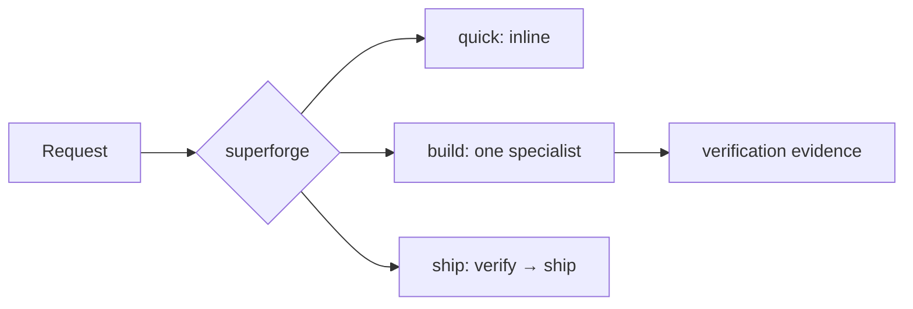

# ⚡ superforge

[](https://opensource.org/licenses/MIT)
[](https://claude.com/claude-code)

**English** · [日本語](README.ja.md) · [简体中文](README.zh-CN.md) · [Español](README.es.md) · [한국어](README.ko.md)

> Start a phase once. Continue with ordinary feedback.

## What it is

`superforge` is the thin front door to the fourteen `superforge-*` specialists.
It decides whether a request is Small, Medium, or Large, selects one primary
specialist when needed, and preserves verification and release gates.

It is intentionally not loaded for every correction. Once a phase is active,
follow-up copy, CSS, and template fixes continue under the existing constraints.



## Three entries

| Entry | Use it when | Default behavior |
|---|---|---|
| `/superforge quick` | The correction is bounded | Inline; no specialist, docs, or log |
| `/superforge build` | A feature or meaningful change begins | One primary specialist at a time |
| `/superforge ship` | Public or paid release is being considered | Verify first, then evaluate release readiness |

Plain `/superforge` infers the smallest safe entry. You do not need to repeat it
on every message.

## Why it is cheaper

- The router is at most 100 lines and contains no model catalog.
- Detailed intake, delegation, model, artifact, and log guidance loads only when
  its condition is true.
- Small work does not create coordination overhead.
- UI/design skills are alternatives, not an automatic stack.
- Run logs record corrections, failures, retries, and releases—not routine work.

Model selection still happens before an actual agent dispatch, but its
version-sensitive guidance lives in an on-demand reference instead of the
always-loaded router.

## Install

```bash
git clone https://github.com/takaoumehara/superforge-skill
cd superforge-skill
./install.sh
```

Then start a substantial phase with `/superforge build`, or call a specialist
directly when you already know the domain.

## Files

- [SKILL.md](SKILL.md) — thin router
- [artifacts.md](references/artifacts.md) — durable-state policy
- [run-log.md](references/run-log.md) — sparse exception log
- [model-prompting.md](references/model-prompting.md) — dispatch-time guidance
- [wiring.md](references/wiring.md) — optional deeper-skill delegation

MIT — see [LICENSE](../../LICENSE). Suite overview: [superforge-skill](../../README.md).
