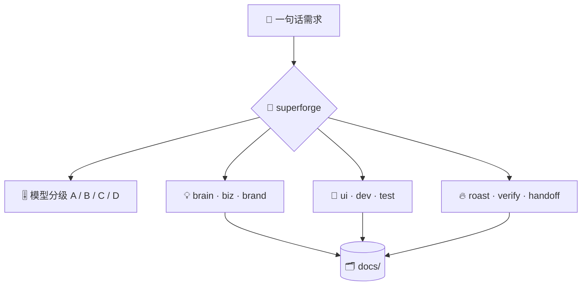

# ⚡ superforge

[](https://opensource.org/licenses/MIT)
[](https://claude.com/claude-code)
[](https://github.com/takaoumehara/superforge-skill)

[English](README.md) · [日本語](README.ja.md) · **简体中文** · [Español](README.es.md) · [한국어](README.ko.md)

> **说出你想做的东西，对应的专职技能立刻开工，并且跑在这段活儿真正需要的模型上。**

---

## 🔰 这是什么？

想象一个大工坊的前台。你说出想做什么，熟悉每一张工作台的人把你带到正确的位置，再把活儿交给手艺对得上的师傅，而不是每次都叫最贵的那位。

`superforge` 就是这十个 `superforge-*` 技能的前台。它读懂需求、决定去向，在派出任何 agent 之前先给每个子任务定好模型分级，并保证每一步都留下文件。

---

## 📐 系统架构



输入是一条需求；输出是接手的专职技能、选定的模型分级，以及 `docs/` 里的一份文件。

---

## ✨ 三大亮点

### 🧭 直接分流，不反复追问
十个专职技能覆盖创意、商业、品牌、UI、实现、测试、调试、批评、验证和交接。先用一行说明去向和分级，然后开工；只有当两条方向完全不同的路都说得通时才会确认。

### 🎚️ 派活之前就定好每个子任务的分级
判断交给 Opus 5，走量交给 Sonnet 5，杂活交给 Haiku 4.5，无人值守的长任务交给 Fable 5，不需要碰仓库的纯文本交给本机的 `gemini` CLI。绝不会为了保险把所有 agent 都留在会话默认模型上。

### 🗂️ 结论不会只活在对话里
每个技能在汇报之前先把产物写进 `docs/`。无论是 `/clear`、换模型还是隔天再来，已经定下的事都不用重来一遍。

---

## 🔄 使用前 / 使用后

| | 使用前 | 使用后 |
|---|---|---|
| 开工时 | “到底从哪儿开始？” | 一句话，一行分流 |
| 模型选择 | 所有 agent 都用会话默认模型 | 每个子任务一个分级，先说清楚 |
| 杂活成本 | 按判断级模型计费 | Haiku 4.5，或者完全不走 Anthropic |
| `/clear` 之后 | 已定的事重新吵一遍 | 从 `docs/` 读回来 |

---

## 🚀 安装与使用

### 🖥️ 一次装好全部 11 个技能（只需一次）

克隆仓库并运行安装脚本。它会找出本机所有技能目录，把 11 个技能一次性链接进去（Claude Code / Codex CLI / Gemini CLI / Antigravity）。

```bash
git clone https://github.com/takaoumehara/superforge-skill
cd superforge-skill
./install.sh
```

完整选项、只装单个技能的方法，以及 claude.ai 的上传步骤，都在[整套 README](../../README.zh-CN.md)。

### ⌨️ 调用它

```
/superforge
```

开工之前，它会先用一行报出去向和模型分级。

---

## 📄 许可证

MIT — 见 [LICENSE](../../LICENSE)。技能正文在 [SKILL.md](SKILL.md)，按需加载的规则在 [references/intake.md](references/intake.md)、[references/artifacts.md](references/artifacts.md) 和 [references/wiring.md](references/wiring.md)。整套说明见 [superforge-skill](../../README.zh-CN.md)。
